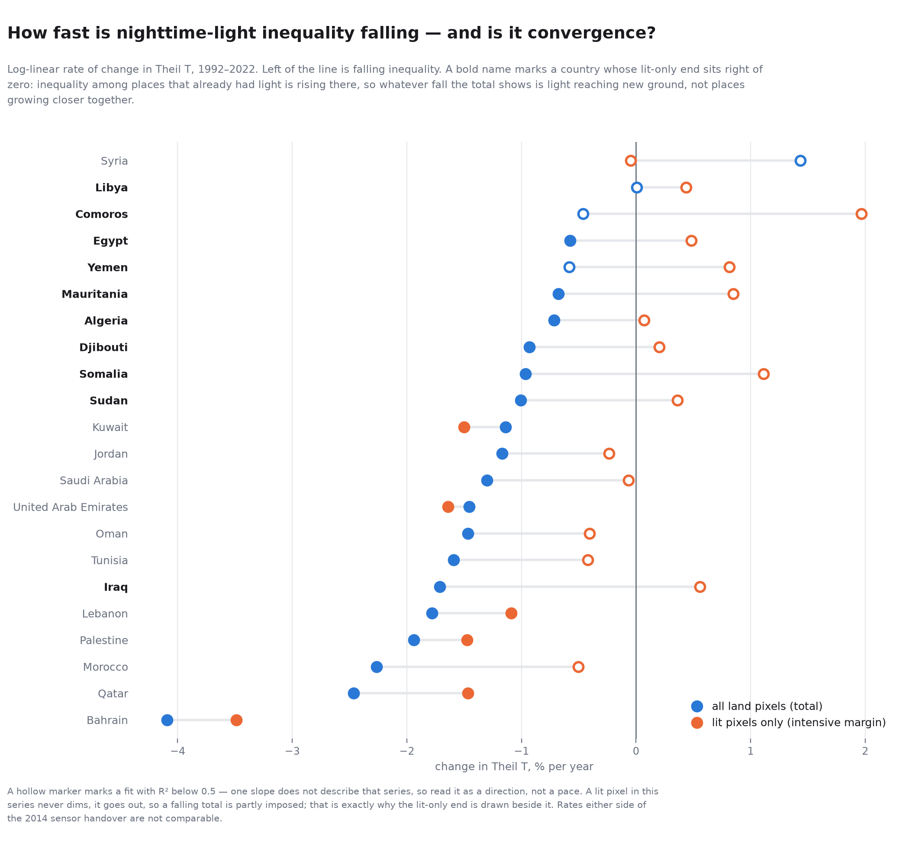

# Nighttime-light inequality across the Arab world, 1992–2022

All 22 Arab League members extracted from the LRCC-DVNL global grid at national
and subnational levels, with Gini, Theil T and Theil L series and an additive
between/within decomposition of Theil.

This supersedes the earlier Maghreb-only write-up. Tunisia, done first and in
most detail, keeps its own page: [`tunisia.md`](tunisia.md).

> **Read [`lrcc-dvnl.md`](lrcc-dvnl.md) before quoting any number here.** In
> this series a lit pixel's DN never steps down while it stays lit: every
> decrease is a pixel going out entirely. Gradual dimming is invisible;
> extinction is not. That distinction matters more in this region than
> anywhere — several of these countries went through wars in the window, and
> the series registers those as pixels extinguished rather than dimmed. 2014
> is also a sensor handover.

---

## Coverage

| Country | ISO3 | admin-1 | admin-2 | land px | scopes |
|---|---|---|---|---:|---|
| Algeria | DZA | 48 provinces | 1,504 communes | 2,308,015 | `all`, `dark`, `dark_wide` |
| Saudi Arabia | SAU | 13 provinces | 147 governorates | 1,922,985 | `all`, `dark` |
| Sudan | SDN | 18 states | 80 districts | 1,872,206 | `all`, `dark`, `dark_wide` |
| Libya | LBY | 22 districts | **none** | 1,616,024 | `all`, `dark`, `dark_wide` |
| Mauritania | MRT | 13 regions | 44 departments | 1,040,998 | `all`, `dark`, `dark_wide` |
| Egypt | EGY | 27 governorates | 343 subdivisions | 983,814 | `all`, `dark`, `dark_wide` |
| Somalia | SOM | 18 regions | 74 districts | 633,509 | `all`, `dark`, `dark_wide` |
| Yemen | YEM | 21 governorates | 332 districts | 452,188 | `all`, `dark`, `dark_wide` |
| Iraq | IRQ | 18 provinces | 102 districts | 436,464 | `all`, `dark`, `dark_wide` |
| Morocco | MAR | 15 regions | 54 provinces | 413,507 | `all`, `dark`, `dark_wide` |
| Oman | OMN | 11 regions | 49 provinces | 309,155 | `all`, `dark`, `dark_wide` |
| Syria | SYR | 14 governorates | 60 districts | 186,929 | `all`, `dark`, `dark_wide` |
| Tunisia | TUN | 24 governorates | 268 delegations | 154,885 | `all`, `narrow`, `wide`, `dark_wide` |
| Jordan | JOR | 12 provinces | 52 sub-provinces | 89,197 | `all`, `dark`, `dark_wide` |
| United Arab Emirates | ARE | 7 emirates | 195 districts | 71,076 | `all` |
| Djibouti | DJI | 6 regions | 21 admin-2 units | 22,356 | `all` |
| Kuwait | KWT | 6 provinces | **none** | 17,432 | `all` |
| Qatar | QAT | 7 municipalitys | **none** | 11,582 | `all` |
| Lebanon | LBN | 8 governorates | 30 districts | 10,252 | `all` |
| Palestine | PSE | 2 districts | 16 governorates | 6,220 | `all` |
| Comoros | COM | 3 autonomous islands | **none** | 1,678 | `all` |
| Bahrain | BHR | 4 governorates | **none** | 717 | `all` |

**Total: 12,561,189 land pixels** across 22 countries.

Land-pixel counts are measured from the rasterised GADM national boundary at
1 km in EPSG:8857. Palestine appears with GADM's own coding of the West Bank
and Gaza; that is the boundary set in use, not a position on its status.

### Level names come from GADM, not from us

Each country's admin levels are labelled with GADM's own `ENGTYPE_1` and
`ENGTYPE_2` values. This is not fussiness: the labels were hand-written for the
Maghreb first, and that got **Algeria wrong** — its ADM_2 units are *communes*
(GADM labels 1 345 of 1 504 that way), not the coarser *daïras*, and the wrong
word was rendered onto every Algerian admin-2 map before it was checked.

Where GADM records no type at all — Djibouti's `ENGTYPE_2` is literally `"NA"`
— a generic label applies rather than a plausible-sounding invention.

### Five countries have no admin-2 layer

GADM 4.1 ships no `ADM_2` for **Libya, Bahrain, Comoros, Kuwait or Qatar**.
Their analyses run at levels 0 and 1 only, and the nested three-way split
(pixel → admin-2 → admin-1) collapses to the two-way pixel → admin-1 split.
Nothing downstream fakes it: no admin-2 figure directories, no admin-2 zonal
table, no `nested` decomposition rows.

### Very small countries

Bahrain covers 717 land pixels across 4 units, Comoros 1 678 across 3, and
Palestine 6 220 across 2. A subnational inequality index over two to four
observations is close to meaningless. These are computed and published rather
than silently dropped, so the choice is visible — but do not read those rows
the way you would read Algeria's.

---

## Scopes: what the low-light rule does and does not find

Exclusion scopes are derived from the light itself by
[`scripts/derive_low_light_scopes.py`](../scripts/derive_low_light_scopes.py):

> Sort a country's admin-1 units by lit share in 2022. Consider every gap in
> the lower half of that ranking. Cut at the largest relative gap that still
> leaves at least 8 units standing. `dark` is that cut; `dark_wide` is the
> largest remaining gap above it.

The output is frozen into `satimg/regions.py` rather than recomputed at run
time, for the same reason the dataset manifest is committed.

**The validity check:** on Tunisia the rule selects Tataouine, Kebili and
Tozeur — *exactly* the three governorates hand-picked as `narrow` before the
rule existed. That agreement is the evidence it finds real geography.

### Where it finds something other than desert

At Maghreb scale the mismatches were minor. Across 22 countries they are not,
and the scope names say `dark`, never `desert`, for this reason:

| Country | What the cut actually selects |
|---|---|
| **Syria** | Hims, Dayr Az Zawr, Ar Raqqah are desert governorates *and* the most war-destroyed; the causes cannot be separated here. `dark_wide` adds **Aleppo** — Syria's largest city. Unambiguously conflict. |
| **Iraq** | The sharpest break of all 22 (×4.90) lands on genuinely desert governorates — but `dark_wide` adds **Ninawa**, i.e. Mosul. War damage. |
| **Somalia** | Bakool, Jubbada Dhexe and Gedo are southern *riverine farmland*. Their darkness is poverty and conflict, not aridity. |
| **Saudi Arabia** | Excludes **Ash-Sharqīyah**, the oil and industrial heartland, because lit *share* penalises a province that is mostly Rub' al Khali. The guard also binds, so there is no second scope. |
| **Sudan** | North and Central Darfur — arid, but their darkness is also displacement. |
| **Yemen** | `dark` includes **Raymah**, a small mountainous governorate. Poverty, not desert. |
| Egypt, Jordan, Oman, Morocco, Tunisia | Clean. New Valley, Red Sea, Ma'an, Mafraq, Dhofar, Al Wusta and the Saharan trio are all genuinely desert. |

Every one of these readings is recorded in the scope's `rationale` in
`regions.py`, and tests assert the conflict-related ones so that a later edit
cannot quietly recast them as desert sets.

**Eight countries get no derived scope at all** — ARE, QAT, BHR, KWT, LBN, PSE,
DJI and COM — because fewer than eight admin-1 units would remain. They run
with `all` only. That is the guard working, not a gap.

---

## What the 22 countries show

Theil T over all land pixels, scope `all`, decomposed against each country's
admin-1 units. **Bold** marks a value that rose.

| Country | admin-1 unit | Theil T 1992 | 2022 | between share 1992 | 2022 |
|---|---|---:|---:|---:|---:|
| Somalia | region | 8.503 | 5.674 | 0.420 | 0.205 |
| Mauritania | region | 7.998 | 6.031 | 0.468 | 0.444 |
| Sudan | state | 5.850 | 4.117 | 0.345 | 0.281 |
| Djibouti | region | 5.195 | 3.761 | 0.577 | 0.471 |
| Yemen | governorate | 3.810 | 2.761 | 0.297 | 0.133 |
| Libya | district | 3.627 | 3.440 | 0.327 | **0.341** |
| Algeria | province | 3.570 | 2.713 | 0.337 | **0.416** |
| Morocco | region | 3.492 | 1.618 | 0.156 | **0.205** |
| Comoros † | autonomous island | 3.264 | 2.272 | 0.043 | 0.019 |
| Oman | region | 3.001 | 1.794 | 0.170 | **0.205** |
| Egypt | governorate | 2.983 | 2.396 | 0.490 | **0.492** |
| Saudi Arabia | province | 2.963 | 1.926 | 0.080 | **0.132** |
| Jordan | province | 2.475 | 1.646 | 0.408 | 0.371 |
| Tunisia | governorate | 2.439 | 1.231 | 0.292 | **0.341** |
| Iraq | province | 2.326 | 1.284 | 0.283 | **0.343** |
| Syria | governorate | 1.808 | **1.904** | 0.218 | 0.167 |
| UAE | emirate | 1.425 | 0.827 | 0.142 | **0.144** |
| Kuwait | province | 0.923 | 0.439 | 0.329 | 0.196 |
| Qatar | municipality | 0.794 | 0.314 | 0.162 | 0.121 |
| Lebanon | governorate | 0.665 | 0.327 | 0.407 | 0.313 |
| Palestine † | district | 0.334 | 0.157 | 0.024 | 0.019 |
| Bahrain † | governorate | 0.193 | 0.054 | 0.247 | 0.056 |

† Bahrain (4 units), Comoros (3) and Palestine (2) are too small for a
subnational decomposition to carry much meaning. They are listed for
completeness, not for interpretation.

> ⚠️ **Read down the columns of this table with care: the levels are partly
> mechanical.** Theil T is bounded above by ln(N), and N — land pixels — runs
> from Bahrain's 717 to Algeria's 2 308 015. Across the 22,
> **Spearman(N, Theil T 1992) = +0.68**; dividing each country's index by its
> own ln(N) only brings that to +0.53. So a large country scoring higher than a
> small one here is not, on its own, evidence that it is more unequal. Compare
> countries by *pace* instead — see [Pace](#pace-how-fast-and-what-kind), where
> the confound cancels.

### Total inequality falls almost everywhere — Syria excepted

Theil T falls in **21 of 22**. The single exception is **Syria**, where it rises
1.808 → 1.904. That is the war: the series records the conflict as pixels going
out, and light that survives is more concentrated than what preceded it. Syria
is also the only country whose national sum of lights ends the period below
where it started.

### The Maghreb pattern does **not** generalize

Working with the Maghreb five, four of them showed total inequality falling
while the share *between* admin-1 units rose — light spreading within regions
faster than between them. That looked like a regional finding.

Across all 22 it is not. The between-share rises in only **9 of 22**:

* **Rises** — Algeria, Iraq, Tunisia, Libya, Morocco, Oman, Saudi Arabia,
  Egypt, UAE.
* **Falls** — Somalia, Djibouti, Yemen, Sudan, Mauritania, Kuwait, Lebanon,
  Jordan, Qatar, Syria, Bahrain, Comoros, Palestine.

The split is not random. The risers are mostly large states with a bright core
and a vast dark interior, where growth concentrated in places already lit. The
fallers are dominated by the poorest countries in the region — Somalia,
Djibouti, Yemen, Sudan, Mauritania — where light arrived in regions that had
almost none, which is exactly what makes a between-group share fall.

So the honest summary is narrower than the Maghreb result suggested: **falling
total inequality is near-universal here; whether it is driven by convergence
between regions or within them depends on the country, and splits roughly along
income and settlement geography.**

### Two more things the numbers say

**Egypt is the most between-concentrated country in the region** (between share
0.490 → 0.492, both years the highest of the 22). Almost all Egyptian light is
in the Nile valley and Delta, and 30 years did not change that.

**Saudi Arabia's between-share nearly doubles** (0.080 → 0.132) off the lowest
base of the large countries. Its light started unusually evenly spread across
provinces and became less so.

Per-country series, decompositions and per-unit contributions are in
[`../results/`](../results/), with a generated data dictionary for every column.

---

## Pace: how fast, and what kind

The table above is a snapshot — two years, twenty-two countries. It cannot say
whether a country is converging quickly or barely moving, and its levels are
partly an artefact of country size. Rates are free of that particular problem.

**Why pace is comparable where levels are not.** Theil T's ceiling is ln(N),
and N is the country's land-pixel count — fixed over time, and verified so:
the pixel count is identical across all 31 years for all 22 countries. So
whatever constant you normalise the index by, ln(N) included, it drops out of
the fitted slope exactly. The size confound that contaminates the level table
does not carry into the rates.

That is not the same as saying pace is unrelated to size. It is:
**Spearman(N, rate) = +0.45** — larger countries converge more slowly. But that
is a finding about geography, not an artefact of the index's ceiling.

**How the rate is fitted.** `ln(T_t) = a + b·t`, with `b` reported as % per
year; proportional rather than absolute because these are ratio-scale indices,
so a fall from 8.0 to 6.0 and one from 0.8 to 0.6 count as the same pace.
Non-positive and missing values are dropped rather than clamped — `lit_share`
reaches 0 and Theil L is `nan` wherever any unit is unlit, and substituting an
epsilon would invent a rate out of a missing observation. R² is reported beside
every rate, because a single slope is a lie for a series that changes direction.

### Three margins, because "inequality fell" means two different things

| series | what a fall means |
|---|---|
| Theil T, all land pixels | **total** — both margins together |
| Theil T, lit pixels only | **intensive** — convergence among places that already had light |
| lit share of land pixels | **extensive** — light reaching ground that had none |

[](../figures/trends/pace_total_vs_intensive.png)

Full window, 1992–2022, pixel level, scope `all`. Half-life is `ln(2)/|b|` — the
years it would take the index to halve at this pace, and blank where the series
is not falling. Sorted by total pace.

| Country | total %/yr | R² | half-life | intensive %/yr | extensive %/yr | between-share %/yr | trajectory |
|---|---:|---:|---:|---:|---:|---:|---|
| Bahrain | −4.09 | 0.92 | 17 y | −3.49 | +0.10 | −5.69 | intensive converger |
| Qatar | −2.46 | 0.93 | 28 y | −1.47 | +0.75 | −0.33 | intensive converger |
| Morocco | −2.26 | 0.96 | 31 y | −0.50 | +5.30 | +1.08 | mixed |
| Palestine | −1.94 | 0.92 | 36 y | −1.48 | +0.14 | −2.98 | intensive converger |
| Lebanon | −1.78 | 0.67 | 39 y | −1.09 | +0.49 | −0.48 | intensive converger |
| Iraq | −1.71 | 0.84 | 40 y | **+0.56** | +3.32 | +0.57 | extensive spreader |
| Tunisia | −1.59 | 0.84 | 44 y | −0.42 | +2.51 | +0.20 | mixed |
| Oman | −1.47 | 0.94 | 47 y | −0.41 | +3.17 | +0.58 | mixed |
| UAE | −1.46 | 0.89 | 48 y | −1.64 | +0.94 | +0.47 | intensive converger |
| Saudi Arabia | −1.30 | 0.96 | 53 y | −0.07 | +3.08 | +1.20 | mixed |
| Jordan | −1.17 | 0.98 | 59 y | −0.24 | +2.24 | −0.26 | mixed |
| Kuwait | −1.14 | 0.53 | 61 y | −1.50 | +0.17 | −1.94 | intensive converger |
| Sudan | −1.01 | 0.95 | 69 y | **+0.36** | +5.08 | −1.13 | extensive spreader |
| Somalia | −0.96 | 0.91 | 72 y | **+1.11** | +7.10 | −2.01 | extensive spreader |
| Djibouti | −0.93 | 0.90 | 74 y | **+0.20** | +4.20 | +0.13 | extensive spreader |
| Algeria | −0.72 | 0.86 | 97 y | **+0.07** | +2.27 | +0.79 | extensive spreader |
| Mauritania | −0.68 | 0.90 | 102 y | **+0.85** | +5.09 | +0.13 | extensive spreader |
| Yemen ‡ | −0.58 | 0.29 | 119 y | **+0.81** | +2.26 | −2.44 | extensive spreader |
| Egypt | −0.57 | 0.93 | 121 y | **+0.48** | +1.70 | +0.10 | extensive spreader |
| Comoros ‡ | −0.46 | 0.13 | 150 y | **+1.97** | +1.67 | −4.61 | extensive spreader |
| Libya ‡ | +0.01 | 0.00 | — | +0.44 | +0.17 | +0.40 | flat |
| Syria ‡ | **+1.44** | 0.40 | — | −0.05 | **−2.43** | −0.26 | disrupted |

‡ **R² below 0.5: one slope does not describe these four series.** Read their
rates as a direction at most. Libya's Theil T simply wanders between 3.42 and
3.73 for thirty years — its fit is +0.01 %/yr at R² 0.0004, and its endpoints
happen to land *lower* than they started, which is the one place in this
analysis where the fitted sign and the 1992→2022 endpoints disagree. They
disagree because there is no trend to agree with.

### The finding: a falling total is not the same as convergence

Nine countries' total inequality falls **while inequality among their
already-lit places rises**. Somalia is the clearest: total −0.96 %/yr, lit-only
**+1.11 %/yr**, lit area **+7.10 %/yr**. Nothing converged there. Light reached
ground that had none, and among the places that already had it, the gaps grew.

Bahrain is the opposite pole and the reason the comparison is worth making at
all: total −4.09 %/yr, lit-only −3.49 %/yr, lit area flat at +0.10 %/yr. It has
nowhere left to spread into, so its decline is the real thing.

Reporting only the total would file these two under the same headline. The
typology names the difference, assigned by rule from the measured rates rather
than by hand (thresholds are `satimg.trends.FLAT` and `RISING`, and each row
carries the clause that classified it):

* **Intensive convergers** (6) — Bahrain, Qatar, Palestine, Lebanon, UAE,
  Kuwait. Already largely lit; the decline is convergence.
* **Extensive spreaders** (9) — Somalia, Mauritania, Sudan, Djibouti, Comoros,
  Yemen, Iraq, Algeria, Egypt. Total falls only because light arrives
  somewhere new.
* **Mixed** (5) — Morocco, Tunisia, Oman, Saudi Arabia, Jordan. Both margins
  contribute.
* **Flat** (1) — Libya. No movement to explain.
* **Disrupted** (1) — Syria. The only country whose lit *area* shrinks, and the
  only one whose inequality rises.

This cuts across the between-share split above rather than reproducing it. Iraq
and Egypt are extensive spreaders whose between-share *rises*; Somalia and
Sudan are extensive spreaders whose between-share falls. Where light arrives is
a separate question from whether it arrives at all.

### The post-2014 acceleration is the instrument, not history

Fitting each era separately: **18 of 22 countries decline faster after 2014**.

| | DMSP 1992–2013 | VIIRS 2014–2022 |
|---|---:|---:|
| Iraq | −0.97 | **−4.80** |
| Palestine | −1.44 | **−4.16** |
| Qatar | −2.18 | **−4.03** |
| Morocco | −2.24 | **−3.91** |
| Tunisia | −1.77 | **−3.02** |

A near-universal jump at exactly the sensor handover is a property of the
instrument, not of the Arab world. VIIRS resolves low light that DMSP could not
see at all, so the extensive margin appears to open up the moment the sensor
changes. **Do not compare a post-2014 rate with a pre-2014 one.** The table
publishes both windows precisely so nobody has to infer them from the full one.

Three of the four countries that *decelerate* are near-saturated — Bahrain
(100% of land pixels lit by 2022), Lebanon (89%) and Kuwait (87%) have almost
no dark ground left for a better sensor to find, which is what a sensor
explanation predicts. **Sudan is the exception and is stated as one:** at 3.0%
lit it is among the darkest countries here and it decelerates anyway
(−1.14 → −1.04 %/yr). One counter-example does not overturn an 18-of-22
pattern, but it does mean the sensor story is the likely reading, not a proved
one.

### What the pace numbers cannot fix

* **A falling total is partly imposed.** A lit pixel in this series never dims —
  it goes out (see [`lrcc-dvnl.md`](lrcc-dvnl.md)). As lit area grows the
  zeros-included index falls almost by construction, which is exactly why the
  lit-only rate is published beside it rather than under it.
* **The eras are not comparable**, as above.
* **A single slope hides shape.** Four countries are flagged; Syria is the one
  where it matters most, since its full-window rate (+1.44 %/yr) and both of its
  era rates (−0.04, −1.97) tell different stories about a series that rose
  through the war and fell back afterwards.
* **Levels remain confounded by size** even though pace is not.

Regenerate the table and the figure with:

```bash
satimg trends --country all          # results/trends_by_country.csv + the figure
satimg trends --country TUN,MAR --no-figure
```

---

## Reproducing

```bash
pip install -e ".[dev]"
satimg lrcc-dvnl download
satimg boundaries fetch
python - <<'PY'
from satimg.regions import ARAB_LEAGUE; print(" ".join(ARAB_LEAGUE))
PY
# then, per country:
satimg lrcc-dvnl extract     --country "$ISO" --levels 0,1,2
satimg lrcc-dvnl choropleth  --country "$ISO" --levels 1,2
satimg lrcc-dvnl inequality  --country "$ISO"
satimg figures build
satimg results build
```

Outputs land under gitignored `data/regions/<ISO3>/`; the committed subsets are
[`figures/`](../figures/) and [`results/`](../results/).

---

## Licensing

Boundaries are GADM 4.1, which is non-commercial with no redistribution, so the
figures and tables are carved out of the repository's MIT licence by
[`../figures/NOTICE.md`](../figures/NOTICE.md).
