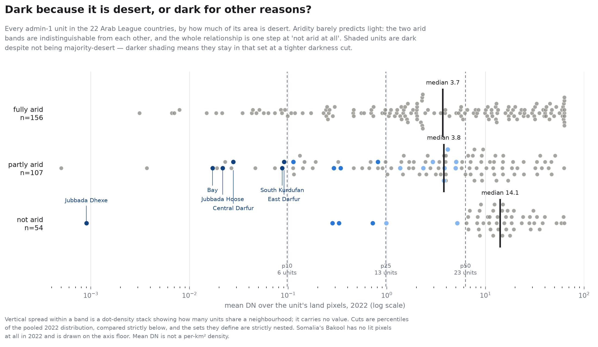

# Aridity: separating desert from darkness

The exclusion scopes in [`../src/satimg/regions.py`](../src/satimg/regions.py)
are cut from a break in observed **lit share**. That measures darkness, not
climate, and this page is the measurement that tells the two apart.

**It refuted most of what this repository previously asserted about them.**

---

## Source

**Global Aridity Index & PET Database v3.1** — Zomer, Xu & Trabucco (2022),
*Scientific Data* 9, 409,
[10.1038/s41597-022-01493-1](https://doi.org/10.1038/s41597-022-01493-1),
figshare item 7504448, file id 56300327 (645 783 906 B).

| | |
|---|---|
| Grid | 30 arc-sec (1/120°), **EPSG:4326** |
| Encoding | AI × 10 000, `uint16` |
| Climatology | **1970–2000 normal**, WorldClim 2.x |
| Licence | **CC BY 4.0** — attribution, no non-commercial clause |

**Use v3.1, not v3.0.** v3.0 was deprecated for an error in net longwave
radiation that biased the index dry.

UNEP classes, compared as **integers** because the data is quantised to 1e-4 and
pixels sit exactly on the boundaries:

| raw | AI | class |
|---|---|---|
| < 300 | < 0.03 | hyper-arid |
| 300 – 1999 | 0.03 – 0.2 | arid |
| 2000 – 4999 | 0.2 – 0.5 | semi-arid |
| 5000 – 6499 | 0.5 – 0.65 | dry sub-humid |
| ≥ 6500 | ≥ 0.65 | humid |

**Desert = raw < 2000** (hyper-arid + arid), UNEP's drylands definition.

### The nodata problem, and how the dataset solves it

The AI layer **declares no nodata, and 0 is ambiguous**: it is the ocean fill
*and* a real value where precipitation is essentially nil. Egypt's New Valley
contains 0 on genuine land. Treating 0 as nodata deletes the driest desert on
Earth; treating it as data paints the Atlantic hyper-arid.

The companion **ET0 layer resolves it**: ET0 *does* declare nodata (65535) and
is defined over all land, so `ET0 != 65535` is a land mask from the dataset
itself rather than a heuristic. Measured: it selects **28.6%** of the grid
against Earth's ~29% land fraction, marks the mid-Atlantic invalid, and keeps
New Valley's zeros (where ET0 reads 2534–2612).

### Area, not pixels

A 30 arc-second cell at 37°N is 20% smaller than one at the equator, so a pixel
count is not an area fraction. Row areas use the exact ellipsoidal formula,
validated by integrating to **510 065 622 km²** against the accepted
510 065 600 (4.3e-8). The domain runs **12.5°S to 37.5°N** — Comoros and southern
Somalia are in the southern hemisphere.

Cross-checked against the `area_km2` already committed from EPSG:8857 geometry,
an entirely independent computation: agreement within **±0.61% for 20 of 22
countries**. The one flag, UAE at −2.37%, is Dubai, and is exactly its 2.32%
unclassified pixels — GADM's polygon includes reclaimed coastal land that a
1970–2000 land mask predates. Every row carries `pixels_unclassified` so this is
visible rather than mysterious.

---

## What it found

### The prose caveats were mostly wrong

`regions.py` used to explain the light rule's odd selections by eye. Measured:

| unit | claimed | measured desert share |
|---|---|---|
| Aleppo | "unambiguously conflict, not aridity" | **0.70 — arid** |
| Ninawa (Mosul) | "NOT a desert … war damage" | **0.58 — arid** |
| Raymah | "mountainous, not desert" | **0.97 — arid** |
| Nalut, Al Jabal al Gharbi | "populated Nafusa Mountain districts" | **1.00 — arid** |
| Bakool | "riverine farmland, not desert" | **0.96 — arid** |
| Gedo | "riverine farmland, not desert" | **0.82 — arid** |
| Jubbada Dhexe | "riverine farmland, not desert" | 0.00 — holds |
| Siliana | "interior, not desert" | 0.03 — holds |

Eight of ten refuted. The error was conflating **where people live** with
**what the climate is**: a city, a farm or a mountain in an arid climate is
still arid.

### The light rule tracks climate better than the prose implied

Across all **317** admin-1 units, 230 (73%) are majority-arid. Of the **65** the
light rule excludes, **61 (94%)** are majority-arid — a lift of **1.29**. The
rule was doing a better job than its own documentation gave it credit for.

### The anomalous cell is real, and it is not Aleppo

| | arid | not arid |
|---|---|---|
| **dark** | 135 | **23** |
| **lit** | 95 | 64 |

The 23 non-arid-yet-dark units are led by **Jubbada Dhexe, Bay and Jubbada
Hoose** (Somalia) and **Central Darfur, South Kurdufan, East and South Darfur,
Blue Nile, Al Qadarif** (Sudan). The "dark for human reasons" cell is Darfur and
southern Somalia — the poorest and most conflict-affected non-arid regions.

### But the cell has no crisp boundary, and the relationship is a step

[](../figures/aridity/arid_vs_lit.png)

Two things the 2×2 above cannot show, and the figure does.

**The set depends entirely on where darkness is cut.** At the 10th percentile of
2022 mean DN it is 6 units, at the 25th 13, at the median 23. The sets are
**strictly nested**, so this is not churn — there is a hard core that survives
every threshold (Somalia's Juba valley and Bay, Darfur, South Kurdufan) and a
soft margin that appears only as the cut loosens. Those margins are not one
phenomenon: the p25 additions include all three Comoros islands, small humid
units where the reading is arguably a measurement artefact, and the p50
additions are ordinary Maghreb agrarian highlands at 3–5 mean DN. Only the core
six are named on the figure, because naming all 23 would assert a class this
document elsewhere denies.

**Aridity is a weak predictor of light, and not in the way a correlation
suggests.** Median 2022 mean DN by band:

| band | units | median mean DN |
|---|---:|---:|
| fully arid (`desert_share` = 1) | 156 | 3.70 |
| partly arid (0 < share < 1) | 107 | 3.78 |
| not arid at all (share = 0) | 54 | **14.09** |

The two arid bands are indistinguishable from each other, and within the
interior band there is no internal gradient (Spearman −0.157). The relationship
is a **single step at "not arid at all"**, not a slope — which is why the figure
is three bands rather than a scatter, and why the band medians are quoted here
in preference to a single coefficient.

For the record, that coefficient is **Spearman(`desert_share`, `mean_dn_2022`)
= −0.146** across the 317 units. An earlier version of this page said −0.18 for
the pair it named; that number does not reproduce and has been corrected. The
coefficient hides the step shape in any case.

That correction also named −0.173 as the value for `dryland_share`. **That was
computed from a broken column** and is withdrawn. `dryland_share` was being
summed as hyper-arid + arid + semi-arid, silently dropping **dry sub-humid**,
against both the `DRYLAND_MAX_RAW = 6500` constant and this page's own
definition. It understated the share for **60 of the 317** units — most starkly
Beirut, which is wholly dry sub-humid and was published as **0% dryland**. The
sum is now derived from the class list rather than hand-written, a test asserts
`dryland_share == 1 − humid_share` for every published row, and the corrected
coefficient is **−0.127**.

Nothing else moved: `desert_share` is hyper-arid + arid and was never affected,
so `majority_arid`, the four cells, the 6/13/23 nesting, the figure and the
94%-against-73% lift all stand unchanged. The published `dark_2022` and `cell`
columns are byte-identical across the correction.

⚠️ `mean_dn_2022` is the **mean DN over the unit's land pixels**, not a
sum-of-lights density — `results/` publishes a genuine `density_sol_per_km2`
elsewhere and the two differ by a few percent on a 1 km grid. The columns were
briefly published under `density_*` names; they are now `mean_dn_*`.

---

## Syria: aridity cannot isolate the war

The hope was that pixel-level aridity would separate war damage from desert —
if the pixels Syria lost were non-arid, they were inhabited places. It does not
work, for a reason worth stating.

Lit→unlit transitions, with the two controls the design demands:

| country | years | sensor | lit | lost | loss rate desert | non-desert | rel. risk |
|---|---|---|---:|---:|---:|---:|---:|
| Syria | 2010→2016 | **spans break** | 75 028 | 47 487 | 70.1% | 53.5% | 0.76 |
| Syria | 2010→2013 | DMSP only | 75 028 | 39 147 | 54.1% | 49.4% | 0.91 |
| Syria | 2014→2016 | VIIRS only | 30 816 | 4 916 | 24.6% | 5.8% | 0.24 |
| Jordan | 2010→2013 | DMSP only | 19 410 | 1 595 | 9.4% | 1.1% | 0.12 |
| Lebanon | 2010→2013 | DMSP only | 8 786 | 280 | — | 3.2% | — |

Relative risk is **below 1 everywhere**: a lit pixel in an arid area was *more*
likely to go dark, the opposite of the prediction. And stratifying by baseline
brightness reverses it again — **Simpson's paradox**:

| Syria 2010→2013, baseline DN | rel. risk (non-desert vs desert) |
|---|---:|
| 1–3 | 1.05 |
| 3–6 | 1.10 |
| 6–12 | 1.05 |
| 12–25 | 0.92 |
| 25–63 | 0.35 |

Within the dim bands that hold most pixels, non-desert pixels were slightly
*more* likely to go out; the pooled figure below 1 comes entirely from the
brightest band. That band is Deir ez-Zor and Raqqa — **arid-climate cities**,
destroyed in the war. Aridity and war damage are genuinely entangled in Syria
because the war was fought substantially in climatically arid governorates.

**What does isolate the war is the magnitude, not the composition.** Over
identical years and the same sensor era, Syria lost 52% of its lit pixels while
Jordan lost 8% and Lebanon 3%.

> The 2010→2016 window straddles the DMSP→VIIRS handover at 2013/2014. Any
> lit→unlit count across it conflates extinction with a sensor change, which is
> why the same-sensor pairs and control countries are reported beside it and the
> spanning row is never quoted alone.

---

## Limitations

- **1970–2000 normal.** It predates the 2006–2010 Syrian drought entirely and
  cannot support any claim that drought explains a darkening. It is a static
  stratifier — *was this pixel in a climatically arid place* — and nothing more.
- "Non-arid but dark" evidences a **human** cause without separating war from
  poverty; Sudan and Somalia both land there for different reasons.
- Admin-1 units are large and heterogeneous. Aleppo governorate is 70% arid and
  contains a large non-arid city; the unit summary cannot see that.
- Small units are quantised: Beirut is ~30 cells at 30″. `pixels_classified` is
  emitted so they can be excluded.

## Reproducing

```bash
satimg aridity fetch                 # 646 MB, CC BY 4.0
satimg aridity check                 # assert the grid is what this code assumes
satimg aridity units                 # pass A: per-unit class shares, all 22
satimg aridity pixels                # pass B: classify once, warp onto each grid
satimg aridity vs-light              # the cross-country join -> results/
satimg aridity chart                 # the figure above
```

`units` and `pixels` need the source layers and the GADM world layer; `vs-light`
and `chart` do not — they read only the committed CSVs under `results/`, so the
table and the figure can be rebuilt on a clone where `data/` is empty:

```bash
satimg aridity vs-light --results results
satimg aridity chart --results results --figures figures
```

A fresh `vs-light` reproduces the committed `results/aridity_vs_light.csv` row
for row; a test asserts it.
