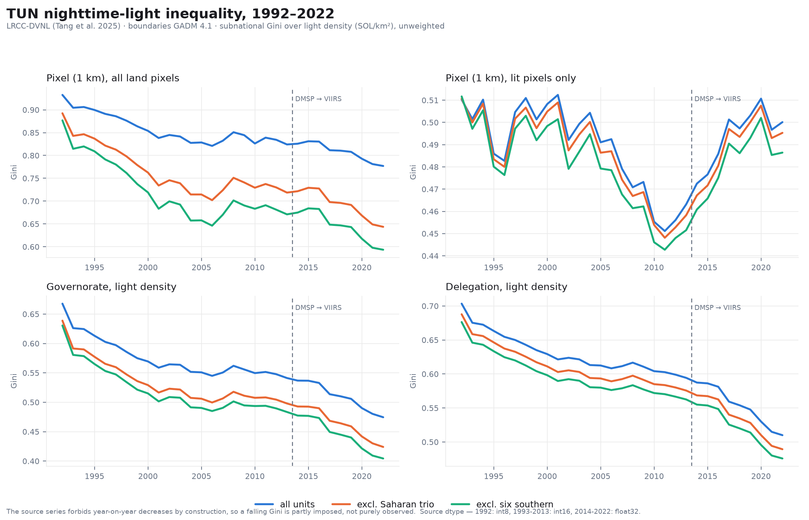
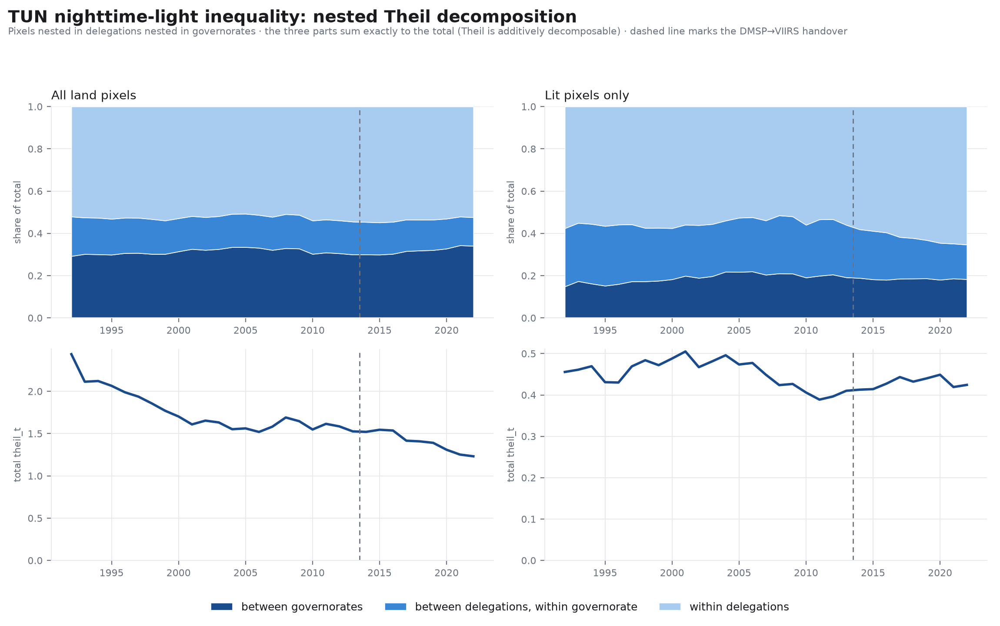
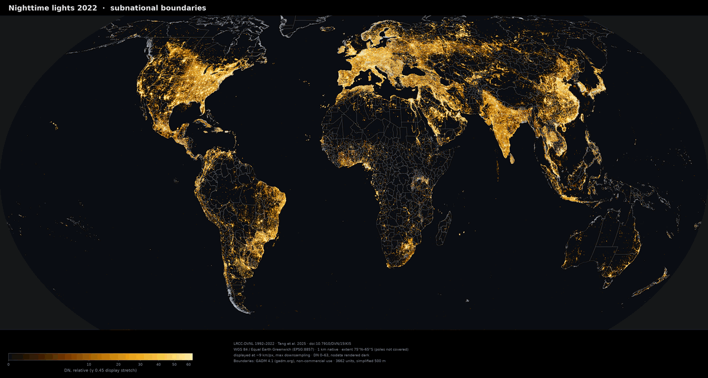

# Figures

Every figure this repository produces, in one place — 2568 of them, 166.2 MB.

*This file is generated by `satimg figures build`; edit
[`src/satimg/figures.py`](../src/satimg/figures.py), not this page.*

The renderers write full-resolution output under `data/`, which is gitignored
(439 MB). The gallery is the same figures re-encoded to a 256-colour palette,
with the per-year series capped at 1200 px on the longest side; the charts
and the small-multiple panels keep their native pixels. To regenerate at any
size:

```bash
pip install -e ".[dev]"
satimg lrcc-dvnl overlay                                # global sets
satimg lrcc-dvnl extract    --country TUN --levels 0,1,2
satimg lrcc-dvnl choropleth --country TUN --levels 1,2
satimg lrcc-dvnl inequality --country TUN
satimg figures build --max-px 0                         # 0 = keep full size
```

## Provenance and terms — read before reusing a figure

* **Imagery** — LRCC-DVNL, 1992–2022 at 1 km
  ([paper](https://doi.org/10.1038/s41597-025-05246-8) ·
  [data](https://doi.org/10.7910/DVN/15IKI5))
* **Boundaries** — GADM 4.1 ([gadm.org](https://gadm.org))
* **Projection** — WGS 84 / Equal Earth Greenwich (EPSG:8857)

⚠️ **These figures are not covered by the repository's MIT licence.** They
depict GADM 4.1 boundaries, and GADM's terms are *academic and other
non-commercial use; redistribution or commercial use not allowed without prior
permission*. Reproducing a figure in academic work with the attribution above is
what GADM permits; commercial use is not. The MIT licence applies to the code
only. See [`NOTICE.md`](NOTICE.md) and
[`../docs/overlays.md`](../docs/overlays.md).

No GADM data is committed here: the vector layers, the boundary-mask GeoTIFF
bands and the GID-keyed zonal tables all stay under gitignored `data/`. What is
committed is rendered raster imagery, at a resolution from which the source
geometry cannot be recovered.

Every figure also carries its own provenance and attribution in its footer, so
a figure lifted out of this folder stays self-describing.

## What to look at first

Tunisia, three inequality measures, four levels of aggregation, 1992–2022.

[](TUN/charts/TUN_inequality_series.png)

Where the inequality sits: Theil T halves, yet the share of it that is *between* governorates rises — convergence happened within regions, not between them.

[](TUN/charts/TUN_theil_decomposition.png)

Governorates coloured by their own light density relative to the national mean of the same year — 31 years at once.

[](TUN/panels/choropleth/ylorrd/TUN_adm1_relative_1992-2022.png)

The 2022 global grid with GADM subnational boundaries over it.

[](global/adm1/LACC_2022_adm1.png)

## Summary figures

### Morocco: inequality series and Theil decomposition

Gini, Theil T and Theil L over 1992–2022, and the additive between/within split of Theil.

`MAR/charts/` — 2 file(s)

[MAR_inequality_series](MAR/charts/MAR_inequality_series.png) · [MAR_theil_decomposition](MAR/charts/MAR_theil_decomposition.png)

### Algeria: inequality series and Theil decomposition

Gini, Theil T and Theil L over 1992–2022, and the additive between/within split of Theil.

`DZA/charts/` — 2 file(s)

[DZA_inequality_series](DZA/charts/DZA_inequality_series.png) · [DZA_theil_decomposition](DZA/charts/DZA_theil_decomposition.png)

### Tunisia: inequality series and Theil decomposition

Gini, Theil T and Theil L over 1992–2022, and the additive between/within split of Theil.

`TUN/charts/` — 2 file(s)

[TUN_inequality_series](TUN/charts/TUN_inequality_series.png) · [TUN_theil_decomposition](TUN/charts/TUN_theil_decomposition.png)

### Libya: inequality series and Theil decomposition

Gini, Theil T and Theil L over 1992–2022, and the additive between/within split of Theil.

`LBY/charts/` — 2 file(s)

[LBY_inequality_series](LBY/charts/LBY_inequality_series.png) · [LBY_theil_decomposition](LBY/charts/LBY_theil_decomposition.png)

### Mauritania: inequality series and Theil decomposition

Gini, Theil T and Theil L over 1992–2022, and the additive between/within split of Theil.

`MRT/charts/` — 2 file(s)

[MRT_inequality_series](MRT/charts/MRT_inequality_series.png) · [MRT_theil_decomposition](MRT/charts/MRT_theil_decomposition.png)

## Morocco (MAR)

### Raster panels (inferno)

All 31 years of one admin level in a single small-multiple.

`MAR/panels/raster/inferno/` — 3 file(s)

[MAR_adm0_1992-2022](MAR/panels/raster/inferno/MAR_adm0_1992-2022.png) · [MAR_adm1_1992-2022](MAR/panels/raster/inferno/MAR_adm1_1992-2022.png) · [MAR_adm2_1992-2022](MAR/panels/raster/inferno/MAR_adm2_1992-2022.png)

### Raster panels (magma)

All 31 years of one admin level in a single small-multiple.

`MAR/panels/raster/magma/` — 3 file(s)

[MAR_adm0_1992-2022](MAR/panels/raster/magma/MAR_adm0_1992-2022.png) · [MAR_adm1_1992-2022](MAR/panels/raster/magma/MAR_adm1_1992-2022.png) · [MAR_adm2_1992-2022](MAR/panels/raster/magma/MAR_adm2_1992-2022.png)

### Raster panels (cividis)

All 31 years of one admin level in a single small-multiple.

`MAR/panels/raster/cividis/` — 3 file(s)

[MAR_adm0_1992-2022](MAR/panels/raster/cividis/MAR_adm0_1992-2022.png) · [MAR_adm1_1992-2022](MAR/panels/raster/cividis/MAR_adm1_1992-2022.png) · [MAR_adm2_1992-2022](MAR/panels/raster/cividis/MAR_adm2_1992-2022.png)

### Choropleth panels (ylorrd)

Units filled by their own light level, all 31 years at once.

`MAR/panels/choropleth/ylorrd/` — 4 file(s)

[MAR_adm1_absolute_1992-2022](MAR/panels/choropleth/ylorrd/MAR_adm1_absolute_1992-2022.png) · [MAR_adm1_relative_1992-2022](MAR/panels/choropleth/ylorrd/MAR_adm1_relative_1992-2022.png) · [MAR_adm2_absolute_1992-2022](MAR/panels/choropleth/ylorrd/MAR_adm2_absolute_1992-2022.png) · [MAR_adm2_relative_1992-2022](MAR/panels/choropleth/ylorrd/MAR_adm2_relative_1992-2022.png)

### Choropleth panels (cividis)

Units filled by their own light level, all 31 years at once.

`MAR/panels/choropleth/cividis/` — 4 file(s)

[MAR_adm1_absolute_1992-2022](MAR/panels/choropleth/cividis/MAR_adm1_absolute_1992-2022.png) · [MAR_adm1_relative_1992-2022](MAR/panels/choropleth/cividis/MAR_adm1_relative_1992-2022.png) · [MAR_adm2_absolute_1992-2022](MAR/panels/choropleth/cividis/MAR_adm2_absolute_1992-2022.png) · [MAR_adm2_relative_1992-2022](MAR/panels/choropleth/cividis/MAR_adm2_relative_1992-2022.png)

### adm0 · national · inferno

Clipped LRCC-DVNL imagery with GADM boundaries over it.

`MAR/raster/inferno/adm0/` — 31 file(s)

[1992](MAR/raster/inferno/adm0/LACC_1992_MAR_adm0.png) · [1993](MAR/raster/inferno/adm0/LACC_1993_MAR_adm0.png) · [1994](MAR/raster/inferno/adm0/LACC_1994_MAR_adm0.png) · [1995](MAR/raster/inferno/adm0/LACC_1995_MAR_adm0.png) · [1996](MAR/raster/inferno/adm0/LACC_1996_MAR_adm0.png) · [1997](MAR/raster/inferno/adm0/LACC_1997_MAR_adm0.png) · [1998](MAR/raster/inferno/adm0/LACC_1998_MAR_adm0.png) · [1999](MAR/raster/inferno/adm0/LACC_1999_MAR_adm0.png) · [2000](MAR/raster/inferno/adm0/LACC_2000_MAR_adm0.png) · [2001](MAR/raster/inferno/adm0/LACC_2001_MAR_adm0.png) · [2002](MAR/raster/inferno/adm0/LACC_2002_MAR_adm0.png) · [2003](MAR/raster/inferno/adm0/LACC_2003_MAR_adm0.png) · [2004](MAR/raster/inferno/adm0/LACC_2004_MAR_adm0.png) · [2005](MAR/raster/inferno/adm0/LACC_2005_MAR_adm0.png) · [2006](MAR/raster/inferno/adm0/LACC_2006_MAR_adm0.png) · [2007](MAR/raster/inferno/adm0/LACC_2007_MAR_adm0.png) · [2008](MAR/raster/inferno/adm0/LACC_2008_MAR_adm0.png) · [2009](MAR/raster/inferno/adm0/LACC_2009_MAR_adm0.png) · [2010](MAR/raster/inferno/adm0/LACC_2010_MAR_adm0.png) · [2011](MAR/raster/inferno/adm0/LACC_2011_MAR_adm0.png) · [2012](MAR/raster/inferno/adm0/LACC_2012_MAR_adm0.png) · [2013](MAR/raster/inferno/adm0/LACC_2013_MAR_adm0.png) · [2014](MAR/raster/inferno/adm0/LACC_2014_MAR_adm0.png) · [2015](MAR/raster/inferno/adm0/LACC_2015_MAR_adm0.png) · [2016](MAR/raster/inferno/adm0/LACC_2016_MAR_adm0.png) · [2017](MAR/raster/inferno/adm0/LACC_2017_MAR_adm0.png) · [2018](MAR/raster/inferno/adm0/LACC_2018_MAR_adm0.png) · [2019](MAR/raster/inferno/adm0/LACC_2019_MAR_adm0.png) · [2020](MAR/raster/inferno/adm0/LACC_2020_MAR_adm0.png) · [2021](MAR/raster/inferno/adm0/LACC_2021_MAR_adm0.png) · [2022](MAR/raster/inferno/adm0/LACC_2022_MAR_adm0.png)

### adm1 · region · inferno

Clipped LRCC-DVNL imagery with GADM boundaries over it.

`MAR/raster/inferno/adm1/` — 31 file(s)

[1992](MAR/raster/inferno/adm1/LACC_1992_MAR_adm1.png) · [1993](MAR/raster/inferno/adm1/LACC_1993_MAR_adm1.png) · [1994](MAR/raster/inferno/adm1/LACC_1994_MAR_adm1.png) · [1995](MAR/raster/inferno/adm1/LACC_1995_MAR_adm1.png) · [1996](MAR/raster/inferno/adm1/LACC_1996_MAR_adm1.png) · [1997](MAR/raster/inferno/adm1/LACC_1997_MAR_adm1.png) · [1998](MAR/raster/inferno/adm1/LACC_1998_MAR_adm1.png) · [1999](MAR/raster/inferno/adm1/LACC_1999_MAR_adm1.png) · [2000](MAR/raster/inferno/adm1/LACC_2000_MAR_adm1.png) · [2001](MAR/raster/inferno/adm1/LACC_2001_MAR_adm1.png) · [2002](MAR/raster/inferno/adm1/LACC_2002_MAR_adm1.png) · [2003](MAR/raster/inferno/adm1/LACC_2003_MAR_adm1.png) · [2004](MAR/raster/inferno/adm1/LACC_2004_MAR_adm1.png) · [2005](MAR/raster/inferno/adm1/LACC_2005_MAR_adm1.png) · [2006](MAR/raster/inferno/adm1/LACC_2006_MAR_adm1.png) · [2007](MAR/raster/inferno/adm1/LACC_2007_MAR_adm1.png) · [2008](MAR/raster/inferno/adm1/LACC_2008_MAR_adm1.png) · [2009](MAR/raster/inferno/adm1/LACC_2009_MAR_adm1.png) · [2010](MAR/raster/inferno/adm1/LACC_2010_MAR_adm1.png) · [2011](MAR/raster/inferno/adm1/LACC_2011_MAR_adm1.png) · [2012](MAR/raster/inferno/adm1/LACC_2012_MAR_adm1.png) · [2013](MAR/raster/inferno/adm1/LACC_2013_MAR_adm1.png) · [2014](MAR/raster/inferno/adm1/LACC_2014_MAR_adm1.png) · [2015](MAR/raster/inferno/adm1/LACC_2015_MAR_adm1.png) · [2016](MAR/raster/inferno/adm1/LACC_2016_MAR_adm1.png) · [2017](MAR/raster/inferno/adm1/LACC_2017_MAR_adm1.png) · [2018](MAR/raster/inferno/adm1/LACC_2018_MAR_adm1.png) · [2019](MAR/raster/inferno/adm1/LACC_2019_MAR_adm1.png) · [2020](MAR/raster/inferno/adm1/LACC_2020_MAR_adm1.png) · [2021](MAR/raster/inferno/adm1/LACC_2021_MAR_adm1.png) · [2022](MAR/raster/inferno/adm1/LACC_2022_MAR_adm1.png)

### adm2 · province · inferno

Clipped LRCC-DVNL imagery with GADM boundaries over it.

`MAR/raster/inferno/adm2/` — 31 file(s)

[1992](MAR/raster/inferno/adm2/LACC_1992_MAR_adm2.png) · [1993](MAR/raster/inferno/adm2/LACC_1993_MAR_adm2.png) · [1994](MAR/raster/inferno/adm2/LACC_1994_MAR_adm2.png) · [1995](MAR/raster/inferno/adm2/LACC_1995_MAR_adm2.png) · [1996](MAR/raster/inferno/adm2/LACC_1996_MAR_adm2.png) · [1997](MAR/raster/inferno/adm2/LACC_1997_MAR_adm2.png) · [1998](MAR/raster/inferno/adm2/LACC_1998_MAR_adm2.png) · [1999](MAR/raster/inferno/adm2/LACC_1999_MAR_adm2.png) · [2000](MAR/raster/inferno/adm2/LACC_2000_MAR_adm2.png) · [2001](MAR/raster/inferno/adm2/LACC_2001_MAR_adm2.png) · [2002](MAR/raster/inferno/adm2/LACC_2002_MAR_adm2.png) · [2003](MAR/raster/inferno/adm2/LACC_2003_MAR_adm2.png) · [2004](MAR/raster/inferno/adm2/LACC_2004_MAR_adm2.png) · [2005](MAR/raster/inferno/adm2/LACC_2005_MAR_adm2.png) · [2006](MAR/raster/inferno/adm2/LACC_2006_MAR_adm2.png) · [2007](MAR/raster/inferno/adm2/LACC_2007_MAR_adm2.png) · [2008](MAR/raster/inferno/adm2/LACC_2008_MAR_adm2.png) · [2009](MAR/raster/inferno/adm2/LACC_2009_MAR_adm2.png) · [2010](MAR/raster/inferno/adm2/LACC_2010_MAR_adm2.png) · [2011](MAR/raster/inferno/adm2/LACC_2011_MAR_adm2.png) · [2012](MAR/raster/inferno/adm2/LACC_2012_MAR_adm2.png) · [2013](MAR/raster/inferno/adm2/LACC_2013_MAR_adm2.png) · [2014](MAR/raster/inferno/adm2/LACC_2014_MAR_adm2.png) · [2015](MAR/raster/inferno/adm2/LACC_2015_MAR_adm2.png) · [2016](MAR/raster/inferno/adm2/LACC_2016_MAR_adm2.png) · [2017](MAR/raster/inferno/adm2/LACC_2017_MAR_adm2.png) · [2018](MAR/raster/inferno/adm2/LACC_2018_MAR_adm2.png) · [2019](MAR/raster/inferno/adm2/LACC_2019_MAR_adm2.png) · [2020](MAR/raster/inferno/adm2/LACC_2020_MAR_adm2.png) · [2021](MAR/raster/inferno/adm2/LACC_2021_MAR_adm2.png) · [2022](MAR/raster/inferno/adm2/LACC_2022_MAR_adm2.png)

### adm0 · national · magma

Clipped LRCC-DVNL imagery with GADM boundaries over it.

`MAR/raster/magma/adm0/` — 31 file(s)

[1992](MAR/raster/magma/adm0/LACC_1992_MAR_adm0.png) · [1993](MAR/raster/magma/adm0/LACC_1993_MAR_adm0.png) · [1994](MAR/raster/magma/adm0/LACC_1994_MAR_adm0.png) · [1995](MAR/raster/magma/adm0/LACC_1995_MAR_adm0.png) · [1996](MAR/raster/magma/adm0/LACC_1996_MAR_adm0.png) · [1997](MAR/raster/magma/adm0/LACC_1997_MAR_adm0.png) · [1998](MAR/raster/magma/adm0/LACC_1998_MAR_adm0.png) · [1999](MAR/raster/magma/adm0/LACC_1999_MAR_adm0.png) · [2000](MAR/raster/magma/adm0/LACC_2000_MAR_adm0.png) · [2001](MAR/raster/magma/adm0/LACC_2001_MAR_adm0.png) · [2002](MAR/raster/magma/adm0/LACC_2002_MAR_adm0.png) · [2003](MAR/raster/magma/adm0/LACC_2003_MAR_adm0.png) · [2004](MAR/raster/magma/adm0/LACC_2004_MAR_adm0.png) · [2005](MAR/raster/magma/adm0/LACC_2005_MAR_adm0.png) · [2006](MAR/raster/magma/adm0/LACC_2006_MAR_adm0.png) · [2007](MAR/raster/magma/adm0/LACC_2007_MAR_adm0.png) · [2008](MAR/raster/magma/adm0/LACC_2008_MAR_adm0.png) · [2009](MAR/raster/magma/adm0/LACC_2009_MAR_adm0.png) · [2010](MAR/raster/magma/adm0/LACC_2010_MAR_adm0.png) · [2011](MAR/raster/magma/adm0/LACC_2011_MAR_adm0.png) · [2012](MAR/raster/magma/adm0/LACC_2012_MAR_adm0.png) · [2013](MAR/raster/magma/adm0/LACC_2013_MAR_adm0.png) · [2014](MAR/raster/magma/adm0/LACC_2014_MAR_adm0.png) · [2015](MAR/raster/magma/adm0/LACC_2015_MAR_adm0.png) · [2016](MAR/raster/magma/adm0/LACC_2016_MAR_adm0.png) · [2017](MAR/raster/magma/adm0/LACC_2017_MAR_adm0.png) · [2018](MAR/raster/magma/adm0/LACC_2018_MAR_adm0.png) · [2019](MAR/raster/magma/adm0/LACC_2019_MAR_adm0.png) · [2020](MAR/raster/magma/adm0/LACC_2020_MAR_adm0.png) · [2021](MAR/raster/magma/adm0/LACC_2021_MAR_adm0.png) · [2022](MAR/raster/magma/adm0/LACC_2022_MAR_adm0.png)

### adm1 · region · magma

Clipped LRCC-DVNL imagery with GADM boundaries over it.

`MAR/raster/magma/adm1/` — 31 file(s)

[1992](MAR/raster/magma/adm1/LACC_1992_MAR_adm1.png) · [1993](MAR/raster/magma/adm1/LACC_1993_MAR_adm1.png) · [1994](MAR/raster/magma/adm1/LACC_1994_MAR_adm1.png) · [1995](MAR/raster/magma/adm1/LACC_1995_MAR_adm1.png) · [1996](MAR/raster/magma/adm1/LACC_1996_MAR_adm1.png) · [1997](MAR/raster/magma/adm1/LACC_1997_MAR_adm1.png) · [1998](MAR/raster/magma/adm1/LACC_1998_MAR_adm1.png) · [1999](MAR/raster/magma/adm1/LACC_1999_MAR_adm1.png) · [2000](MAR/raster/magma/adm1/LACC_2000_MAR_adm1.png) · [2001](MAR/raster/magma/adm1/LACC_2001_MAR_adm1.png) · [2002](MAR/raster/magma/adm1/LACC_2002_MAR_adm1.png) · [2003](MAR/raster/magma/adm1/LACC_2003_MAR_adm1.png) · [2004](MAR/raster/magma/adm1/LACC_2004_MAR_adm1.png) · [2005](MAR/raster/magma/adm1/LACC_2005_MAR_adm1.png) · [2006](MAR/raster/magma/adm1/LACC_2006_MAR_adm1.png) · [2007](MAR/raster/magma/adm1/LACC_2007_MAR_adm1.png) · [2008](MAR/raster/magma/adm1/LACC_2008_MAR_adm1.png) · [2009](MAR/raster/magma/adm1/LACC_2009_MAR_adm1.png) · [2010](MAR/raster/magma/adm1/LACC_2010_MAR_adm1.png) · [2011](MAR/raster/magma/adm1/LACC_2011_MAR_adm1.png) · [2012](MAR/raster/magma/adm1/LACC_2012_MAR_adm1.png) · [2013](MAR/raster/magma/adm1/LACC_2013_MAR_adm1.png) · [2014](MAR/raster/magma/adm1/LACC_2014_MAR_adm1.png) · [2015](MAR/raster/magma/adm1/LACC_2015_MAR_adm1.png) · [2016](MAR/raster/magma/adm1/LACC_2016_MAR_adm1.png) · [2017](MAR/raster/magma/adm1/LACC_2017_MAR_adm1.png) · [2018](MAR/raster/magma/adm1/LACC_2018_MAR_adm1.png) · [2019](MAR/raster/magma/adm1/LACC_2019_MAR_adm1.png) · [2020](MAR/raster/magma/adm1/LACC_2020_MAR_adm1.png) · [2021](MAR/raster/magma/adm1/LACC_2021_MAR_adm1.png) · [2022](MAR/raster/magma/adm1/LACC_2022_MAR_adm1.png)

### adm2 · province · magma

Clipped LRCC-DVNL imagery with GADM boundaries over it.

`MAR/raster/magma/adm2/` — 31 file(s)

[1992](MAR/raster/magma/adm2/LACC_1992_MAR_adm2.png) · [1993](MAR/raster/magma/adm2/LACC_1993_MAR_adm2.png) · [1994](MAR/raster/magma/adm2/LACC_1994_MAR_adm2.png) · [1995](MAR/raster/magma/adm2/LACC_1995_MAR_adm2.png) · [1996](MAR/raster/magma/adm2/LACC_1996_MAR_adm2.png) · [1997](MAR/raster/magma/adm2/LACC_1997_MAR_adm2.png) · [1998](MAR/raster/magma/adm2/LACC_1998_MAR_adm2.png) · [1999](MAR/raster/magma/adm2/LACC_1999_MAR_adm2.png) · [2000](MAR/raster/magma/adm2/LACC_2000_MAR_adm2.png) · [2001](MAR/raster/magma/adm2/LACC_2001_MAR_adm2.png) · [2002](MAR/raster/magma/adm2/LACC_2002_MAR_adm2.png) · [2003](MAR/raster/magma/adm2/LACC_2003_MAR_adm2.png) · [2004](MAR/raster/magma/adm2/LACC_2004_MAR_adm2.png) · [2005](MAR/raster/magma/adm2/LACC_2005_MAR_adm2.png) · [2006](MAR/raster/magma/adm2/LACC_2006_MAR_adm2.png) · [2007](MAR/raster/magma/adm2/LACC_2007_MAR_adm2.png) · [2008](MAR/raster/magma/adm2/LACC_2008_MAR_adm2.png) · [2009](MAR/raster/magma/adm2/LACC_2009_MAR_adm2.png) · [2010](MAR/raster/magma/adm2/LACC_2010_MAR_adm2.png) · [2011](MAR/raster/magma/adm2/LACC_2011_MAR_adm2.png) · [2012](MAR/raster/magma/adm2/LACC_2012_MAR_adm2.png) · [2013](MAR/raster/magma/adm2/LACC_2013_MAR_adm2.png) · [2014](MAR/raster/magma/adm2/LACC_2014_MAR_adm2.png) · [2015](MAR/raster/magma/adm2/LACC_2015_MAR_adm2.png) · [2016](MAR/raster/magma/adm2/LACC_2016_MAR_adm2.png) · [2017](MAR/raster/magma/adm2/LACC_2017_MAR_adm2.png) · [2018](MAR/raster/magma/adm2/LACC_2018_MAR_adm2.png) · [2019](MAR/raster/magma/adm2/LACC_2019_MAR_adm2.png) · [2020](MAR/raster/magma/adm2/LACC_2020_MAR_adm2.png) · [2021](MAR/raster/magma/adm2/LACC_2021_MAR_adm2.png) · [2022](MAR/raster/magma/adm2/LACC_2022_MAR_adm2.png)

### adm0 · national · cividis

Clipped LRCC-DVNL imagery with GADM boundaries over it.

`MAR/raster/cividis/adm0/` — 31 file(s)

[1992](MAR/raster/cividis/adm0/LACC_1992_MAR_adm0.png) · [1993](MAR/raster/cividis/adm0/LACC_1993_MAR_adm0.png) · [1994](MAR/raster/cividis/adm0/LACC_1994_MAR_adm0.png) · [1995](MAR/raster/cividis/adm0/LACC_1995_MAR_adm0.png) · [1996](MAR/raster/cividis/adm0/LACC_1996_MAR_adm0.png) · [1997](MAR/raster/cividis/adm0/LACC_1997_MAR_adm0.png) · [1998](MAR/raster/cividis/adm0/LACC_1998_MAR_adm0.png) · [1999](MAR/raster/cividis/adm0/LACC_1999_MAR_adm0.png) · [2000](MAR/raster/cividis/adm0/LACC_2000_MAR_adm0.png) · [2001](MAR/raster/cividis/adm0/LACC_2001_MAR_adm0.png) · [2002](MAR/raster/cividis/adm0/LACC_2002_MAR_adm0.png) · [2003](MAR/raster/cividis/adm0/LACC_2003_MAR_adm0.png) · [2004](MAR/raster/cividis/adm0/LACC_2004_MAR_adm0.png) · [2005](MAR/raster/cividis/adm0/LACC_2005_MAR_adm0.png) · [2006](MAR/raster/cividis/adm0/LACC_2006_MAR_adm0.png) · [2007](MAR/raster/cividis/adm0/LACC_2007_MAR_adm0.png) · [2008](MAR/raster/cividis/adm0/LACC_2008_MAR_adm0.png) · [2009](MAR/raster/cividis/adm0/LACC_2009_MAR_adm0.png) · [2010](MAR/raster/cividis/adm0/LACC_2010_MAR_adm0.png) · [2011](MAR/raster/cividis/adm0/LACC_2011_MAR_adm0.png) · [2012](MAR/raster/cividis/adm0/LACC_2012_MAR_adm0.png) · [2013](MAR/raster/cividis/adm0/LACC_2013_MAR_adm0.png) · [2014](MAR/raster/cividis/adm0/LACC_2014_MAR_adm0.png) · [2015](MAR/raster/cividis/adm0/LACC_2015_MAR_adm0.png) · [2016](MAR/raster/cividis/adm0/LACC_2016_MAR_adm0.png) · [2017](MAR/raster/cividis/adm0/LACC_2017_MAR_adm0.png) · [2018](MAR/raster/cividis/adm0/LACC_2018_MAR_adm0.png) · [2019](MAR/raster/cividis/adm0/LACC_2019_MAR_adm0.png) · [2020](MAR/raster/cividis/adm0/LACC_2020_MAR_adm0.png) · [2021](MAR/raster/cividis/adm0/LACC_2021_MAR_adm0.png) · [2022](MAR/raster/cividis/adm0/LACC_2022_MAR_adm0.png)

### adm1 · region · cividis

Clipped LRCC-DVNL imagery with GADM boundaries over it.

`MAR/raster/cividis/adm1/` — 31 file(s)

[1992](MAR/raster/cividis/adm1/LACC_1992_MAR_adm1.png) · [1993](MAR/raster/cividis/adm1/LACC_1993_MAR_adm1.png) · [1994](MAR/raster/cividis/adm1/LACC_1994_MAR_adm1.png) · [1995](MAR/raster/cividis/adm1/LACC_1995_MAR_adm1.png) · [1996](MAR/raster/cividis/adm1/LACC_1996_MAR_adm1.png) · [1997](MAR/raster/cividis/adm1/LACC_1997_MAR_adm1.png) · [1998](MAR/raster/cividis/adm1/LACC_1998_MAR_adm1.png) · [1999](MAR/raster/cividis/adm1/LACC_1999_MAR_adm1.png) · [2000](MAR/raster/cividis/adm1/LACC_2000_MAR_adm1.png) · [2001](MAR/raster/cividis/adm1/LACC_2001_MAR_adm1.png) · [2002](MAR/raster/cividis/adm1/LACC_2002_MAR_adm1.png) · [2003](MAR/raster/cividis/adm1/LACC_2003_MAR_adm1.png) · [2004](MAR/raster/cividis/adm1/LACC_2004_MAR_adm1.png) · [2005](MAR/raster/cividis/adm1/LACC_2005_MAR_adm1.png) · [2006](MAR/raster/cividis/adm1/LACC_2006_MAR_adm1.png) · [2007](MAR/raster/cividis/adm1/LACC_2007_MAR_adm1.png) · [2008](MAR/raster/cividis/adm1/LACC_2008_MAR_adm1.png) · [2009](MAR/raster/cividis/adm1/LACC_2009_MAR_adm1.png) · [2010](MAR/raster/cividis/adm1/LACC_2010_MAR_adm1.png) · [2011](MAR/raster/cividis/adm1/LACC_2011_MAR_adm1.png) · [2012](MAR/raster/cividis/adm1/LACC_2012_MAR_adm1.png) · [2013](MAR/raster/cividis/adm1/LACC_2013_MAR_adm1.png) · [2014](MAR/raster/cividis/adm1/LACC_2014_MAR_adm1.png) · [2015](MAR/raster/cividis/adm1/LACC_2015_MAR_adm1.png) · [2016](MAR/raster/cividis/adm1/LACC_2016_MAR_adm1.png) · [2017](MAR/raster/cividis/adm1/LACC_2017_MAR_adm1.png) · [2018](MAR/raster/cividis/adm1/LACC_2018_MAR_adm1.png) · [2019](MAR/raster/cividis/adm1/LACC_2019_MAR_adm1.png) · [2020](MAR/raster/cividis/adm1/LACC_2020_MAR_adm1.png) · [2021](MAR/raster/cividis/adm1/LACC_2021_MAR_adm1.png) · [2022](MAR/raster/cividis/adm1/LACC_2022_MAR_adm1.png)

### adm2 · province · cividis

Clipped LRCC-DVNL imagery with GADM boundaries over it.

`MAR/raster/cividis/adm2/` — 31 file(s)

[1992](MAR/raster/cividis/adm2/LACC_1992_MAR_adm2.png) · [1993](MAR/raster/cividis/adm2/LACC_1993_MAR_adm2.png) · [1994](MAR/raster/cividis/adm2/LACC_1994_MAR_adm2.png) · [1995](MAR/raster/cividis/adm2/LACC_1995_MAR_adm2.png) · [1996](MAR/raster/cividis/adm2/LACC_1996_MAR_adm2.png) · [1997](MAR/raster/cividis/adm2/LACC_1997_MAR_adm2.png) · [1998](MAR/raster/cividis/adm2/LACC_1998_MAR_adm2.png) · [1999](MAR/raster/cividis/adm2/LACC_1999_MAR_adm2.png) · [2000](MAR/raster/cividis/adm2/LACC_2000_MAR_adm2.png) · [2001](MAR/raster/cividis/adm2/LACC_2001_MAR_adm2.png) · [2002](MAR/raster/cividis/adm2/LACC_2002_MAR_adm2.png) · [2003](MAR/raster/cividis/adm2/LACC_2003_MAR_adm2.png) · [2004](MAR/raster/cividis/adm2/LACC_2004_MAR_adm2.png) · [2005](MAR/raster/cividis/adm2/LACC_2005_MAR_adm2.png) · [2006](MAR/raster/cividis/adm2/LACC_2006_MAR_adm2.png) · [2007](MAR/raster/cividis/adm2/LACC_2007_MAR_adm2.png) · [2008](MAR/raster/cividis/adm2/LACC_2008_MAR_adm2.png) · [2009](MAR/raster/cividis/adm2/LACC_2009_MAR_adm2.png) · [2010](MAR/raster/cividis/adm2/LACC_2010_MAR_adm2.png) · [2011](MAR/raster/cividis/adm2/LACC_2011_MAR_adm2.png) · [2012](MAR/raster/cividis/adm2/LACC_2012_MAR_adm2.png) · [2013](MAR/raster/cividis/adm2/LACC_2013_MAR_adm2.png) · [2014](MAR/raster/cividis/adm2/LACC_2014_MAR_adm2.png) · [2015](MAR/raster/cividis/adm2/LACC_2015_MAR_adm2.png) · [2016](MAR/raster/cividis/adm2/LACC_2016_MAR_adm2.png) · [2017](MAR/raster/cividis/adm2/LACC_2017_MAR_adm2.png) · [2018](MAR/raster/cividis/adm2/LACC_2018_MAR_adm2.png) · [2019](MAR/raster/cividis/adm2/LACC_2019_MAR_adm2.png) · [2020](MAR/raster/cividis/adm2/LACC_2020_MAR_adm2.png) · [2021](MAR/raster/cividis/adm2/LACC_2021_MAR_adm2.png) · [2022](MAR/raster/cividis/adm2/LACC_2022_MAR_adm2.png)

### adm1 · region · absolute · ylorrd

absolute (shared scale across years)

`MAR/choropleth/ylorrd/adm1/absolute/` — 31 file(s)

[1992](MAR/choropleth/ylorrd/adm1/absolute/LACC_1992_MAR_adm1_absolute.png) · [1993](MAR/choropleth/ylorrd/adm1/absolute/LACC_1993_MAR_adm1_absolute.png) · [1994](MAR/choropleth/ylorrd/adm1/absolute/LACC_1994_MAR_adm1_absolute.png) · [1995](MAR/choropleth/ylorrd/adm1/absolute/LACC_1995_MAR_adm1_absolute.png) · [1996](MAR/choropleth/ylorrd/adm1/absolute/LACC_1996_MAR_adm1_absolute.png) · [1997](MAR/choropleth/ylorrd/adm1/absolute/LACC_1997_MAR_adm1_absolute.png) · [1998](MAR/choropleth/ylorrd/adm1/absolute/LACC_1998_MAR_adm1_absolute.png) · [1999](MAR/choropleth/ylorrd/adm1/absolute/LACC_1999_MAR_adm1_absolute.png) · [2000](MAR/choropleth/ylorrd/adm1/absolute/LACC_2000_MAR_adm1_absolute.png) · [2001](MAR/choropleth/ylorrd/adm1/absolute/LACC_2001_MAR_adm1_absolute.png) · [2002](MAR/choropleth/ylorrd/adm1/absolute/LACC_2002_MAR_adm1_absolute.png) · [2003](MAR/choropleth/ylorrd/adm1/absolute/LACC_2003_MAR_adm1_absolute.png) · [2004](MAR/choropleth/ylorrd/adm1/absolute/LACC_2004_MAR_adm1_absolute.png) · [2005](MAR/choropleth/ylorrd/adm1/absolute/LACC_2005_MAR_adm1_absolute.png) · [2006](MAR/choropleth/ylorrd/adm1/absolute/LACC_2006_MAR_adm1_absolute.png) · [2007](MAR/choropleth/ylorrd/adm1/absolute/LACC_2007_MAR_adm1_absolute.png) · [2008](MAR/choropleth/ylorrd/adm1/absolute/LACC_2008_MAR_adm1_absolute.png) · [2009](MAR/choropleth/ylorrd/adm1/absolute/LACC_2009_MAR_adm1_absolute.png) · [2010](MAR/choropleth/ylorrd/adm1/absolute/LACC_2010_MAR_adm1_absolute.png) · [2011](MAR/choropleth/ylorrd/adm1/absolute/LACC_2011_MAR_adm1_absolute.png) · [2012](MAR/choropleth/ylorrd/adm1/absolute/LACC_2012_MAR_adm1_absolute.png) · [2013](MAR/choropleth/ylorrd/adm1/absolute/LACC_2013_MAR_adm1_absolute.png) · [2014](MAR/choropleth/ylorrd/adm1/absolute/LACC_2014_MAR_adm1_absolute.png) · [2015](MAR/choropleth/ylorrd/adm1/absolute/LACC_2015_MAR_adm1_absolute.png) · [2016](MAR/choropleth/ylorrd/adm1/absolute/LACC_2016_MAR_adm1_absolute.png) · [2017](MAR/choropleth/ylorrd/adm1/absolute/LACC_2017_MAR_adm1_absolute.png) · [2018](MAR/choropleth/ylorrd/adm1/absolute/LACC_2018_MAR_adm1_absolute.png) · [2019](MAR/choropleth/ylorrd/adm1/absolute/LACC_2019_MAR_adm1_absolute.png) · [2020](MAR/choropleth/ylorrd/adm1/absolute/LACC_2020_MAR_adm1_absolute.png) · [2021](MAR/choropleth/ylorrd/adm1/absolute/LACC_2021_MAR_adm1_absolute.png) · [2022](MAR/choropleth/ylorrd/adm1/absolute/LACC_2022_MAR_adm1_absolute.png)

### adm1 · region · relative · ylorrd

relative to the national mean of the same year

`MAR/choropleth/ylorrd/adm1/relative/` — 31 file(s)

[1992](MAR/choropleth/ylorrd/adm1/relative/LACC_1992_MAR_adm1_relative.png) · [1993](MAR/choropleth/ylorrd/adm1/relative/LACC_1993_MAR_adm1_relative.png) · [1994](MAR/choropleth/ylorrd/adm1/relative/LACC_1994_MAR_adm1_relative.png) · [1995](MAR/choropleth/ylorrd/adm1/relative/LACC_1995_MAR_adm1_relative.png) · [1996](MAR/choropleth/ylorrd/adm1/relative/LACC_1996_MAR_adm1_relative.png) · [1997](MAR/choropleth/ylorrd/adm1/relative/LACC_1997_MAR_adm1_relative.png) · [1998](MAR/choropleth/ylorrd/adm1/relative/LACC_1998_MAR_adm1_relative.png) · [1999](MAR/choropleth/ylorrd/adm1/relative/LACC_1999_MAR_adm1_relative.png) · [2000](MAR/choropleth/ylorrd/adm1/relative/LACC_2000_MAR_adm1_relative.png) · [2001](MAR/choropleth/ylorrd/adm1/relative/LACC_2001_MAR_adm1_relative.png) · [2002](MAR/choropleth/ylorrd/adm1/relative/LACC_2002_MAR_adm1_relative.png) · [2003](MAR/choropleth/ylorrd/adm1/relative/LACC_2003_MAR_adm1_relative.png) · [2004](MAR/choropleth/ylorrd/adm1/relative/LACC_2004_MAR_adm1_relative.png) · [2005](MAR/choropleth/ylorrd/adm1/relative/LACC_2005_MAR_adm1_relative.png) · [2006](MAR/choropleth/ylorrd/adm1/relative/LACC_2006_MAR_adm1_relative.png) · [2007](MAR/choropleth/ylorrd/adm1/relative/LACC_2007_MAR_adm1_relative.png) · [2008](MAR/choropleth/ylorrd/adm1/relative/LACC_2008_MAR_adm1_relative.png) · [2009](MAR/choropleth/ylorrd/adm1/relative/LACC_2009_MAR_adm1_relative.png) · [2010](MAR/choropleth/ylorrd/adm1/relative/LACC_2010_MAR_adm1_relative.png) · [2011](MAR/choropleth/ylorrd/adm1/relative/LACC_2011_MAR_adm1_relative.png) · [2012](MAR/choropleth/ylorrd/adm1/relative/LACC_2012_MAR_adm1_relative.png) · [2013](MAR/choropleth/ylorrd/adm1/relative/LACC_2013_MAR_adm1_relative.png) · [2014](MAR/choropleth/ylorrd/adm1/relative/LACC_2014_MAR_adm1_relative.png) · [2015](MAR/choropleth/ylorrd/adm1/relative/LACC_2015_MAR_adm1_relative.png) · [2016](MAR/choropleth/ylorrd/adm1/relative/LACC_2016_MAR_adm1_relative.png) · [2017](MAR/choropleth/ylorrd/adm1/relative/LACC_2017_MAR_adm1_relative.png) · [2018](MAR/choropleth/ylorrd/adm1/relative/LACC_2018_MAR_adm1_relative.png) · [2019](MAR/choropleth/ylorrd/adm1/relative/LACC_2019_MAR_adm1_relative.png) · [2020](MAR/choropleth/ylorrd/adm1/relative/LACC_2020_MAR_adm1_relative.png) · [2021](MAR/choropleth/ylorrd/adm1/relative/LACC_2021_MAR_adm1_relative.png) · [2022](MAR/choropleth/ylorrd/adm1/relative/LACC_2022_MAR_adm1_relative.png)

### adm2 · province · absolute · ylorrd

absolute (shared scale across years)

`MAR/choropleth/ylorrd/adm2/absolute/` — 31 file(s)

[1992](MAR/choropleth/ylorrd/adm2/absolute/LACC_1992_MAR_adm2_absolute.png) · [1993](MAR/choropleth/ylorrd/adm2/absolute/LACC_1993_MAR_adm2_absolute.png) · [1994](MAR/choropleth/ylorrd/adm2/absolute/LACC_1994_MAR_adm2_absolute.png) · [1995](MAR/choropleth/ylorrd/adm2/absolute/LACC_1995_MAR_adm2_absolute.png) · [1996](MAR/choropleth/ylorrd/adm2/absolute/LACC_1996_MAR_adm2_absolute.png) · [1997](MAR/choropleth/ylorrd/adm2/absolute/LACC_1997_MAR_adm2_absolute.png) · [1998](MAR/choropleth/ylorrd/adm2/absolute/LACC_1998_MAR_adm2_absolute.png) · [1999](MAR/choropleth/ylorrd/adm2/absolute/LACC_1999_MAR_adm2_absolute.png) · [2000](MAR/choropleth/ylorrd/adm2/absolute/LACC_2000_MAR_adm2_absolute.png) · [2001](MAR/choropleth/ylorrd/adm2/absolute/LACC_2001_MAR_adm2_absolute.png) · [2002](MAR/choropleth/ylorrd/adm2/absolute/LACC_2002_MAR_adm2_absolute.png) · [2003](MAR/choropleth/ylorrd/adm2/absolute/LACC_2003_MAR_adm2_absolute.png) · [2004](MAR/choropleth/ylorrd/adm2/absolute/LACC_2004_MAR_adm2_absolute.png) · [2005](MAR/choropleth/ylorrd/adm2/absolute/LACC_2005_MAR_adm2_absolute.png) · [2006](MAR/choropleth/ylorrd/adm2/absolute/LACC_2006_MAR_adm2_absolute.png) · [2007](MAR/choropleth/ylorrd/adm2/absolute/LACC_2007_MAR_adm2_absolute.png) · [2008](MAR/choropleth/ylorrd/adm2/absolute/LACC_2008_MAR_adm2_absolute.png) · [2009](MAR/choropleth/ylorrd/adm2/absolute/LACC_2009_MAR_adm2_absolute.png) · [2010](MAR/choropleth/ylorrd/adm2/absolute/LACC_2010_MAR_adm2_absolute.png) · [2011](MAR/choropleth/ylorrd/adm2/absolute/LACC_2011_MAR_adm2_absolute.png) · [2012](MAR/choropleth/ylorrd/adm2/absolute/LACC_2012_MAR_adm2_absolute.png) · [2013](MAR/choropleth/ylorrd/adm2/absolute/LACC_2013_MAR_adm2_absolute.png) · [2014](MAR/choropleth/ylorrd/adm2/absolute/LACC_2014_MAR_adm2_absolute.png) · [2015](MAR/choropleth/ylorrd/adm2/absolute/LACC_2015_MAR_adm2_absolute.png) · [2016](MAR/choropleth/ylorrd/adm2/absolute/LACC_2016_MAR_adm2_absolute.png) · [2017](MAR/choropleth/ylorrd/adm2/absolute/LACC_2017_MAR_adm2_absolute.png) · [2018](MAR/choropleth/ylorrd/adm2/absolute/LACC_2018_MAR_adm2_absolute.png) · [2019](MAR/choropleth/ylorrd/adm2/absolute/LACC_2019_MAR_adm2_absolute.png) · [2020](MAR/choropleth/ylorrd/adm2/absolute/LACC_2020_MAR_adm2_absolute.png) · [2021](MAR/choropleth/ylorrd/adm2/absolute/LACC_2021_MAR_adm2_absolute.png) · [2022](MAR/choropleth/ylorrd/adm2/absolute/LACC_2022_MAR_adm2_absolute.png)

### adm2 · province · relative · ylorrd

relative to the national mean of the same year

`MAR/choropleth/ylorrd/adm2/relative/` — 31 file(s)

[1992](MAR/choropleth/ylorrd/adm2/relative/LACC_1992_MAR_adm2_relative.png) · [1993](MAR/choropleth/ylorrd/adm2/relative/LACC_1993_MAR_adm2_relative.png) · [1994](MAR/choropleth/ylorrd/adm2/relative/LACC_1994_MAR_adm2_relative.png) · [1995](MAR/choropleth/ylorrd/adm2/relative/LACC_1995_MAR_adm2_relative.png) · [1996](MAR/choropleth/ylorrd/adm2/relative/LACC_1996_MAR_adm2_relative.png) · [1997](MAR/choropleth/ylorrd/adm2/relative/LACC_1997_MAR_adm2_relative.png) · [1998](MAR/choropleth/ylorrd/adm2/relative/LACC_1998_MAR_adm2_relative.png) · [1999](MAR/choropleth/ylorrd/adm2/relative/LACC_1999_MAR_adm2_relative.png) · [2000](MAR/choropleth/ylorrd/adm2/relative/LACC_2000_MAR_adm2_relative.png) · [2001](MAR/choropleth/ylorrd/adm2/relative/LACC_2001_MAR_adm2_relative.png) · [2002](MAR/choropleth/ylorrd/adm2/relative/LACC_2002_MAR_adm2_relative.png) · [2003](MAR/choropleth/ylorrd/adm2/relative/LACC_2003_MAR_adm2_relative.png) · [2004](MAR/choropleth/ylorrd/adm2/relative/LACC_2004_MAR_adm2_relative.png) · [2005](MAR/choropleth/ylorrd/adm2/relative/LACC_2005_MAR_adm2_relative.png) · [2006](MAR/choropleth/ylorrd/adm2/relative/LACC_2006_MAR_adm2_relative.png) · [2007](MAR/choropleth/ylorrd/adm2/relative/LACC_2007_MAR_adm2_relative.png) · [2008](MAR/choropleth/ylorrd/adm2/relative/LACC_2008_MAR_adm2_relative.png) · [2009](MAR/choropleth/ylorrd/adm2/relative/LACC_2009_MAR_adm2_relative.png) · [2010](MAR/choropleth/ylorrd/adm2/relative/LACC_2010_MAR_adm2_relative.png) · [2011](MAR/choropleth/ylorrd/adm2/relative/LACC_2011_MAR_adm2_relative.png) · [2012](MAR/choropleth/ylorrd/adm2/relative/LACC_2012_MAR_adm2_relative.png) · [2013](MAR/choropleth/ylorrd/adm2/relative/LACC_2013_MAR_adm2_relative.png) · [2014](MAR/choropleth/ylorrd/adm2/relative/LACC_2014_MAR_adm2_relative.png) · [2015](MAR/choropleth/ylorrd/adm2/relative/LACC_2015_MAR_adm2_relative.png) · [2016](MAR/choropleth/ylorrd/adm2/relative/LACC_2016_MAR_adm2_relative.png) · [2017](MAR/choropleth/ylorrd/adm2/relative/LACC_2017_MAR_adm2_relative.png) · [2018](MAR/choropleth/ylorrd/adm2/relative/LACC_2018_MAR_adm2_relative.png) · [2019](MAR/choropleth/ylorrd/adm2/relative/LACC_2019_MAR_adm2_relative.png) · [2020](MAR/choropleth/ylorrd/adm2/relative/LACC_2020_MAR_adm2_relative.png) · [2021](MAR/choropleth/ylorrd/adm2/relative/LACC_2021_MAR_adm2_relative.png) · [2022](MAR/choropleth/ylorrd/adm2/relative/LACC_2022_MAR_adm2_relative.png)

### adm1 · region · absolute · cividis

absolute (shared scale across years)

`MAR/choropleth/cividis/adm1/absolute/` — 31 file(s)

[1992](MAR/choropleth/cividis/adm1/absolute/LACC_1992_MAR_adm1_absolute.png) · [1993](MAR/choropleth/cividis/adm1/absolute/LACC_1993_MAR_adm1_absolute.png) · [1994](MAR/choropleth/cividis/adm1/absolute/LACC_1994_MAR_adm1_absolute.png) · [1995](MAR/choropleth/cividis/adm1/absolute/LACC_1995_MAR_adm1_absolute.png) · [1996](MAR/choropleth/cividis/adm1/absolute/LACC_1996_MAR_adm1_absolute.png) · [1997](MAR/choropleth/cividis/adm1/absolute/LACC_1997_MAR_adm1_absolute.png) · [1998](MAR/choropleth/cividis/adm1/absolute/LACC_1998_MAR_adm1_absolute.png) · [1999](MAR/choropleth/cividis/adm1/absolute/LACC_1999_MAR_adm1_absolute.png) · [2000](MAR/choropleth/cividis/adm1/absolute/LACC_2000_MAR_adm1_absolute.png) · [2001](MAR/choropleth/cividis/adm1/absolute/LACC_2001_MAR_adm1_absolute.png) · [2002](MAR/choropleth/cividis/adm1/absolute/LACC_2002_MAR_adm1_absolute.png) · [2003](MAR/choropleth/cividis/adm1/absolute/LACC_2003_MAR_adm1_absolute.png) · [2004](MAR/choropleth/cividis/adm1/absolute/LACC_2004_MAR_adm1_absolute.png) · [2005](MAR/choropleth/cividis/adm1/absolute/LACC_2005_MAR_adm1_absolute.png) · [2006](MAR/choropleth/cividis/adm1/absolute/LACC_2006_MAR_adm1_absolute.png) · [2007](MAR/choropleth/cividis/adm1/absolute/LACC_2007_MAR_adm1_absolute.png) · [2008](MAR/choropleth/cividis/adm1/absolute/LACC_2008_MAR_adm1_absolute.png) · [2009](MAR/choropleth/cividis/adm1/absolute/LACC_2009_MAR_adm1_absolute.png) · [2010](MAR/choropleth/cividis/adm1/absolute/LACC_2010_MAR_adm1_absolute.png) · [2011](MAR/choropleth/cividis/adm1/absolute/LACC_2011_MAR_adm1_absolute.png) · [2012](MAR/choropleth/cividis/adm1/absolute/LACC_2012_MAR_adm1_absolute.png) · [2013](MAR/choropleth/cividis/adm1/absolute/LACC_2013_MAR_adm1_absolute.png) · [2014](MAR/choropleth/cividis/adm1/absolute/LACC_2014_MAR_adm1_absolute.png) · [2015](MAR/choropleth/cividis/adm1/absolute/LACC_2015_MAR_adm1_absolute.png) · [2016](MAR/choropleth/cividis/adm1/absolute/LACC_2016_MAR_adm1_absolute.png) · [2017](MAR/choropleth/cividis/adm1/absolute/LACC_2017_MAR_adm1_absolute.png) · [2018](MAR/choropleth/cividis/adm1/absolute/LACC_2018_MAR_adm1_absolute.png) · [2019](MAR/choropleth/cividis/adm1/absolute/LACC_2019_MAR_adm1_absolute.png) · [2020](MAR/choropleth/cividis/adm1/absolute/LACC_2020_MAR_adm1_absolute.png) · [2021](MAR/choropleth/cividis/adm1/absolute/LACC_2021_MAR_adm1_absolute.png) · [2022](MAR/choropleth/cividis/adm1/absolute/LACC_2022_MAR_adm1_absolute.png)

### adm1 · region · relative · cividis

relative to the national mean of the same year

`MAR/choropleth/cividis/adm1/relative/` — 31 file(s)

[1992](MAR/choropleth/cividis/adm1/relative/LACC_1992_MAR_adm1_relative.png) · [1993](MAR/choropleth/cividis/adm1/relative/LACC_1993_MAR_adm1_relative.png) · [1994](MAR/choropleth/cividis/adm1/relative/LACC_1994_MAR_adm1_relative.png) · [1995](MAR/choropleth/cividis/adm1/relative/LACC_1995_MAR_adm1_relative.png) · [1996](MAR/choropleth/cividis/adm1/relative/LACC_1996_MAR_adm1_relative.png) · [1997](MAR/choropleth/cividis/adm1/relative/LACC_1997_MAR_adm1_relative.png) · [1998](MAR/choropleth/cividis/adm1/relative/LACC_1998_MAR_adm1_relative.png) · [1999](MAR/choropleth/cividis/adm1/relative/LACC_1999_MAR_adm1_relative.png) · [2000](MAR/choropleth/cividis/adm1/relative/LACC_2000_MAR_adm1_relative.png) · [2001](MAR/choropleth/cividis/adm1/relative/LACC_2001_MAR_adm1_relative.png) · [2002](MAR/choropleth/cividis/adm1/relative/LACC_2002_MAR_adm1_relative.png) · [2003](MAR/choropleth/cividis/adm1/relative/LACC_2003_MAR_adm1_relative.png) · [2004](MAR/choropleth/cividis/adm1/relative/LACC_2004_MAR_adm1_relative.png) · [2005](MAR/choropleth/cividis/adm1/relative/LACC_2005_MAR_adm1_relative.png) · [2006](MAR/choropleth/cividis/adm1/relative/LACC_2006_MAR_adm1_relative.png) · [2007](MAR/choropleth/cividis/adm1/relative/LACC_2007_MAR_adm1_relative.png) · [2008](MAR/choropleth/cividis/adm1/relative/LACC_2008_MAR_adm1_relative.png) · [2009](MAR/choropleth/cividis/adm1/relative/LACC_2009_MAR_adm1_relative.png) · [2010](MAR/choropleth/cividis/adm1/relative/LACC_2010_MAR_adm1_relative.png) · [2011](MAR/choropleth/cividis/adm1/relative/LACC_2011_MAR_adm1_relative.png) · [2012](MAR/choropleth/cividis/adm1/relative/LACC_2012_MAR_adm1_relative.png) · [2013](MAR/choropleth/cividis/adm1/relative/LACC_2013_MAR_adm1_relative.png) · [2014](MAR/choropleth/cividis/adm1/relative/LACC_2014_MAR_adm1_relative.png) · [2015](MAR/choropleth/cividis/adm1/relative/LACC_2015_MAR_adm1_relative.png) · [2016](MAR/choropleth/cividis/adm1/relative/LACC_2016_MAR_adm1_relative.png) · [2017](MAR/choropleth/cividis/adm1/relative/LACC_2017_MAR_adm1_relative.png) · [2018](MAR/choropleth/cividis/adm1/relative/LACC_2018_MAR_adm1_relative.png) · [2019](MAR/choropleth/cividis/adm1/relative/LACC_2019_MAR_adm1_relative.png) · [2020](MAR/choropleth/cividis/adm1/relative/LACC_2020_MAR_adm1_relative.png) · [2021](MAR/choropleth/cividis/adm1/relative/LACC_2021_MAR_adm1_relative.png) · [2022](MAR/choropleth/cividis/adm1/relative/LACC_2022_MAR_adm1_relative.png)

### adm2 · province · absolute · cividis

absolute (shared scale across years)

`MAR/choropleth/cividis/adm2/absolute/` — 31 file(s)

[1992](MAR/choropleth/cividis/adm2/absolute/LACC_1992_MAR_adm2_absolute.png) · [1993](MAR/choropleth/cividis/adm2/absolute/LACC_1993_MAR_adm2_absolute.png) · [1994](MAR/choropleth/cividis/adm2/absolute/LACC_1994_MAR_adm2_absolute.png) · [1995](MAR/choropleth/cividis/adm2/absolute/LACC_1995_MAR_adm2_absolute.png) · [1996](MAR/choropleth/cividis/adm2/absolute/LACC_1996_MAR_adm2_absolute.png) · [1997](MAR/choropleth/cividis/adm2/absolute/LACC_1997_MAR_adm2_absolute.png) · [1998](MAR/choropleth/cividis/adm2/absolute/LACC_1998_MAR_adm2_absolute.png) · [1999](MAR/choropleth/cividis/adm2/absolute/LACC_1999_MAR_adm2_absolute.png) · [2000](MAR/choropleth/cividis/adm2/absolute/LACC_2000_MAR_adm2_absolute.png) · [2001](MAR/choropleth/cividis/adm2/absolute/LACC_2001_MAR_adm2_absolute.png) · [2002](MAR/choropleth/cividis/adm2/absolute/LACC_2002_MAR_adm2_absolute.png) · [2003](MAR/choropleth/cividis/adm2/absolute/LACC_2003_MAR_adm2_absolute.png) · [2004](MAR/choropleth/cividis/adm2/absolute/LACC_2004_MAR_adm2_absolute.png) · [2005](MAR/choropleth/cividis/adm2/absolute/LACC_2005_MAR_adm2_absolute.png) · [2006](MAR/choropleth/cividis/adm2/absolute/LACC_2006_MAR_adm2_absolute.png) · [2007](MAR/choropleth/cividis/adm2/absolute/LACC_2007_MAR_adm2_absolute.png) · [2008](MAR/choropleth/cividis/adm2/absolute/LACC_2008_MAR_adm2_absolute.png) · [2009](MAR/choropleth/cividis/adm2/absolute/LACC_2009_MAR_adm2_absolute.png) · [2010](MAR/choropleth/cividis/adm2/absolute/LACC_2010_MAR_adm2_absolute.png) · [2011](MAR/choropleth/cividis/adm2/absolute/LACC_2011_MAR_adm2_absolute.png) · [2012](MAR/choropleth/cividis/adm2/absolute/LACC_2012_MAR_adm2_absolute.png) · [2013](MAR/choropleth/cividis/adm2/absolute/LACC_2013_MAR_adm2_absolute.png) · [2014](MAR/choropleth/cividis/adm2/absolute/LACC_2014_MAR_adm2_absolute.png) · [2015](MAR/choropleth/cividis/adm2/absolute/LACC_2015_MAR_adm2_absolute.png) · [2016](MAR/choropleth/cividis/adm2/absolute/LACC_2016_MAR_adm2_absolute.png) · [2017](MAR/choropleth/cividis/adm2/absolute/LACC_2017_MAR_adm2_absolute.png) · [2018](MAR/choropleth/cividis/adm2/absolute/LACC_2018_MAR_adm2_absolute.png) · [2019](MAR/choropleth/cividis/adm2/absolute/LACC_2019_MAR_adm2_absolute.png) · [2020](MAR/choropleth/cividis/adm2/absolute/LACC_2020_MAR_adm2_absolute.png) · [2021](MAR/choropleth/cividis/adm2/absolute/LACC_2021_MAR_adm2_absolute.png) · [2022](MAR/choropleth/cividis/adm2/absolute/LACC_2022_MAR_adm2_absolute.png)

### adm2 · province · relative · cividis

relative to the national mean of the same year

`MAR/choropleth/cividis/adm2/relative/` — 31 file(s)

[1992](MAR/choropleth/cividis/adm2/relative/LACC_1992_MAR_adm2_relative.png) · [1993](MAR/choropleth/cividis/adm2/relative/LACC_1993_MAR_adm2_relative.png) · [1994](MAR/choropleth/cividis/adm2/relative/LACC_1994_MAR_adm2_relative.png) · [1995](MAR/choropleth/cividis/adm2/relative/LACC_1995_MAR_adm2_relative.png) · [1996](MAR/choropleth/cividis/adm2/relative/LACC_1996_MAR_adm2_relative.png) · [1997](MAR/choropleth/cividis/adm2/relative/LACC_1997_MAR_adm2_relative.png) · [1998](MAR/choropleth/cividis/adm2/relative/LACC_1998_MAR_adm2_relative.png) · [1999](MAR/choropleth/cividis/adm2/relative/LACC_1999_MAR_adm2_relative.png) · [2000](MAR/choropleth/cividis/adm2/relative/LACC_2000_MAR_adm2_relative.png) · [2001](MAR/choropleth/cividis/adm2/relative/LACC_2001_MAR_adm2_relative.png) · [2002](MAR/choropleth/cividis/adm2/relative/LACC_2002_MAR_adm2_relative.png) · [2003](MAR/choropleth/cividis/adm2/relative/LACC_2003_MAR_adm2_relative.png) · [2004](MAR/choropleth/cividis/adm2/relative/LACC_2004_MAR_adm2_relative.png) · [2005](MAR/choropleth/cividis/adm2/relative/LACC_2005_MAR_adm2_relative.png) · [2006](MAR/choropleth/cividis/adm2/relative/LACC_2006_MAR_adm2_relative.png) · [2007](MAR/choropleth/cividis/adm2/relative/LACC_2007_MAR_adm2_relative.png) · [2008](MAR/choropleth/cividis/adm2/relative/LACC_2008_MAR_adm2_relative.png) · [2009](MAR/choropleth/cividis/adm2/relative/LACC_2009_MAR_adm2_relative.png) · [2010](MAR/choropleth/cividis/adm2/relative/LACC_2010_MAR_adm2_relative.png) · [2011](MAR/choropleth/cividis/adm2/relative/LACC_2011_MAR_adm2_relative.png) · [2012](MAR/choropleth/cividis/adm2/relative/LACC_2012_MAR_adm2_relative.png) · [2013](MAR/choropleth/cividis/adm2/relative/LACC_2013_MAR_adm2_relative.png) · [2014](MAR/choropleth/cividis/adm2/relative/LACC_2014_MAR_adm2_relative.png) · [2015](MAR/choropleth/cividis/adm2/relative/LACC_2015_MAR_adm2_relative.png) · [2016](MAR/choropleth/cividis/adm2/relative/LACC_2016_MAR_adm2_relative.png) · [2017](MAR/choropleth/cividis/adm2/relative/LACC_2017_MAR_adm2_relative.png) · [2018](MAR/choropleth/cividis/adm2/relative/LACC_2018_MAR_adm2_relative.png) · [2019](MAR/choropleth/cividis/adm2/relative/LACC_2019_MAR_adm2_relative.png) · [2020](MAR/choropleth/cividis/adm2/relative/LACC_2020_MAR_adm2_relative.png) · [2021](MAR/choropleth/cividis/adm2/relative/LACC_2021_MAR_adm2_relative.png) · [2022](MAR/choropleth/cividis/adm2/relative/LACC_2022_MAR_adm2_relative.png)

## Algeria (DZA)

### Raster panels (inferno)

All 31 years of one admin level in a single small-multiple.

`DZA/panels/raster/inferno/` — 3 file(s)

[DZA_adm0_1992-2022](DZA/panels/raster/inferno/DZA_adm0_1992-2022.png) · [DZA_adm1_1992-2022](DZA/panels/raster/inferno/DZA_adm1_1992-2022.png) · [DZA_adm2_1992-2022](DZA/panels/raster/inferno/DZA_adm2_1992-2022.png)

### Raster panels (magma)

All 31 years of one admin level in a single small-multiple.

`DZA/panels/raster/magma/` — 3 file(s)

[DZA_adm0_1992-2022](DZA/panels/raster/magma/DZA_adm0_1992-2022.png) · [DZA_adm1_1992-2022](DZA/panels/raster/magma/DZA_adm1_1992-2022.png) · [DZA_adm2_1992-2022](DZA/panels/raster/magma/DZA_adm2_1992-2022.png)

### Raster panels (cividis)

All 31 years of one admin level in a single small-multiple.

`DZA/panels/raster/cividis/` — 3 file(s)

[DZA_adm0_1992-2022](DZA/panels/raster/cividis/DZA_adm0_1992-2022.png) · [DZA_adm1_1992-2022](DZA/panels/raster/cividis/DZA_adm1_1992-2022.png) · [DZA_adm2_1992-2022](DZA/panels/raster/cividis/DZA_adm2_1992-2022.png)

### Choropleth panels (ylorrd)

Units filled by their own light level, all 31 years at once.

`DZA/panels/choropleth/ylorrd/` — 4 file(s)

[DZA_adm1_absolute_1992-2022](DZA/panels/choropleth/ylorrd/DZA_adm1_absolute_1992-2022.png) · [DZA_adm1_relative_1992-2022](DZA/panels/choropleth/ylorrd/DZA_adm1_relative_1992-2022.png) · [DZA_adm2_absolute_1992-2022](DZA/panels/choropleth/ylorrd/DZA_adm2_absolute_1992-2022.png) · [DZA_adm2_relative_1992-2022](DZA/panels/choropleth/ylorrd/DZA_adm2_relative_1992-2022.png)

### Choropleth panels (cividis)

Units filled by their own light level, all 31 years at once.

`DZA/panels/choropleth/cividis/` — 4 file(s)

[DZA_adm1_absolute_1992-2022](DZA/panels/choropleth/cividis/DZA_adm1_absolute_1992-2022.png) · [DZA_adm1_relative_1992-2022](DZA/panels/choropleth/cividis/DZA_adm1_relative_1992-2022.png) · [DZA_adm2_absolute_1992-2022](DZA/panels/choropleth/cividis/DZA_adm2_absolute_1992-2022.png) · [DZA_adm2_relative_1992-2022](DZA/panels/choropleth/cividis/DZA_adm2_relative_1992-2022.png)

### adm0 · national · inferno

Clipped LRCC-DVNL imagery with GADM boundaries over it.

`DZA/raster/inferno/adm0/` — 31 file(s)

[1992](DZA/raster/inferno/adm0/LACC_1992_DZA_adm0.png) · [1993](DZA/raster/inferno/adm0/LACC_1993_DZA_adm0.png) · [1994](DZA/raster/inferno/adm0/LACC_1994_DZA_adm0.png) · [1995](DZA/raster/inferno/adm0/LACC_1995_DZA_adm0.png) · [1996](DZA/raster/inferno/adm0/LACC_1996_DZA_adm0.png) · [1997](DZA/raster/inferno/adm0/LACC_1997_DZA_adm0.png) · [1998](DZA/raster/inferno/adm0/LACC_1998_DZA_adm0.png) · [1999](DZA/raster/inferno/adm0/LACC_1999_DZA_adm0.png) · [2000](DZA/raster/inferno/adm0/LACC_2000_DZA_adm0.png) · [2001](DZA/raster/inferno/adm0/LACC_2001_DZA_adm0.png) · [2002](DZA/raster/inferno/adm0/LACC_2002_DZA_adm0.png) · [2003](DZA/raster/inferno/adm0/LACC_2003_DZA_adm0.png) · [2004](DZA/raster/inferno/adm0/LACC_2004_DZA_adm0.png) · [2005](DZA/raster/inferno/adm0/LACC_2005_DZA_adm0.png) · [2006](DZA/raster/inferno/adm0/LACC_2006_DZA_adm0.png) · [2007](DZA/raster/inferno/adm0/LACC_2007_DZA_adm0.png) · [2008](DZA/raster/inferno/adm0/LACC_2008_DZA_adm0.png) · [2009](DZA/raster/inferno/adm0/LACC_2009_DZA_adm0.png) · [2010](DZA/raster/inferno/adm0/LACC_2010_DZA_adm0.png) · [2011](DZA/raster/inferno/adm0/LACC_2011_DZA_adm0.png) · [2012](DZA/raster/inferno/adm0/LACC_2012_DZA_adm0.png) · [2013](DZA/raster/inferno/adm0/LACC_2013_DZA_adm0.png) · [2014](DZA/raster/inferno/adm0/LACC_2014_DZA_adm0.png) · [2015](DZA/raster/inferno/adm0/LACC_2015_DZA_adm0.png) · [2016](DZA/raster/inferno/adm0/LACC_2016_DZA_adm0.png) · [2017](DZA/raster/inferno/adm0/LACC_2017_DZA_adm0.png) · [2018](DZA/raster/inferno/adm0/LACC_2018_DZA_adm0.png) · [2019](DZA/raster/inferno/adm0/LACC_2019_DZA_adm0.png) · [2020](DZA/raster/inferno/adm0/LACC_2020_DZA_adm0.png) · [2021](DZA/raster/inferno/adm0/LACC_2021_DZA_adm0.png) · [2022](DZA/raster/inferno/adm0/LACC_2022_DZA_adm0.png)

### adm1 · wilaya · inferno

Clipped LRCC-DVNL imagery with GADM boundaries over it.

`DZA/raster/inferno/adm1/` — 31 file(s)

[1992](DZA/raster/inferno/adm1/LACC_1992_DZA_adm1.png) · [1993](DZA/raster/inferno/adm1/LACC_1993_DZA_adm1.png) · [1994](DZA/raster/inferno/adm1/LACC_1994_DZA_adm1.png) · [1995](DZA/raster/inferno/adm1/LACC_1995_DZA_adm1.png) · [1996](DZA/raster/inferno/adm1/LACC_1996_DZA_adm1.png) · [1997](DZA/raster/inferno/adm1/LACC_1997_DZA_adm1.png) · [1998](DZA/raster/inferno/adm1/LACC_1998_DZA_adm1.png) · [1999](DZA/raster/inferno/adm1/LACC_1999_DZA_adm1.png) · [2000](DZA/raster/inferno/adm1/LACC_2000_DZA_adm1.png) · [2001](DZA/raster/inferno/adm1/LACC_2001_DZA_adm1.png) · [2002](DZA/raster/inferno/adm1/LACC_2002_DZA_adm1.png) · [2003](DZA/raster/inferno/adm1/LACC_2003_DZA_adm1.png) · [2004](DZA/raster/inferno/adm1/LACC_2004_DZA_adm1.png) · [2005](DZA/raster/inferno/adm1/LACC_2005_DZA_adm1.png) · [2006](DZA/raster/inferno/adm1/LACC_2006_DZA_adm1.png) · [2007](DZA/raster/inferno/adm1/LACC_2007_DZA_adm1.png) · [2008](DZA/raster/inferno/adm1/LACC_2008_DZA_adm1.png) · [2009](DZA/raster/inferno/adm1/LACC_2009_DZA_adm1.png) · [2010](DZA/raster/inferno/adm1/LACC_2010_DZA_adm1.png) · [2011](DZA/raster/inferno/adm1/LACC_2011_DZA_adm1.png) · [2012](DZA/raster/inferno/adm1/LACC_2012_DZA_adm1.png) · [2013](DZA/raster/inferno/adm1/LACC_2013_DZA_adm1.png) · [2014](DZA/raster/inferno/adm1/LACC_2014_DZA_adm1.png) · [2015](DZA/raster/inferno/adm1/LACC_2015_DZA_adm1.png) · [2016](DZA/raster/inferno/adm1/LACC_2016_DZA_adm1.png) · [2017](DZA/raster/inferno/adm1/LACC_2017_DZA_adm1.png) · [2018](DZA/raster/inferno/adm1/LACC_2018_DZA_adm1.png) · [2019](DZA/raster/inferno/adm1/LACC_2019_DZA_adm1.png) · [2020](DZA/raster/inferno/adm1/LACC_2020_DZA_adm1.png) · [2021](DZA/raster/inferno/adm1/LACC_2021_DZA_adm1.png) · [2022](DZA/raster/inferno/adm1/LACC_2022_DZA_adm1.png)

### adm2 · daira · inferno

Clipped LRCC-DVNL imagery with GADM boundaries over it.

`DZA/raster/inferno/adm2/` — 31 file(s)

[1992](DZA/raster/inferno/adm2/LACC_1992_DZA_adm2.png) · [1993](DZA/raster/inferno/adm2/LACC_1993_DZA_adm2.png) · [1994](DZA/raster/inferno/adm2/LACC_1994_DZA_adm2.png) · [1995](DZA/raster/inferno/adm2/LACC_1995_DZA_adm2.png) · [1996](DZA/raster/inferno/adm2/LACC_1996_DZA_adm2.png) · [1997](DZA/raster/inferno/adm2/LACC_1997_DZA_adm2.png) · [1998](DZA/raster/inferno/adm2/LACC_1998_DZA_adm2.png) · [1999](DZA/raster/inferno/adm2/LACC_1999_DZA_adm2.png) · [2000](DZA/raster/inferno/adm2/LACC_2000_DZA_adm2.png) · [2001](DZA/raster/inferno/adm2/LACC_2001_DZA_adm2.png) · [2002](DZA/raster/inferno/adm2/LACC_2002_DZA_adm2.png) · [2003](DZA/raster/inferno/adm2/LACC_2003_DZA_adm2.png) · [2004](DZA/raster/inferno/adm2/LACC_2004_DZA_adm2.png) · [2005](DZA/raster/inferno/adm2/LACC_2005_DZA_adm2.png) · [2006](DZA/raster/inferno/adm2/LACC_2006_DZA_adm2.png) · [2007](DZA/raster/inferno/adm2/LACC_2007_DZA_adm2.png) · [2008](DZA/raster/inferno/adm2/LACC_2008_DZA_adm2.png) · [2009](DZA/raster/inferno/adm2/LACC_2009_DZA_adm2.png) · [2010](DZA/raster/inferno/adm2/LACC_2010_DZA_adm2.png) · [2011](DZA/raster/inferno/adm2/LACC_2011_DZA_adm2.png) · [2012](DZA/raster/inferno/adm2/LACC_2012_DZA_adm2.png) · [2013](DZA/raster/inferno/adm2/LACC_2013_DZA_adm2.png) · [2014](DZA/raster/inferno/adm2/LACC_2014_DZA_adm2.png) · [2015](DZA/raster/inferno/adm2/LACC_2015_DZA_adm2.png) · [2016](DZA/raster/inferno/adm2/LACC_2016_DZA_adm2.png) · [2017](DZA/raster/inferno/adm2/LACC_2017_DZA_adm2.png) · [2018](DZA/raster/inferno/adm2/LACC_2018_DZA_adm2.png) · [2019](DZA/raster/inferno/adm2/LACC_2019_DZA_adm2.png) · [2020](DZA/raster/inferno/adm2/LACC_2020_DZA_adm2.png) · [2021](DZA/raster/inferno/adm2/LACC_2021_DZA_adm2.png) · [2022](DZA/raster/inferno/adm2/LACC_2022_DZA_adm2.png)

### adm0 · national · magma

Clipped LRCC-DVNL imagery with GADM boundaries over it.

`DZA/raster/magma/adm0/` — 31 file(s)

[1992](DZA/raster/magma/adm0/LACC_1992_DZA_adm0.png) · [1993](DZA/raster/magma/adm0/LACC_1993_DZA_adm0.png) · [1994](DZA/raster/magma/adm0/LACC_1994_DZA_adm0.png) · [1995](DZA/raster/magma/adm0/LACC_1995_DZA_adm0.png) · [1996](DZA/raster/magma/adm0/LACC_1996_DZA_adm0.png) · [1997](DZA/raster/magma/adm0/LACC_1997_DZA_adm0.png) · [1998](DZA/raster/magma/adm0/LACC_1998_DZA_adm0.png) · [1999](DZA/raster/magma/adm0/LACC_1999_DZA_adm0.png) · [2000](DZA/raster/magma/adm0/LACC_2000_DZA_adm0.png) · [2001](DZA/raster/magma/adm0/LACC_2001_DZA_adm0.png) · [2002](DZA/raster/magma/adm0/LACC_2002_DZA_adm0.png) · [2003](DZA/raster/magma/adm0/LACC_2003_DZA_adm0.png) · [2004](DZA/raster/magma/adm0/LACC_2004_DZA_adm0.png) · [2005](DZA/raster/magma/adm0/LACC_2005_DZA_adm0.png) · [2006](DZA/raster/magma/adm0/LACC_2006_DZA_adm0.png) · [2007](DZA/raster/magma/adm0/LACC_2007_DZA_adm0.png) · [2008](DZA/raster/magma/adm0/LACC_2008_DZA_adm0.png) · [2009](DZA/raster/magma/adm0/LACC_2009_DZA_adm0.png) · [2010](DZA/raster/magma/adm0/LACC_2010_DZA_adm0.png) · [2011](DZA/raster/magma/adm0/LACC_2011_DZA_adm0.png) · [2012](DZA/raster/magma/adm0/LACC_2012_DZA_adm0.png) · [2013](DZA/raster/magma/adm0/LACC_2013_DZA_adm0.png) · [2014](DZA/raster/magma/adm0/LACC_2014_DZA_adm0.png) · [2015](DZA/raster/magma/adm0/LACC_2015_DZA_adm0.png) · [2016](DZA/raster/magma/adm0/LACC_2016_DZA_adm0.png) · [2017](DZA/raster/magma/adm0/LACC_2017_DZA_adm0.png) · [2018](DZA/raster/magma/adm0/LACC_2018_DZA_adm0.png) · [2019](DZA/raster/magma/adm0/LACC_2019_DZA_adm0.png) · [2020](DZA/raster/magma/adm0/LACC_2020_DZA_adm0.png) · [2021](DZA/raster/magma/adm0/LACC_2021_DZA_adm0.png) · [2022](DZA/raster/magma/adm0/LACC_2022_DZA_adm0.png)

### adm1 · wilaya · magma

Clipped LRCC-DVNL imagery with GADM boundaries over it.

`DZA/raster/magma/adm1/` — 31 file(s)

[1992](DZA/raster/magma/adm1/LACC_1992_DZA_adm1.png) · [1993](DZA/raster/magma/adm1/LACC_1993_DZA_adm1.png) · [1994](DZA/raster/magma/adm1/LACC_1994_DZA_adm1.png) · [1995](DZA/raster/magma/adm1/LACC_1995_DZA_adm1.png) · [1996](DZA/raster/magma/adm1/LACC_1996_DZA_adm1.png) · [1997](DZA/raster/magma/adm1/LACC_1997_DZA_adm1.png) · [1998](DZA/raster/magma/adm1/LACC_1998_DZA_adm1.png) · [1999](DZA/raster/magma/adm1/LACC_1999_DZA_adm1.png) · [2000](DZA/raster/magma/adm1/LACC_2000_DZA_adm1.png) · [2001](DZA/raster/magma/adm1/LACC_2001_DZA_adm1.png) · [2002](DZA/raster/magma/adm1/LACC_2002_DZA_adm1.png) · [2003](DZA/raster/magma/adm1/LACC_2003_DZA_adm1.png) · [2004](DZA/raster/magma/adm1/LACC_2004_DZA_adm1.png) · [2005](DZA/raster/magma/adm1/LACC_2005_DZA_adm1.png) · [2006](DZA/raster/magma/adm1/LACC_2006_DZA_adm1.png) · [2007](DZA/raster/magma/adm1/LACC_2007_DZA_adm1.png) · [2008](DZA/raster/magma/adm1/LACC_2008_DZA_adm1.png) · [2009](DZA/raster/magma/adm1/LACC_2009_DZA_adm1.png) · [2010](DZA/raster/magma/adm1/LACC_2010_DZA_adm1.png) · [2011](DZA/raster/magma/adm1/LACC_2011_DZA_adm1.png) · [2012](DZA/raster/magma/adm1/LACC_2012_DZA_adm1.png) · [2013](DZA/raster/magma/adm1/LACC_2013_DZA_adm1.png) · [2014](DZA/raster/magma/adm1/LACC_2014_DZA_adm1.png) · [2015](DZA/raster/magma/adm1/LACC_2015_DZA_adm1.png) · [2016](DZA/raster/magma/adm1/LACC_2016_DZA_adm1.png) · [2017](DZA/raster/magma/adm1/LACC_2017_DZA_adm1.png) · [2018](DZA/raster/magma/adm1/LACC_2018_DZA_adm1.png) · [2019](DZA/raster/magma/adm1/LACC_2019_DZA_adm1.png) · [2020](DZA/raster/magma/adm1/LACC_2020_DZA_adm1.png) · [2021](DZA/raster/magma/adm1/LACC_2021_DZA_adm1.png) · [2022](DZA/raster/magma/adm1/LACC_2022_DZA_adm1.png)

### adm2 · daira · magma

Clipped LRCC-DVNL imagery with GADM boundaries over it.

`DZA/raster/magma/adm2/` — 31 file(s)

[1992](DZA/raster/magma/adm2/LACC_1992_DZA_adm2.png) · [1993](DZA/raster/magma/adm2/LACC_1993_DZA_adm2.png) · [1994](DZA/raster/magma/adm2/LACC_1994_DZA_adm2.png) · [1995](DZA/raster/magma/adm2/LACC_1995_DZA_adm2.png) · [1996](DZA/raster/magma/adm2/LACC_1996_DZA_adm2.png) · [1997](DZA/raster/magma/adm2/LACC_1997_DZA_adm2.png) · [1998](DZA/raster/magma/adm2/LACC_1998_DZA_adm2.png) · [1999](DZA/raster/magma/adm2/LACC_1999_DZA_adm2.png) · [2000](DZA/raster/magma/adm2/LACC_2000_DZA_adm2.png) · [2001](DZA/raster/magma/adm2/LACC_2001_DZA_adm2.png) · [2002](DZA/raster/magma/adm2/LACC_2002_DZA_adm2.png) · [2003](DZA/raster/magma/adm2/LACC_2003_DZA_adm2.png) · [2004](DZA/raster/magma/adm2/LACC_2004_DZA_adm2.png) · [2005](DZA/raster/magma/adm2/LACC_2005_DZA_adm2.png) · [2006](DZA/raster/magma/adm2/LACC_2006_DZA_adm2.png) · [2007](DZA/raster/magma/adm2/LACC_2007_DZA_adm2.png) · [2008](DZA/raster/magma/adm2/LACC_2008_DZA_adm2.png) · [2009](DZA/raster/magma/adm2/LACC_2009_DZA_adm2.png) · [2010](DZA/raster/magma/adm2/LACC_2010_DZA_adm2.png) · [2011](DZA/raster/magma/adm2/LACC_2011_DZA_adm2.png) · [2012](DZA/raster/magma/adm2/LACC_2012_DZA_adm2.png) · [2013](DZA/raster/magma/adm2/LACC_2013_DZA_adm2.png) · [2014](DZA/raster/magma/adm2/LACC_2014_DZA_adm2.png) · [2015](DZA/raster/magma/adm2/LACC_2015_DZA_adm2.png) · [2016](DZA/raster/magma/adm2/LACC_2016_DZA_adm2.png) · [2017](DZA/raster/magma/adm2/LACC_2017_DZA_adm2.png) · [2018](DZA/raster/magma/adm2/LACC_2018_DZA_adm2.png) · [2019](DZA/raster/magma/adm2/LACC_2019_DZA_adm2.png) · [2020](DZA/raster/magma/adm2/LACC_2020_DZA_adm2.png) · [2021](DZA/raster/magma/adm2/LACC_2021_DZA_adm2.png) · [2022](DZA/raster/magma/adm2/LACC_2022_DZA_adm2.png)

### adm0 · national · cividis

Clipped LRCC-DVNL imagery with GADM boundaries over it.

`DZA/raster/cividis/adm0/` — 31 file(s)

[1992](DZA/raster/cividis/adm0/LACC_1992_DZA_adm0.png) · [1993](DZA/raster/cividis/adm0/LACC_1993_DZA_adm0.png) · [1994](DZA/raster/cividis/adm0/LACC_1994_DZA_adm0.png) · [1995](DZA/raster/cividis/adm0/LACC_1995_DZA_adm0.png) · [1996](DZA/raster/cividis/adm0/LACC_1996_DZA_adm0.png) · [1997](DZA/raster/cividis/adm0/LACC_1997_DZA_adm0.png) · [1998](DZA/raster/cividis/adm0/LACC_1998_DZA_adm0.png) · [1999](DZA/raster/cividis/adm0/LACC_1999_DZA_adm0.png) · [2000](DZA/raster/cividis/adm0/LACC_2000_DZA_adm0.png) · [2001](DZA/raster/cividis/adm0/LACC_2001_DZA_adm0.png) · [2002](DZA/raster/cividis/adm0/LACC_2002_DZA_adm0.png) · [2003](DZA/raster/cividis/adm0/LACC_2003_DZA_adm0.png) · [2004](DZA/raster/cividis/adm0/LACC_2004_DZA_adm0.png) · [2005](DZA/raster/cividis/adm0/LACC_2005_DZA_adm0.png) · [2006](DZA/raster/cividis/adm0/LACC_2006_DZA_adm0.png) · [2007](DZA/raster/cividis/adm0/LACC_2007_DZA_adm0.png) · [2008](DZA/raster/cividis/adm0/LACC_2008_DZA_adm0.png) · [2009](DZA/raster/cividis/adm0/LACC_2009_DZA_adm0.png) · [2010](DZA/raster/cividis/adm0/LACC_2010_DZA_adm0.png) · [2011](DZA/raster/cividis/adm0/LACC_2011_DZA_adm0.png) · [2012](DZA/raster/cividis/adm0/LACC_2012_DZA_adm0.png) · [2013](DZA/raster/cividis/adm0/LACC_2013_DZA_adm0.png) · [2014](DZA/raster/cividis/adm0/LACC_2014_DZA_adm0.png) · [2015](DZA/raster/cividis/adm0/LACC_2015_DZA_adm0.png) · [2016](DZA/raster/cividis/adm0/LACC_2016_DZA_adm0.png) · [2017](DZA/raster/cividis/adm0/LACC_2017_DZA_adm0.png) · [2018](DZA/raster/cividis/adm0/LACC_2018_DZA_adm0.png) · [2019](DZA/raster/cividis/adm0/LACC_2019_DZA_adm0.png) · [2020](DZA/raster/cividis/adm0/LACC_2020_DZA_adm0.png) · [2021](DZA/raster/cividis/adm0/LACC_2021_DZA_adm0.png) · [2022](DZA/raster/cividis/adm0/LACC_2022_DZA_adm0.png)

### adm1 · wilaya · cividis

Clipped LRCC-DVNL imagery with GADM boundaries over it.

`DZA/raster/cividis/adm1/` — 31 file(s)

[1992](DZA/raster/cividis/adm1/LACC_1992_DZA_adm1.png) · [1993](DZA/raster/cividis/adm1/LACC_1993_DZA_adm1.png) · [1994](DZA/raster/cividis/adm1/LACC_1994_DZA_adm1.png) · [1995](DZA/raster/cividis/adm1/LACC_1995_DZA_adm1.png) · [1996](DZA/raster/cividis/adm1/LACC_1996_DZA_adm1.png) · [1997](DZA/raster/cividis/adm1/LACC_1997_DZA_adm1.png) · [1998](DZA/raster/cividis/adm1/LACC_1998_DZA_adm1.png) · [1999](DZA/raster/cividis/adm1/LACC_1999_DZA_adm1.png) · [2000](DZA/raster/cividis/adm1/LACC_2000_DZA_adm1.png) · [2001](DZA/raster/cividis/adm1/LACC_2001_DZA_adm1.png) · [2002](DZA/raster/cividis/adm1/LACC_2002_DZA_adm1.png) · [2003](DZA/raster/cividis/adm1/LACC_2003_DZA_adm1.png) · [2004](DZA/raster/cividis/adm1/LACC_2004_DZA_adm1.png) · [2005](DZA/raster/cividis/adm1/LACC_2005_DZA_adm1.png) · [2006](DZA/raster/cividis/adm1/LACC_2006_DZA_adm1.png) · [2007](DZA/raster/cividis/adm1/LACC_2007_DZA_adm1.png) · [2008](DZA/raster/cividis/adm1/LACC_2008_DZA_adm1.png) · [2009](DZA/raster/cividis/adm1/LACC_2009_DZA_adm1.png) · [2010](DZA/raster/cividis/adm1/LACC_2010_DZA_adm1.png) · [2011](DZA/raster/cividis/adm1/LACC_2011_DZA_adm1.png) · [2012](DZA/raster/cividis/adm1/LACC_2012_DZA_adm1.png) · [2013](DZA/raster/cividis/adm1/LACC_2013_DZA_adm1.png) · [2014](DZA/raster/cividis/adm1/LACC_2014_DZA_adm1.png) · [2015](DZA/raster/cividis/adm1/LACC_2015_DZA_adm1.png) · [2016](DZA/raster/cividis/adm1/LACC_2016_DZA_adm1.png) · [2017](DZA/raster/cividis/adm1/LACC_2017_DZA_adm1.png) · [2018](DZA/raster/cividis/adm1/LACC_2018_DZA_adm1.png) · [2019](DZA/raster/cividis/adm1/LACC_2019_DZA_adm1.png) · [2020](DZA/raster/cividis/adm1/LACC_2020_DZA_adm1.png) · [2021](DZA/raster/cividis/adm1/LACC_2021_DZA_adm1.png) · [2022](DZA/raster/cividis/adm1/LACC_2022_DZA_adm1.png)

### adm2 · daira · cividis

Clipped LRCC-DVNL imagery with GADM boundaries over it.

`DZA/raster/cividis/adm2/` — 31 file(s)

[1992](DZA/raster/cividis/adm2/LACC_1992_DZA_adm2.png) · [1993](DZA/raster/cividis/adm2/LACC_1993_DZA_adm2.png) · [1994](DZA/raster/cividis/adm2/LACC_1994_DZA_adm2.png) · [1995](DZA/raster/cividis/adm2/LACC_1995_DZA_adm2.png) · [1996](DZA/raster/cividis/adm2/LACC_1996_DZA_adm2.png) · [1997](DZA/raster/cividis/adm2/LACC_1997_DZA_adm2.png) · [1998](DZA/raster/cividis/adm2/LACC_1998_DZA_adm2.png) · [1999](DZA/raster/cividis/adm2/LACC_1999_DZA_adm2.png) · [2000](DZA/raster/cividis/adm2/LACC_2000_DZA_adm2.png) · [2001](DZA/raster/cividis/adm2/LACC_2001_DZA_adm2.png) · [2002](DZA/raster/cividis/adm2/LACC_2002_DZA_adm2.png) · [2003](DZA/raster/cividis/adm2/LACC_2003_DZA_adm2.png) · [2004](DZA/raster/cividis/adm2/LACC_2004_DZA_adm2.png) · [2005](DZA/raster/cividis/adm2/LACC_2005_DZA_adm2.png) · [2006](DZA/raster/cividis/adm2/LACC_2006_DZA_adm2.png) · [2007](DZA/raster/cividis/adm2/LACC_2007_DZA_adm2.png) · [2008](DZA/raster/cividis/adm2/LACC_2008_DZA_adm2.png) · [2009](DZA/raster/cividis/adm2/LACC_2009_DZA_adm2.png) · [2010](DZA/raster/cividis/adm2/LACC_2010_DZA_adm2.png) · [2011](DZA/raster/cividis/adm2/LACC_2011_DZA_adm2.png) · [2012](DZA/raster/cividis/adm2/LACC_2012_DZA_adm2.png) · [2013](DZA/raster/cividis/adm2/LACC_2013_DZA_adm2.png) · [2014](DZA/raster/cividis/adm2/LACC_2014_DZA_adm2.png) · [2015](DZA/raster/cividis/adm2/LACC_2015_DZA_adm2.png) · [2016](DZA/raster/cividis/adm2/LACC_2016_DZA_adm2.png) · [2017](DZA/raster/cividis/adm2/LACC_2017_DZA_adm2.png) · [2018](DZA/raster/cividis/adm2/LACC_2018_DZA_adm2.png) · [2019](DZA/raster/cividis/adm2/LACC_2019_DZA_adm2.png) · [2020](DZA/raster/cividis/adm2/LACC_2020_DZA_adm2.png) · [2021](DZA/raster/cividis/adm2/LACC_2021_DZA_adm2.png) · [2022](DZA/raster/cividis/adm2/LACC_2022_DZA_adm2.png)

### adm1 · wilaya · absolute · ylorrd

absolute (shared scale across years)

`DZA/choropleth/ylorrd/adm1/absolute/` — 31 file(s)

[1992](DZA/choropleth/ylorrd/adm1/absolute/LACC_1992_DZA_adm1_absolute.png) · [1993](DZA/choropleth/ylorrd/adm1/absolute/LACC_1993_DZA_adm1_absolute.png) · [1994](DZA/choropleth/ylorrd/adm1/absolute/LACC_1994_DZA_adm1_absolute.png) · [1995](DZA/choropleth/ylorrd/adm1/absolute/LACC_1995_DZA_adm1_absolute.png) · [1996](DZA/choropleth/ylorrd/adm1/absolute/LACC_1996_DZA_adm1_absolute.png) · [1997](DZA/choropleth/ylorrd/adm1/absolute/LACC_1997_DZA_adm1_absolute.png) · [1998](DZA/choropleth/ylorrd/adm1/absolute/LACC_1998_DZA_adm1_absolute.png) · [1999](DZA/choropleth/ylorrd/adm1/absolute/LACC_1999_DZA_adm1_absolute.png) · [2000](DZA/choropleth/ylorrd/adm1/absolute/LACC_2000_DZA_adm1_absolute.png) · [2001](DZA/choropleth/ylorrd/adm1/absolute/LACC_2001_DZA_adm1_absolute.png) · [2002](DZA/choropleth/ylorrd/adm1/absolute/LACC_2002_DZA_adm1_absolute.png) · [2003](DZA/choropleth/ylorrd/adm1/absolute/LACC_2003_DZA_adm1_absolute.png) · [2004](DZA/choropleth/ylorrd/adm1/absolute/LACC_2004_DZA_adm1_absolute.png) · [2005](DZA/choropleth/ylorrd/adm1/absolute/LACC_2005_DZA_adm1_absolute.png) · [2006](DZA/choropleth/ylorrd/adm1/absolute/LACC_2006_DZA_adm1_absolute.png) · [2007](DZA/choropleth/ylorrd/adm1/absolute/LACC_2007_DZA_adm1_absolute.png) · [2008](DZA/choropleth/ylorrd/adm1/absolute/LACC_2008_DZA_adm1_absolute.png) · [2009](DZA/choropleth/ylorrd/adm1/absolute/LACC_2009_DZA_adm1_absolute.png) · [2010](DZA/choropleth/ylorrd/adm1/absolute/LACC_2010_DZA_adm1_absolute.png) · [2011](DZA/choropleth/ylorrd/adm1/absolute/LACC_2011_DZA_adm1_absolute.png) · [2012](DZA/choropleth/ylorrd/adm1/absolute/LACC_2012_DZA_adm1_absolute.png) · [2013](DZA/choropleth/ylorrd/adm1/absolute/LACC_2013_DZA_adm1_absolute.png) · [2014](DZA/choropleth/ylorrd/adm1/absolute/LACC_2014_DZA_adm1_absolute.png) · [2015](DZA/choropleth/ylorrd/adm1/absolute/LACC_2015_DZA_adm1_absolute.png) · [2016](DZA/choropleth/ylorrd/adm1/absolute/LACC_2016_DZA_adm1_absolute.png) · [2017](DZA/choropleth/ylorrd/adm1/absolute/LACC_2017_DZA_adm1_absolute.png) · [2018](DZA/choropleth/ylorrd/adm1/absolute/LACC_2018_DZA_adm1_absolute.png) · [2019](DZA/choropleth/ylorrd/adm1/absolute/LACC_2019_DZA_adm1_absolute.png) · [2020](DZA/choropleth/ylorrd/adm1/absolute/LACC_2020_DZA_adm1_absolute.png) · [2021](DZA/choropleth/ylorrd/adm1/absolute/LACC_2021_DZA_adm1_absolute.png) · [2022](DZA/choropleth/ylorrd/adm1/absolute/LACC_2022_DZA_adm1_absolute.png)

### adm1 · wilaya · relative · ylorrd

relative to the national mean of the same year

`DZA/choropleth/ylorrd/adm1/relative/` — 31 file(s)

[1992](DZA/choropleth/ylorrd/adm1/relative/LACC_1992_DZA_adm1_relative.png) · [1993](DZA/choropleth/ylorrd/adm1/relative/LACC_1993_DZA_adm1_relative.png) · [1994](DZA/choropleth/ylorrd/adm1/relative/LACC_1994_DZA_adm1_relative.png) · [1995](DZA/choropleth/ylorrd/adm1/relative/LACC_1995_DZA_adm1_relative.png) · [1996](DZA/choropleth/ylorrd/adm1/relative/LACC_1996_DZA_adm1_relative.png) · [1997](DZA/choropleth/ylorrd/adm1/relative/LACC_1997_DZA_adm1_relative.png) · [1998](DZA/choropleth/ylorrd/adm1/relative/LACC_1998_DZA_adm1_relative.png) · [1999](DZA/choropleth/ylorrd/adm1/relative/LACC_1999_DZA_adm1_relative.png) · [2000](DZA/choropleth/ylorrd/adm1/relative/LACC_2000_DZA_adm1_relative.png) · [2001](DZA/choropleth/ylorrd/adm1/relative/LACC_2001_DZA_adm1_relative.png) · [2002](DZA/choropleth/ylorrd/adm1/relative/LACC_2002_DZA_adm1_relative.png) · [2003](DZA/choropleth/ylorrd/adm1/relative/LACC_2003_DZA_adm1_relative.png) · [2004](DZA/choropleth/ylorrd/adm1/relative/LACC_2004_DZA_adm1_relative.png) · [2005](DZA/choropleth/ylorrd/adm1/relative/LACC_2005_DZA_adm1_relative.png) · [2006](DZA/choropleth/ylorrd/adm1/relative/LACC_2006_DZA_adm1_relative.png) · [2007](DZA/choropleth/ylorrd/adm1/relative/LACC_2007_DZA_adm1_relative.png) · [2008](DZA/choropleth/ylorrd/adm1/relative/LACC_2008_DZA_adm1_relative.png) · [2009](DZA/choropleth/ylorrd/adm1/relative/LACC_2009_DZA_adm1_relative.png) · [2010](DZA/choropleth/ylorrd/adm1/relative/LACC_2010_DZA_adm1_relative.png) · [2011](DZA/choropleth/ylorrd/adm1/relative/LACC_2011_DZA_adm1_relative.png) · [2012](DZA/choropleth/ylorrd/adm1/relative/LACC_2012_DZA_adm1_relative.png) · [2013](DZA/choropleth/ylorrd/adm1/relative/LACC_2013_DZA_adm1_relative.png) · [2014](DZA/choropleth/ylorrd/adm1/relative/LACC_2014_DZA_adm1_relative.png) · [2015](DZA/choropleth/ylorrd/adm1/relative/LACC_2015_DZA_adm1_relative.png) · [2016](DZA/choropleth/ylorrd/adm1/relative/LACC_2016_DZA_adm1_relative.png) · [2017](DZA/choropleth/ylorrd/adm1/relative/LACC_2017_DZA_adm1_relative.png) · [2018](DZA/choropleth/ylorrd/adm1/relative/LACC_2018_DZA_adm1_relative.png) · [2019](DZA/choropleth/ylorrd/adm1/relative/LACC_2019_DZA_adm1_relative.png) · [2020](DZA/choropleth/ylorrd/adm1/relative/LACC_2020_DZA_adm1_relative.png) · [2021](DZA/choropleth/ylorrd/adm1/relative/LACC_2021_DZA_adm1_relative.png) · [2022](DZA/choropleth/ylorrd/adm1/relative/LACC_2022_DZA_adm1_relative.png)

### adm2 · daira · absolute · ylorrd

absolute (shared scale across years)

`DZA/choropleth/ylorrd/adm2/absolute/` — 31 file(s)

[1992](DZA/choropleth/ylorrd/adm2/absolute/LACC_1992_DZA_adm2_absolute.png) · [1993](DZA/choropleth/ylorrd/adm2/absolute/LACC_1993_DZA_adm2_absolute.png) · [1994](DZA/choropleth/ylorrd/adm2/absolute/LACC_1994_DZA_adm2_absolute.png) · [1995](DZA/choropleth/ylorrd/adm2/absolute/LACC_1995_DZA_adm2_absolute.png) · [1996](DZA/choropleth/ylorrd/adm2/absolute/LACC_1996_DZA_adm2_absolute.png) · [1997](DZA/choropleth/ylorrd/adm2/absolute/LACC_1997_DZA_adm2_absolute.png) · [1998](DZA/choropleth/ylorrd/adm2/absolute/LACC_1998_DZA_adm2_absolute.png) · [1999](DZA/choropleth/ylorrd/adm2/absolute/LACC_1999_DZA_adm2_absolute.png) · [2000](DZA/choropleth/ylorrd/adm2/absolute/LACC_2000_DZA_adm2_absolute.png) · [2001](DZA/choropleth/ylorrd/adm2/absolute/LACC_2001_DZA_adm2_absolute.png) · [2002](DZA/choropleth/ylorrd/adm2/absolute/LACC_2002_DZA_adm2_absolute.png) · [2003](DZA/choropleth/ylorrd/adm2/absolute/LACC_2003_DZA_adm2_absolute.png) · [2004](DZA/choropleth/ylorrd/adm2/absolute/LACC_2004_DZA_adm2_absolute.png) · [2005](DZA/choropleth/ylorrd/adm2/absolute/LACC_2005_DZA_adm2_absolute.png) · [2006](DZA/choropleth/ylorrd/adm2/absolute/LACC_2006_DZA_adm2_absolute.png) · [2007](DZA/choropleth/ylorrd/adm2/absolute/LACC_2007_DZA_adm2_absolute.png) · [2008](DZA/choropleth/ylorrd/adm2/absolute/LACC_2008_DZA_adm2_absolute.png) · [2009](DZA/choropleth/ylorrd/adm2/absolute/LACC_2009_DZA_adm2_absolute.png) · [2010](DZA/choropleth/ylorrd/adm2/absolute/LACC_2010_DZA_adm2_absolute.png) · [2011](DZA/choropleth/ylorrd/adm2/absolute/LACC_2011_DZA_adm2_absolute.png) · [2012](DZA/choropleth/ylorrd/adm2/absolute/LACC_2012_DZA_adm2_absolute.png) · [2013](DZA/choropleth/ylorrd/adm2/absolute/LACC_2013_DZA_adm2_absolute.png) · [2014](DZA/choropleth/ylorrd/adm2/absolute/LACC_2014_DZA_adm2_absolute.png) · [2015](DZA/choropleth/ylorrd/adm2/absolute/LACC_2015_DZA_adm2_absolute.png) · [2016](DZA/choropleth/ylorrd/adm2/absolute/LACC_2016_DZA_adm2_absolute.png) · [2017](DZA/choropleth/ylorrd/adm2/absolute/LACC_2017_DZA_adm2_absolute.png) · [2018](DZA/choropleth/ylorrd/adm2/absolute/LACC_2018_DZA_adm2_absolute.png) · [2019](DZA/choropleth/ylorrd/adm2/absolute/LACC_2019_DZA_adm2_absolute.png) · [2020](DZA/choropleth/ylorrd/adm2/absolute/LACC_2020_DZA_adm2_absolute.png) · [2021](DZA/choropleth/ylorrd/adm2/absolute/LACC_2021_DZA_adm2_absolute.png) · [2022](DZA/choropleth/ylorrd/adm2/absolute/LACC_2022_DZA_adm2_absolute.png)

### adm2 · daira · relative · ylorrd

relative to the national mean of the same year

`DZA/choropleth/ylorrd/adm2/relative/` — 31 file(s)

[1992](DZA/choropleth/ylorrd/adm2/relative/LACC_1992_DZA_adm2_relative.png) · [1993](DZA/choropleth/ylorrd/adm2/relative/LACC_1993_DZA_adm2_relative.png) · [1994](DZA/choropleth/ylorrd/adm2/relative/LACC_1994_DZA_adm2_relative.png) · [1995](DZA/choropleth/ylorrd/adm2/relative/LACC_1995_DZA_adm2_relative.png) · [1996](DZA/choropleth/ylorrd/adm2/relative/LACC_1996_DZA_adm2_relative.png) · [1997](DZA/choropleth/ylorrd/adm2/relative/LACC_1997_DZA_adm2_relative.png) · [1998](DZA/choropleth/ylorrd/adm2/relative/LACC_1998_DZA_adm2_relative.png) · [1999](DZA/choropleth/ylorrd/adm2/relative/LACC_1999_DZA_adm2_relative.png) · [2000](DZA/choropleth/ylorrd/adm2/relative/LACC_2000_DZA_adm2_relative.png) · [2001](DZA/choropleth/ylorrd/adm2/relative/LACC_2001_DZA_adm2_relative.png) · [2002](DZA/choropleth/ylorrd/adm2/relative/LACC_2002_DZA_adm2_relative.png) · [2003](DZA/choropleth/ylorrd/adm2/relative/LACC_2003_DZA_adm2_relative.png) · [2004](DZA/choropleth/ylorrd/adm2/relative/LACC_2004_DZA_adm2_relative.png) · [2005](DZA/choropleth/ylorrd/adm2/relative/LACC_2005_DZA_adm2_relative.png) · [2006](DZA/choropleth/ylorrd/adm2/relative/LACC_2006_DZA_adm2_relative.png) · [2007](DZA/choropleth/ylorrd/adm2/relative/LACC_2007_DZA_adm2_relative.png) · [2008](DZA/choropleth/ylorrd/adm2/relative/LACC_2008_DZA_adm2_relative.png) · [2009](DZA/choropleth/ylorrd/adm2/relative/LACC_2009_DZA_adm2_relative.png) · [2010](DZA/choropleth/ylorrd/adm2/relative/LACC_2010_DZA_adm2_relative.png) · [2011](DZA/choropleth/ylorrd/adm2/relative/LACC_2011_DZA_adm2_relative.png) · [2012](DZA/choropleth/ylorrd/adm2/relative/LACC_2012_DZA_adm2_relative.png) · [2013](DZA/choropleth/ylorrd/adm2/relative/LACC_2013_DZA_adm2_relative.png) · [2014](DZA/choropleth/ylorrd/adm2/relative/LACC_2014_DZA_adm2_relative.png) · [2015](DZA/choropleth/ylorrd/adm2/relative/LACC_2015_DZA_adm2_relative.png) · [2016](DZA/choropleth/ylorrd/adm2/relative/LACC_2016_DZA_adm2_relative.png) · [2017](DZA/choropleth/ylorrd/adm2/relative/LACC_2017_DZA_adm2_relative.png) · [2018](DZA/choropleth/ylorrd/adm2/relative/LACC_2018_DZA_adm2_relative.png) · [2019](DZA/choropleth/ylorrd/adm2/relative/LACC_2019_DZA_adm2_relative.png) · [2020](DZA/choropleth/ylorrd/adm2/relative/LACC_2020_DZA_adm2_relative.png) · [2021](DZA/choropleth/ylorrd/adm2/relative/LACC_2021_DZA_adm2_relative.png) · [2022](DZA/choropleth/ylorrd/adm2/relative/LACC_2022_DZA_adm2_relative.png)

### adm1 · wilaya · absolute · cividis

absolute (shared scale across years)

`DZA/choropleth/cividis/adm1/absolute/` — 31 file(s)

[1992](DZA/choropleth/cividis/adm1/absolute/LACC_1992_DZA_adm1_absolute.png) · [1993](DZA/choropleth/cividis/adm1/absolute/LACC_1993_DZA_adm1_absolute.png) · [1994](DZA/choropleth/cividis/adm1/absolute/LACC_1994_DZA_adm1_absolute.png) · [1995](DZA/choropleth/cividis/adm1/absolute/LACC_1995_DZA_adm1_absolute.png) · [1996](DZA/choropleth/cividis/adm1/absolute/LACC_1996_DZA_adm1_absolute.png) · [1997](DZA/choropleth/cividis/adm1/absolute/LACC_1997_DZA_adm1_absolute.png) · [1998](DZA/choropleth/cividis/adm1/absolute/LACC_1998_DZA_adm1_absolute.png) · [1999](DZA/choropleth/cividis/adm1/absolute/LACC_1999_DZA_adm1_absolute.png) · [2000](DZA/choropleth/cividis/adm1/absolute/LACC_2000_DZA_adm1_absolute.png) · [2001](DZA/choropleth/cividis/adm1/absolute/LACC_2001_DZA_adm1_absolute.png) · [2002](DZA/choropleth/cividis/adm1/absolute/LACC_2002_DZA_adm1_absolute.png) · [2003](DZA/choropleth/cividis/adm1/absolute/LACC_2003_DZA_adm1_absolute.png) · [2004](DZA/choropleth/cividis/adm1/absolute/LACC_2004_DZA_adm1_absolute.png) · [2005](DZA/choropleth/cividis/adm1/absolute/LACC_2005_DZA_adm1_absolute.png) · [2006](DZA/choropleth/cividis/adm1/absolute/LACC_2006_DZA_adm1_absolute.png) · [2007](DZA/choropleth/cividis/adm1/absolute/LACC_2007_DZA_adm1_absolute.png) · [2008](DZA/choropleth/cividis/adm1/absolute/LACC_2008_DZA_adm1_absolute.png) · [2009](DZA/choropleth/cividis/adm1/absolute/LACC_2009_DZA_adm1_absolute.png) · [2010](DZA/choropleth/cividis/adm1/absolute/LACC_2010_DZA_adm1_absolute.png) · [2011](DZA/choropleth/cividis/adm1/absolute/LACC_2011_DZA_adm1_absolute.png) · [2012](DZA/choropleth/cividis/adm1/absolute/LACC_2012_DZA_adm1_absolute.png) · [2013](DZA/choropleth/cividis/adm1/absolute/LACC_2013_DZA_adm1_absolute.png) · [2014](DZA/choropleth/cividis/adm1/absolute/LACC_2014_DZA_adm1_absolute.png) · [2015](DZA/choropleth/cividis/adm1/absolute/LACC_2015_DZA_adm1_absolute.png) · [2016](DZA/choropleth/cividis/adm1/absolute/LACC_2016_DZA_adm1_absolute.png) · [2017](DZA/choropleth/cividis/adm1/absolute/LACC_2017_DZA_adm1_absolute.png) · [2018](DZA/choropleth/cividis/adm1/absolute/LACC_2018_DZA_adm1_absolute.png) · [2019](DZA/choropleth/cividis/adm1/absolute/LACC_2019_DZA_adm1_absolute.png) · [2020](DZA/choropleth/cividis/adm1/absolute/LACC_2020_DZA_adm1_absolute.png) · [2021](DZA/choropleth/cividis/adm1/absolute/LACC_2021_DZA_adm1_absolute.png) · [2022](DZA/choropleth/cividis/adm1/absolute/LACC_2022_DZA_adm1_absolute.png)

### adm1 · wilaya · relative · cividis

relative to the national mean of the same year

`DZA/choropleth/cividis/adm1/relative/` — 31 file(s)

[1992](DZA/choropleth/cividis/adm1/relative/LACC_1992_DZA_adm1_relative.png) · [1993](DZA/choropleth/cividis/adm1/relative/LACC_1993_DZA_adm1_relative.png) · [1994](DZA/choropleth/cividis/adm1/relative/LACC_1994_DZA_adm1_relative.png) · [1995](DZA/choropleth/cividis/adm1/relative/LACC_1995_DZA_adm1_relative.png) · [1996](DZA/choropleth/cividis/adm1/relative/LACC_1996_DZA_adm1_relative.png) · [1997](DZA/choropleth/cividis/adm1/relative/LACC_1997_DZA_adm1_relative.png) · [1998](DZA/choropleth/cividis/adm1/relative/LACC_1998_DZA_adm1_relative.png) · [1999](DZA/choropleth/cividis/adm1/relative/LACC_1999_DZA_adm1_relative.png) · [2000](DZA/choropleth/cividis/adm1/relative/LACC_2000_DZA_adm1_relative.png) · [2001](DZA/choropleth/cividis/adm1/relative/LACC_2001_DZA_adm1_relative.png) · [2002](DZA/choropleth/cividis/adm1/relative/LACC_2002_DZA_adm1_relative.png) · [2003](DZA/choropleth/cividis/adm1/relative/LACC_2003_DZA_adm1_relative.png) · [2004](DZA/choropleth/cividis/adm1/relative/LACC_2004_DZA_adm1_relative.png) · [2005](DZA/choropleth/cividis/adm1/relative/LACC_2005_DZA_adm1_relative.png) · [2006](DZA/choropleth/cividis/adm1/relative/LACC_2006_DZA_adm1_relative.png) · [2007](DZA/choropleth/cividis/adm1/relative/LACC_2007_DZA_adm1_relative.png) · [2008](DZA/choropleth/cividis/adm1/relative/LACC_2008_DZA_adm1_relative.png) · [2009](DZA/choropleth/cividis/adm1/relative/LACC_2009_DZA_adm1_relative.png) · [2010](DZA/choropleth/cividis/adm1/relative/LACC_2010_DZA_adm1_relative.png) · [2011](DZA/choropleth/cividis/adm1/relative/LACC_2011_DZA_adm1_relative.png) · [2012](DZA/choropleth/cividis/adm1/relative/LACC_2012_DZA_adm1_relative.png) · [2013](DZA/choropleth/cividis/adm1/relative/LACC_2013_DZA_adm1_relative.png) · [2014](DZA/choropleth/cividis/adm1/relative/LACC_2014_DZA_adm1_relative.png) · [2015](DZA/choropleth/cividis/adm1/relative/LACC_2015_DZA_adm1_relative.png) · [2016](DZA/choropleth/cividis/adm1/relative/LACC_2016_DZA_adm1_relative.png) · [2017](DZA/choropleth/cividis/adm1/relative/LACC_2017_DZA_adm1_relative.png) · [2018](DZA/choropleth/cividis/adm1/relative/LACC_2018_DZA_adm1_relative.png) · [2019](DZA/choropleth/cividis/adm1/relative/LACC_2019_DZA_adm1_relative.png) · [2020](DZA/choropleth/cividis/adm1/relative/LACC_2020_DZA_adm1_relative.png) · [2021](DZA/choropleth/cividis/adm1/relative/LACC_2021_DZA_adm1_relative.png) · [2022](DZA/choropleth/cividis/adm1/relative/LACC_2022_DZA_adm1_relative.png)

### adm2 · daira · absolute · cividis

absolute (shared scale across years)

`DZA/choropleth/cividis/adm2/absolute/` — 31 file(s)

[1992](DZA/choropleth/cividis/adm2/absolute/LACC_1992_DZA_adm2_absolute.png) · [1993](DZA/choropleth/cividis/adm2/absolute/LACC_1993_DZA_adm2_absolute.png) · [1994](DZA/choropleth/cividis/adm2/absolute/LACC_1994_DZA_adm2_absolute.png) · [1995](DZA/choropleth/cividis/adm2/absolute/LACC_1995_DZA_adm2_absolute.png) · [1996](DZA/choropleth/cividis/adm2/absolute/LACC_1996_DZA_adm2_absolute.png) · [1997](DZA/choropleth/cividis/adm2/absolute/LACC_1997_DZA_adm2_absolute.png) · [1998](DZA/choropleth/cividis/adm2/absolute/LACC_1998_DZA_adm2_absolute.png) · [1999](DZA/choropleth/cividis/adm2/absolute/LACC_1999_DZA_adm2_absolute.png) · [2000](DZA/choropleth/cividis/adm2/absolute/LACC_2000_DZA_adm2_absolute.png) · [2001](DZA/choropleth/cividis/adm2/absolute/LACC_2001_DZA_adm2_absolute.png) · [2002](DZA/choropleth/cividis/adm2/absolute/LACC_2002_DZA_adm2_absolute.png) · [2003](DZA/choropleth/cividis/adm2/absolute/LACC_2003_DZA_adm2_absolute.png) · [2004](DZA/choropleth/cividis/adm2/absolute/LACC_2004_DZA_adm2_absolute.png) · [2005](DZA/choropleth/cividis/adm2/absolute/LACC_2005_DZA_adm2_absolute.png) · [2006](DZA/choropleth/cividis/adm2/absolute/LACC_2006_DZA_adm2_absolute.png) · [2007](DZA/choropleth/cividis/adm2/absolute/LACC_2007_DZA_adm2_absolute.png) · [2008](DZA/choropleth/cividis/adm2/absolute/LACC_2008_DZA_adm2_absolute.png) · [2009](DZA/choropleth/cividis/adm2/absolute/LACC_2009_DZA_adm2_absolute.png) · [2010](DZA/choropleth/cividis/adm2/absolute/LACC_2010_DZA_adm2_absolute.png) · [2011](DZA/choropleth/cividis/adm2/absolute/LACC_2011_DZA_adm2_absolute.png) · [2012](DZA/choropleth/cividis/adm2/absolute/LACC_2012_DZA_adm2_absolute.png) · [2013](DZA/choropleth/cividis/adm2/absolute/LACC_2013_DZA_adm2_absolute.png) · [2014](DZA/choropleth/cividis/adm2/absolute/LACC_2014_DZA_adm2_absolute.png) · [2015](DZA/choropleth/cividis/adm2/absolute/LACC_2015_DZA_adm2_absolute.png) · [2016](DZA/choropleth/cividis/adm2/absolute/LACC_2016_DZA_adm2_absolute.png) · [2017](DZA/choropleth/cividis/adm2/absolute/LACC_2017_DZA_adm2_absolute.png) · [2018](DZA/choropleth/cividis/adm2/absolute/LACC_2018_DZA_adm2_absolute.png) · [2019](DZA/choropleth/cividis/adm2/absolute/LACC_2019_DZA_adm2_absolute.png) · [2020](DZA/choropleth/cividis/adm2/absolute/LACC_2020_DZA_adm2_absolute.png) · [2021](DZA/choropleth/cividis/adm2/absolute/LACC_2021_DZA_adm2_absolute.png) · [2022](DZA/choropleth/cividis/adm2/absolute/LACC_2022_DZA_adm2_absolute.png)

### adm2 · daira · relative · cividis

relative to the national mean of the same year

`DZA/choropleth/cividis/adm2/relative/` — 31 file(s)

[1992](DZA/choropleth/cividis/adm2/relative/LACC_1992_DZA_adm2_relative.png) · [1993](DZA/choropleth/cividis/adm2/relative/LACC_1993_DZA_adm2_relative.png) · [1994](DZA/choropleth/cividis/adm2/relative/LACC_1994_DZA_adm2_relative.png) · [1995](DZA/choropleth/cividis/adm2/relative/LACC_1995_DZA_adm2_relative.png) · [1996](DZA/choropleth/cividis/adm2/relative/LACC_1996_DZA_adm2_relative.png) · [1997](DZA/choropleth/cividis/adm2/relative/LACC_1997_DZA_adm2_relative.png) · [1998](DZA/choropleth/cividis/adm2/relative/LACC_1998_DZA_adm2_relative.png) · [1999](DZA/choropleth/cividis/adm2/relative/LACC_1999_DZA_adm2_relative.png) · [2000](DZA/choropleth/cividis/adm2/relative/LACC_2000_DZA_adm2_relative.png) · [2001](DZA/choropleth/cividis/adm2/relative/LACC_2001_DZA_adm2_relative.png) · [2002](DZA/choropleth/cividis/adm2/relative/LACC_2002_DZA_adm2_relative.png) · [2003](DZA/choropleth/cividis/adm2/relative/LACC_2003_DZA_adm2_relative.png) · [2004](DZA/choropleth/cividis/adm2/relative/LACC_2004_DZA_adm2_relative.png) · [2005](DZA/choropleth/cividis/adm2/relative/LACC_2005_DZA_adm2_relative.png) · [2006](DZA/choropleth/cividis/adm2/relative/LACC_2006_DZA_adm2_relative.png) · [2007](DZA/choropleth/cividis/adm2/relative/LACC_2007_DZA_adm2_relative.png) · [2008](DZA/choropleth/cividis/adm2/relative/LACC_2008_DZA_adm2_relative.png) · [2009](DZA/choropleth/cividis/adm2/relative/LACC_2009_DZA_adm2_relative.png) · [2010](DZA/choropleth/cividis/adm2/relative/LACC_2010_DZA_adm2_relative.png) · [2011](DZA/choropleth/cividis/adm2/relative/LACC_2011_DZA_adm2_relative.png) · [2012](DZA/choropleth/cividis/adm2/relative/LACC_2012_DZA_adm2_relative.png) · [2013](DZA/choropleth/cividis/adm2/relative/LACC_2013_DZA_adm2_relative.png) · [2014](DZA/choropleth/cividis/adm2/relative/LACC_2014_DZA_adm2_relative.png) · [2015](DZA/choropleth/cividis/adm2/relative/LACC_2015_DZA_adm2_relative.png) · [2016](DZA/choropleth/cividis/adm2/relative/LACC_2016_DZA_adm2_relative.png) · [2017](DZA/choropleth/cividis/adm2/relative/LACC_2017_DZA_adm2_relative.png) · [2018](DZA/choropleth/cividis/adm2/relative/LACC_2018_DZA_adm2_relative.png) · [2019](DZA/choropleth/cividis/adm2/relative/LACC_2019_DZA_adm2_relative.png) · [2020](DZA/choropleth/cividis/adm2/relative/LACC_2020_DZA_adm2_relative.png) · [2021](DZA/choropleth/cividis/adm2/relative/LACC_2021_DZA_adm2_relative.png) · [2022](DZA/choropleth/cividis/adm2/relative/LACC_2022_DZA_adm2_relative.png)

## Tunisia (TUN)

### Raster panels (inferno)

All 31 years of one admin level in a single small-multiple.

`TUN/panels/raster/inferno/` — 3 file(s)

[TUN_adm0_1992-2022](TUN/panels/raster/inferno/TUN_adm0_1992-2022.png) · [TUN_adm1_1992-2022](TUN/panels/raster/inferno/TUN_adm1_1992-2022.png) · [TUN_adm2_1992-2022](TUN/panels/raster/inferno/TUN_adm2_1992-2022.png)

### Raster panels (magma)

All 31 years of one admin level in a single small-multiple.

`TUN/panels/raster/magma/` — 3 file(s)

[TUN_adm0_1992-2022](TUN/panels/raster/magma/TUN_adm0_1992-2022.png) · [TUN_adm1_1992-2022](TUN/panels/raster/magma/TUN_adm1_1992-2022.png) · [TUN_adm2_1992-2022](TUN/panels/raster/magma/TUN_adm2_1992-2022.png)

### Raster panels (cividis)

All 31 years of one admin level in a single small-multiple.

`TUN/panels/raster/cividis/` — 3 file(s)

[TUN_adm0_1992-2022](TUN/panels/raster/cividis/TUN_adm0_1992-2022.png) · [TUN_adm1_1992-2022](TUN/panels/raster/cividis/TUN_adm1_1992-2022.png) · [TUN_adm2_1992-2022](TUN/panels/raster/cividis/TUN_adm2_1992-2022.png)

### Choropleth panels (ylorrd)

Units filled by their own light level, all 31 years at once.

`TUN/panels/choropleth/ylorrd/` — 4 file(s)

[TUN_adm1_absolute_1992-2022](TUN/panels/choropleth/ylorrd/TUN_adm1_absolute_1992-2022.png) · [TUN_adm1_relative_1992-2022](TUN/panels/choropleth/ylorrd/TUN_adm1_relative_1992-2022.png) · [TUN_adm2_absolute_1992-2022](TUN/panels/choropleth/ylorrd/TUN_adm2_absolute_1992-2022.png) · [TUN_adm2_relative_1992-2022](TUN/panels/choropleth/ylorrd/TUN_adm2_relative_1992-2022.png)

### Choropleth panels (cividis)

Units filled by their own light level, all 31 years at once.

`TUN/panels/choropleth/cividis/` — 4 file(s)

[TUN_adm1_absolute_1992-2022](TUN/panels/choropleth/cividis/TUN_adm1_absolute_1992-2022.png) · [TUN_adm1_relative_1992-2022](TUN/panels/choropleth/cividis/TUN_adm1_relative_1992-2022.png) · [TUN_adm2_absolute_1992-2022](TUN/panels/choropleth/cividis/TUN_adm2_absolute_1992-2022.png) · [TUN_adm2_relative_1992-2022](TUN/panels/choropleth/cividis/TUN_adm2_relative_1992-2022.png)

### adm0 · national · inferno

Clipped LRCC-DVNL imagery with GADM boundaries over it.

`TUN/raster/inferno/adm0/` — 31 file(s)

[1992](TUN/raster/inferno/adm0/LACC_1992_TUN_adm0.png) · [1993](TUN/raster/inferno/adm0/LACC_1993_TUN_adm0.png) · [1994](TUN/raster/inferno/adm0/LACC_1994_TUN_adm0.png) · [1995](TUN/raster/inferno/adm0/LACC_1995_TUN_adm0.png) · [1996](TUN/raster/inferno/adm0/LACC_1996_TUN_adm0.png) · [1997](TUN/raster/inferno/adm0/LACC_1997_TUN_adm0.png) · [1998](TUN/raster/inferno/adm0/LACC_1998_TUN_adm0.png) · [1999](TUN/raster/inferno/adm0/LACC_1999_TUN_adm0.png) · [2000](TUN/raster/inferno/adm0/LACC_2000_TUN_adm0.png) · [2001](TUN/raster/inferno/adm0/LACC_2001_TUN_adm0.png) · [2002](TUN/raster/inferno/adm0/LACC_2002_TUN_adm0.png) · [2003](TUN/raster/inferno/adm0/LACC_2003_TUN_adm0.png) · [2004](TUN/raster/inferno/adm0/LACC_2004_TUN_adm0.png) · [2005](TUN/raster/inferno/adm0/LACC_2005_TUN_adm0.png) · [2006](TUN/raster/inferno/adm0/LACC_2006_TUN_adm0.png) · [2007](TUN/raster/inferno/adm0/LACC_2007_TUN_adm0.png) · [2008](TUN/raster/inferno/adm0/LACC_2008_TUN_adm0.png) · [2009](TUN/raster/inferno/adm0/LACC_2009_TUN_adm0.png) · [2010](TUN/raster/inferno/adm0/LACC_2010_TUN_adm0.png) · [2011](TUN/raster/inferno/adm0/LACC_2011_TUN_adm0.png) · [2012](TUN/raster/inferno/adm0/LACC_2012_TUN_adm0.png) · [2013](TUN/raster/inferno/adm0/LACC_2013_TUN_adm0.png) · [2014](TUN/raster/inferno/adm0/LACC_2014_TUN_adm0.png) · [2015](TUN/raster/inferno/adm0/LACC_2015_TUN_adm0.png) · [2016](TUN/raster/inferno/adm0/LACC_2016_TUN_adm0.png) · [2017](TUN/raster/inferno/adm0/LACC_2017_TUN_adm0.png) · [2018](TUN/raster/inferno/adm0/LACC_2018_TUN_adm0.png) · [2019](TUN/raster/inferno/adm0/LACC_2019_TUN_adm0.png) · [2020](TUN/raster/inferno/adm0/LACC_2020_TUN_adm0.png) · [2021](TUN/raster/inferno/adm0/LACC_2021_TUN_adm0.png) · [2022](TUN/raster/inferno/adm0/LACC_2022_TUN_adm0.png)

### adm1 · governorate · inferno

Clipped LRCC-DVNL imagery with GADM boundaries over it.

`TUN/raster/inferno/adm1/` — 31 file(s)

[1992](TUN/raster/inferno/adm1/LACC_1992_TUN_adm1.png) · [1993](TUN/raster/inferno/adm1/LACC_1993_TUN_adm1.png) · [1994](TUN/raster/inferno/adm1/LACC_1994_TUN_adm1.png) · [1995](TUN/raster/inferno/adm1/LACC_1995_TUN_adm1.png) · [1996](TUN/raster/inferno/adm1/LACC_1996_TUN_adm1.png) · [1997](TUN/raster/inferno/adm1/LACC_1997_TUN_adm1.png) · [1998](TUN/raster/inferno/adm1/LACC_1998_TUN_adm1.png) · [1999](TUN/raster/inferno/adm1/LACC_1999_TUN_adm1.png) · [2000](TUN/raster/inferno/adm1/LACC_2000_TUN_adm1.png) · [2001](TUN/raster/inferno/adm1/LACC_2001_TUN_adm1.png) · [2002](TUN/raster/inferno/adm1/LACC_2002_TUN_adm1.png) · [2003](TUN/raster/inferno/adm1/LACC_2003_TUN_adm1.png) · [2004](TUN/raster/inferno/adm1/LACC_2004_TUN_adm1.png) · [2005](TUN/raster/inferno/adm1/LACC_2005_TUN_adm1.png) · [2006](TUN/raster/inferno/adm1/LACC_2006_TUN_adm1.png) · [2007](TUN/raster/inferno/adm1/LACC_2007_TUN_adm1.png) · [2008](TUN/raster/inferno/adm1/LACC_2008_TUN_adm1.png) · [2009](TUN/raster/inferno/adm1/LACC_2009_TUN_adm1.png) · [2010](TUN/raster/inferno/adm1/LACC_2010_TUN_adm1.png) · [2011](TUN/raster/inferno/adm1/LACC_2011_TUN_adm1.png) · [2012](TUN/raster/inferno/adm1/LACC_2012_TUN_adm1.png) · [2013](TUN/raster/inferno/adm1/LACC_2013_TUN_adm1.png) · [2014](TUN/raster/inferno/adm1/LACC_2014_TUN_adm1.png) · [2015](TUN/raster/inferno/adm1/LACC_2015_TUN_adm1.png) · [2016](TUN/raster/inferno/adm1/LACC_2016_TUN_adm1.png) · [2017](TUN/raster/inferno/adm1/LACC_2017_TUN_adm1.png) · [2018](TUN/raster/inferno/adm1/LACC_2018_TUN_adm1.png) · [2019](TUN/raster/inferno/adm1/LACC_2019_TUN_adm1.png) · [2020](TUN/raster/inferno/adm1/LACC_2020_TUN_adm1.png) · [2021](TUN/raster/inferno/adm1/LACC_2021_TUN_adm1.png) · [2022](TUN/raster/inferno/adm1/LACC_2022_TUN_adm1.png)

### adm2 · delegation · inferno

Clipped LRCC-DVNL imagery with GADM boundaries over it.

`TUN/raster/inferno/adm2/` — 31 file(s)

[1992](TUN/raster/inferno/adm2/LACC_1992_TUN_adm2.png) · [1993](TUN/raster/inferno/adm2/LACC_1993_TUN_adm2.png) · [1994](TUN/raster/inferno/adm2/LACC_1994_TUN_adm2.png) · [1995](TUN/raster/inferno/adm2/LACC_1995_TUN_adm2.png) · [1996](TUN/raster/inferno/adm2/LACC_1996_TUN_adm2.png) · [1997](TUN/raster/inferno/adm2/LACC_1997_TUN_adm2.png) · [1998](TUN/raster/inferno/adm2/LACC_1998_TUN_adm2.png) · [1999](TUN/raster/inferno/adm2/LACC_1999_TUN_adm2.png) · [2000](TUN/raster/inferno/adm2/LACC_2000_TUN_adm2.png) · [2001](TUN/raster/inferno/adm2/LACC_2001_TUN_adm2.png) · [2002](TUN/raster/inferno/adm2/LACC_2002_TUN_adm2.png) · [2003](TUN/raster/inferno/adm2/LACC_2003_TUN_adm2.png) · [2004](TUN/raster/inferno/adm2/LACC_2004_TUN_adm2.png) · [2005](TUN/raster/inferno/adm2/LACC_2005_TUN_adm2.png) · [2006](TUN/raster/inferno/adm2/LACC_2006_TUN_adm2.png) · [2007](TUN/raster/inferno/adm2/LACC_2007_TUN_adm2.png) · [2008](TUN/raster/inferno/adm2/LACC_2008_TUN_adm2.png) · [2009](TUN/raster/inferno/adm2/LACC_2009_TUN_adm2.png) · [2010](TUN/raster/inferno/adm2/LACC_2010_TUN_adm2.png) · [2011](TUN/raster/inferno/adm2/LACC_2011_TUN_adm2.png) · [2012](TUN/raster/inferno/adm2/LACC_2012_TUN_adm2.png) · [2013](TUN/raster/inferno/adm2/LACC_2013_TUN_adm2.png) · [2014](TUN/raster/inferno/adm2/LACC_2014_TUN_adm2.png) · [2015](TUN/raster/inferno/adm2/LACC_2015_TUN_adm2.png) · [2016](TUN/raster/inferno/adm2/LACC_2016_TUN_adm2.png) · [2017](TUN/raster/inferno/adm2/LACC_2017_TUN_adm2.png) · [2018](TUN/raster/inferno/adm2/LACC_2018_TUN_adm2.png) · [2019](TUN/raster/inferno/adm2/LACC_2019_TUN_adm2.png) · [2020](TUN/raster/inferno/adm2/LACC_2020_TUN_adm2.png) · [2021](TUN/raster/inferno/adm2/LACC_2021_TUN_adm2.png) · [2022](TUN/raster/inferno/adm2/LACC_2022_TUN_adm2.png)

### adm0 · national · magma

Clipped LRCC-DVNL imagery with GADM boundaries over it.

`TUN/raster/magma/adm0/` — 31 file(s)

[1992](TUN/raster/magma/adm0/LACC_1992_TUN_adm0.png) · [1993](TUN/raster/magma/adm0/LACC_1993_TUN_adm0.png) · [1994](TUN/raster/magma/adm0/LACC_1994_TUN_adm0.png) · [1995](TUN/raster/magma/adm0/LACC_1995_TUN_adm0.png) · [1996](TUN/raster/magma/adm0/LACC_1996_TUN_adm0.png) · [1997](TUN/raster/magma/adm0/LACC_1997_TUN_adm0.png) · [1998](TUN/raster/magma/adm0/LACC_1998_TUN_adm0.png) · [1999](TUN/raster/magma/adm0/LACC_1999_TUN_adm0.png) · [2000](TUN/raster/magma/adm0/LACC_2000_TUN_adm0.png) · [2001](TUN/raster/magma/adm0/LACC_2001_TUN_adm0.png) · [2002](TUN/raster/magma/adm0/LACC_2002_TUN_adm0.png) · [2003](TUN/raster/magma/adm0/LACC_2003_TUN_adm0.png) · [2004](TUN/raster/magma/adm0/LACC_2004_TUN_adm0.png) · [2005](TUN/raster/magma/adm0/LACC_2005_TUN_adm0.png) · [2006](TUN/raster/magma/adm0/LACC_2006_TUN_adm0.png) · [2007](TUN/raster/magma/adm0/LACC_2007_TUN_adm0.png) · [2008](TUN/raster/magma/adm0/LACC_2008_TUN_adm0.png) · [2009](TUN/raster/magma/adm0/LACC_2009_TUN_adm0.png) · [2010](TUN/raster/magma/adm0/LACC_2010_TUN_adm0.png) · [2011](TUN/raster/magma/adm0/LACC_2011_TUN_adm0.png) · [2012](TUN/raster/magma/adm0/LACC_2012_TUN_adm0.png) · [2013](TUN/raster/magma/adm0/LACC_2013_TUN_adm0.png) · [2014](TUN/raster/magma/adm0/LACC_2014_TUN_adm0.png) · [2015](TUN/raster/magma/adm0/LACC_2015_TUN_adm0.png) · [2016](TUN/raster/magma/adm0/LACC_2016_TUN_adm0.png) · [2017](TUN/raster/magma/adm0/LACC_2017_TUN_adm0.png) · [2018](TUN/raster/magma/adm0/LACC_2018_TUN_adm0.png) · [2019](TUN/raster/magma/adm0/LACC_2019_TUN_adm0.png) · [2020](TUN/raster/magma/adm0/LACC_2020_TUN_adm0.png) · [2021](TUN/raster/magma/adm0/LACC_2021_TUN_adm0.png) · [2022](TUN/raster/magma/adm0/LACC_2022_TUN_adm0.png)

### adm1 · governorate · magma

Clipped LRCC-DVNL imagery with GADM boundaries over it.

`TUN/raster/magma/adm1/` — 31 file(s)

[1992](TUN/raster/magma/adm1/LACC_1992_TUN_adm1.png) · [1993](TUN/raster/magma/adm1/LACC_1993_TUN_adm1.png) · [1994](TUN/raster/magma/adm1/LACC_1994_TUN_adm1.png) · [1995](TUN/raster/magma/adm1/LACC_1995_TUN_adm1.png) · [1996](TUN/raster/magma/adm1/LACC_1996_TUN_adm1.png) · [1997](TUN/raster/magma/adm1/LACC_1997_TUN_adm1.png) · [1998](TUN/raster/magma/adm1/LACC_1998_TUN_adm1.png) · [1999](TUN/raster/magma/adm1/LACC_1999_TUN_adm1.png) · [2000](TUN/raster/magma/adm1/LACC_2000_TUN_adm1.png) · [2001](TUN/raster/magma/adm1/LACC_2001_TUN_adm1.png) · [2002](TUN/raster/magma/adm1/LACC_2002_TUN_adm1.png) · [2003](TUN/raster/magma/adm1/LACC_2003_TUN_adm1.png) · [2004](TUN/raster/magma/adm1/LACC_2004_TUN_adm1.png) · [2005](TUN/raster/magma/adm1/LACC_2005_TUN_adm1.png) · [2006](TUN/raster/magma/adm1/LACC_2006_TUN_adm1.png) · [2007](TUN/raster/magma/adm1/LACC_2007_TUN_adm1.png) · [2008](TUN/raster/magma/adm1/LACC_2008_TUN_adm1.png) · [2009](TUN/raster/magma/adm1/LACC_2009_TUN_adm1.png) · [2010](TUN/raster/magma/adm1/LACC_2010_TUN_adm1.png) · [2011](TUN/raster/magma/adm1/LACC_2011_TUN_adm1.png) · [2012](TUN/raster/magma/adm1/LACC_2012_TUN_adm1.png) · [2013](TUN/raster/magma/adm1/LACC_2013_TUN_adm1.png) · [2014](TUN/raster/magma/adm1/LACC_2014_TUN_adm1.png) · [2015](TUN/raster/magma/adm1/LACC_2015_TUN_adm1.png) · [2016](TUN/raster/magma/adm1/LACC_2016_TUN_adm1.png) · [2017](TUN/raster/magma/adm1/LACC_2017_TUN_adm1.png) · [2018](TUN/raster/magma/adm1/LACC_2018_TUN_adm1.png) · [2019](TUN/raster/magma/adm1/LACC_2019_TUN_adm1.png) · [2020](TUN/raster/magma/adm1/LACC_2020_TUN_adm1.png) · [2021](TUN/raster/magma/adm1/LACC_2021_TUN_adm1.png) · [2022](TUN/raster/magma/adm1/LACC_2022_TUN_adm1.png)

### adm2 · delegation · magma

Clipped LRCC-DVNL imagery with GADM boundaries over it.

`TUN/raster/magma/adm2/` — 31 file(s)

[1992](TUN/raster/magma/adm2/LACC_1992_TUN_adm2.png) · [1993](TUN/raster/magma/adm2/LACC_1993_TUN_adm2.png) · [1994](TUN/raster/magma/adm2/LACC_1994_TUN_adm2.png) · [1995](TUN/raster/magma/adm2/LACC_1995_TUN_adm2.png) · [1996](TUN/raster/magma/adm2/LACC_1996_TUN_adm2.png) · [1997](TUN/raster/magma/adm2/LACC_1997_TUN_adm2.png) · [1998](TUN/raster/magma/adm2/LACC_1998_TUN_adm2.png) · [1999](TUN/raster/magma/adm2/LACC_1999_TUN_adm2.png) · [2000](TUN/raster/magma/adm2/LACC_2000_TUN_adm2.png) · [2001](TUN/raster/magma/adm2/LACC_2001_TUN_adm2.png) · [2002](TUN/raster/magma/adm2/LACC_2002_TUN_adm2.png) · [2003](TUN/raster/magma/adm2/LACC_2003_TUN_adm2.png) · [2004](TUN/raster/magma/adm2/LACC_2004_TUN_adm2.png) · [2005](TUN/raster/magma/adm2/LACC_2005_TUN_adm2.png) · [2006](TUN/raster/magma/adm2/LACC_2006_TUN_adm2.png) · [2007](TUN/raster/magma/adm2/LACC_2007_TUN_adm2.png) · [2008](TUN/raster/magma/adm2/LACC_2008_TUN_adm2.png) · [2009](TUN/raster/magma/adm2/LACC_2009_TUN_adm2.png) · [2010](TUN/raster/magma/adm2/LACC_2010_TUN_adm2.png) · [2011](TUN/raster/magma/adm2/LACC_2011_TUN_adm2.png) · [2012](TUN/raster/magma/adm2/LACC_2012_TUN_adm2.png) · [2013](TUN/raster/magma/adm2/LACC_2013_TUN_adm2.png) · [2014](TUN/raster/magma/adm2/LACC_2014_TUN_adm2.png) · [2015](TUN/raster/magma/adm2/LACC_2015_TUN_adm2.png) · [2016](TUN/raster/magma/adm2/LACC_2016_TUN_adm2.png) · [2017](TUN/raster/magma/adm2/LACC_2017_TUN_adm2.png) · [2018](TUN/raster/magma/adm2/LACC_2018_TUN_adm2.png) · [2019](TUN/raster/magma/adm2/LACC_2019_TUN_adm2.png) · [2020](TUN/raster/magma/adm2/LACC_2020_TUN_adm2.png) · [2021](TUN/raster/magma/adm2/LACC_2021_TUN_adm2.png) · [2022](TUN/raster/magma/adm2/LACC_2022_TUN_adm2.png)

### adm0 · national · cividis

Clipped LRCC-DVNL imagery with GADM boundaries over it.

`TUN/raster/cividis/adm0/` — 31 file(s)

[1992](TUN/raster/cividis/adm0/LACC_1992_TUN_adm0.png) · [1993](TUN/raster/cividis/adm0/LACC_1993_TUN_adm0.png) · [1994](TUN/raster/cividis/adm0/LACC_1994_TUN_adm0.png) · [1995](TUN/raster/cividis/adm0/LACC_1995_TUN_adm0.png) · [1996](TUN/raster/cividis/adm0/LACC_1996_TUN_adm0.png) · [1997](TUN/raster/cividis/adm0/LACC_1997_TUN_adm0.png) · [1998](TUN/raster/cividis/adm0/LACC_1998_TUN_adm0.png) · [1999](TUN/raster/cividis/adm0/LACC_1999_TUN_adm0.png) · [2000](TUN/raster/cividis/adm0/LACC_2000_TUN_adm0.png) · [2001](TUN/raster/cividis/adm0/LACC_2001_TUN_adm0.png) · [2002](TUN/raster/cividis/adm0/LACC_2002_TUN_adm0.png) · [2003](TUN/raster/cividis/adm0/LACC_2003_TUN_adm0.png) · [2004](TUN/raster/cividis/adm0/LACC_2004_TUN_adm0.png) · [2005](TUN/raster/cividis/adm0/LACC_2005_TUN_adm0.png) · [2006](TUN/raster/cividis/adm0/LACC_2006_TUN_adm0.png) · [2007](TUN/raster/cividis/adm0/LACC_2007_TUN_adm0.png) · [2008](TUN/raster/cividis/adm0/LACC_2008_TUN_adm0.png) · [2009](TUN/raster/cividis/adm0/LACC_2009_TUN_adm0.png) · [2010](TUN/raster/cividis/adm0/LACC_2010_TUN_adm0.png) · [2011](TUN/raster/cividis/adm0/LACC_2011_TUN_adm0.png) · [2012](TUN/raster/cividis/adm0/LACC_2012_TUN_adm0.png) · [2013](TUN/raster/cividis/adm0/LACC_2013_TUN_adm0.png) · [2014](TUN/raster/cividis/adm0/LACC_2014_TUN_adm0.png) · [2015](TUN/raster/cividis/adm0/LACC_2015_TUN_adm0.png) · [2016](TUN/raster/cividis/adm0/LACC_2016_TUN_adm0.png) · [2017](TUN/raster/cividis/adm0/LACC_2017_TUN_adm0.png) · [2018](TUN/raster/cividis/adm0/LACC_2018_TUN_adm0.png) · [2019](TUN/raster/cividis/adm0/LACC_2019_TUN_adm0.png) · [2020](TUN/raster/cividis/adm0/LACC_2020_TUN_adm0.png) · [2021](TUN/raster/cividis/adm0/LACC_2021_TUN_adm0.png) · [2022](TUN/raster/cividis/adm0/LACC_2022_TUN_adm0.png)

### adm1 · governorate · cividis

Clipped LRCC-DVNL imagery with GADM boundaries over it.

`TUN/raster/cividis/adm1/` — 31 file(s)

[1992](TUN/raster/cividis/adm1/LACC_1992_TUN_adm1.png) · [1993](TUN/raster/cividis/adm1/LACC_1993_TUN_adm1.png) · [1994](TUN/raster/cividis/adm1/LACC_1994_TUN_adm1.png) · [1995](TUN/raster/cividis/adm1/LACC_1995_TUN_adm1.png) · [1996](TUN/raster/cividis/adm1/LACC_1996_TUN_adm1.png) · [1997](TUN/raster/cividis/adm1/LACC_1997_TUN_adm1.png) · [1998](TUN/raster/cividis/adm1/LACC_1998_TUN_adm1.png) · [1999](TUN/raster/cividis/adm1/LACC_1999_TUN_adm1.png) · [2000](TUN/raster/cividis/adm1/LACC_2000_TUN_adm1.png) · [2001](TUN/raster/cividis/adm1/LACC_2001_TUN_adm1.png) · [2002](TUN/raster/cividis/adm1/LACC_2002_TUN_adm1.png) · [2003](TUN/raster/cividis/adm1/LACC_2003_TUN_adm1.png) · [2004](TUN/raster/cividis/adm1/LACC_2004_TUN_adm1.png) · [2005](TUN/raster/cividis/adm1/LACC_2005_TUN_adm1.png) · [2006](TUN/raster/cividis/adm1/LACC_2006_TUN_adm1.png) · [2007](TUN/raster/cividis/adm1/LACC_2007_TUN_adm1.png) · [2008](TUN/raster/cividis/adm1/LACC_2008_TUN_adm1.png) · [2009](TUN/raster/cividis/adm1/LACC_2009_TUN_adm1.png) · [2010](TUN/raster/cividis/adm1/LACC_2010_TUN_adm1.png) · [2011](TUN/raster/cividis/adm1/LACC_2011_TUN_adm1.png) · [2012](TUN/raster/cividis/adm1/LACC_2012_TUN_adm1.png) · [2013](TUN/raster/cividis/adm1/LACC_2013_TUN_adm1.png) · [2014](TUN/raster/cividis/adm1/LACC_2014_TUN_adm1.png) · [2015](TUN/raster/cividis/adm1/LACC_2015_TUN_adm1.png) · [2016](TUN/raster/cividis/adm1/LACC_2016_TUN_adm1.png) · [2017](TUN/raster/cividis/adm1/LACC_2017_TUN_adm1.png) · [2018](TUN/raster/cividis/adm1/LACC_2018_TUN_adm1.png) · [2019](TUN/raster/cividis/adm1/LACC_2019_TUN_adm1.png) · [2020](TUN/raster/cividis/adm1/LACC_2020_TUN_adm1.png) · [2021](TUN/raster/cividis/adm1/LACC_2021_TUN_adm1.png) · [2022](TUN/raster/cividis/adm1/LACC_2022_TUN_adm1.png)

### adm2 · delegation · cividis

Clipped LRCC-DVNL imagery with GADM boundaries over it.

`TUN/raster/cividis/adm2/` — 31 file(s)

[1992](TUN/raster/cividis/adm2/LACC_1992_TUN_adm2.png) · [1993](TUN/raster/cividis/adm2/LACC_1993_TUN_adm2.png) · [1994](TUN/raster/cividis/adm2/LACC_1994_TUN_adm2.png) · [1995](TUN/raster/cividis/adm2/LACC_1995_TUN_adm2.png) · [1996](TUN/raster/cividis/adm2/LACC_1996_TUN_adm2.png) · [1997](TUN/raster/cividis/adm2/LACC_1997_TUN_adm2.png) · [1998](TUN/raster/cividis/adm2/LACC_1998_TUN_adm2.png) · [1999](TUN/raster/cividis/adm2/LACC_1999_TUN_adm2.png) · [2000](TUN/raster/cividis/adm2/LACC_2000_TUN_adm2.png) · [2001](TUN/raster/cividis/adm2/LACC_2001_TUN_adm2.png) · [2002](TUN/raster/cividis/adm2/LACC_2002_TUN_adm2.png) · [2003](TUN/raster/cividis/adm2/LACC_2003_TUN_adm2.png) · [2004](TUN/raster/cividis/adm2/LACC_2004_TUN_adm2.png) · [2005](TUN/raster/cividis/adm2/LACC_2005_TUN_adm2.png) · [2006](TUN/raster/cividis/adm2/LACC_2006_TUN_adm2.png) · [2007](TUN/raster/cividis/adm2/LACC_2007_TUN_adm2.png) · [2008](TUN/raster/cividis/adm2/LACC_2008_TUN_adm2.png) · [2009](TUN/raster/cividis/adm2/LACC_2009_TUN_adm2.png) · [2010](TUN/raster/cividis/adm2/LACC_2010_TUN_adm2.png) · [2011](TUN/raster/cividis/adm2/LACC_2011_TUN_adm2.png) · [2012](TUN/raster/cividis/adm2/LACC_2012_TUN_adm2.png) · [2013](TUN/raster/cividis/adm2/LACC_2013_TUN_adm2.png) · [2014](TUN/raster/cividis/adm2/LACC_2014_TUN_adm2.png) · [2015](TUN/raster/cividis/adm2/LACC_2015_TUN_adm2.png) · [2016](TUN/raster/cividis/adm2/LACC_2016_TUN_adm2.png) · [2017](TUN/raster/cividis/adm2/LACC_2017_TUN_adm2.png) · [2018](TUN/raster/cividis/adm2/LACC_2018_TUN_adm2.png) · [2019](TUN/raster/cividis/adm2/LACC_2019_TUN_adm2.png) · [2020](TUN/raster/cividis/adm2/LACC_2020_TUN_adm2.png) · [2021](TUN/raster/cividis/adm2/LACC_2021_TUN_adm2.png) · [2022](TUN/raster/cividis/adm2/LACC_2022_TUN_adm2.png)

### adm1 · governorate · absolute · ylorrd

absolute (shared scale across years)

`TUN/choropleth/ylorrd/adm1/absolute/` — 31 file(s)

[1992](TUN/choropleth/ylorrd/adm1/absolute/LACC_1992_TUN_adm1_absolute.png) · [1993](TUN/choropleth/ylorrd/adm1/absolute/LACC_1993_TUN_adm1_absolute.png) · [1994](TUN/choropleth/ylorrd/adm1/absolute/LACC_1994_TUN_adm1_absolute.png) · [1995](TUN/choropleth/ylorrd/adm1/absolute/LACC_1995_TUN_adm1_absolute.png) · [1996](TUN/choropleth/ylorrd/adm1/absolute/LACC_1996_TUN_adm1_absolute.png) · [1997](TUN/choropleth/ylorrd/adm1/absolute/LACC_1997_TUN_adm1_absolute.png) · [1998](TUN/choropleth/ylorrd/adm1/absolute/LACC_1998_TUN_adm1_absolute.png) · [1999](TUN/choropleth/ylorrd/adm1/absolute/LACC_1999_TUN_adm1_absolute.png) · [2000](TUN/choropleth/ylorrd/adm1/absolute/LACC_2000_TUN_adm1_absolute.png) · [2001](TUN/choropleth/ylorrd/adm1/absolute/LACC_2001_TUN_adm1_absolute.png) · [2002](TUN/choropleth/ylorrd/adm1/absolute/LACC_2002_TUN_adm1_absolute.png) · [2003](TUN/choropleth/ylorrd/adm1/absolute/LACC_2003_TUN_adm1_absolute.png) · [2004](TUN/choropleth/ylorrd/adm1/absolute/LACC_2004_TUN_adm1_absolute.png) · [2005](TUN/choropleth/ylorrd/adm1/absolute/LACC_2005_TUN_adm1_absolute.png) · [2006](TUN/choropleth/ylorrd/adm1/absolute/LACC_2006_TUN_adm1_absolute.png) · [2007](TUN/choropleth/ylorrd/adm1/absolute/LACC_2007_TUN_adm1_absolute.png) · [2008](TUN/choropleth/ylorrd/adm1/absolute/LACC_2008_TUN_adm1_absolute.png) · [2009](TUN/choropleth/ylorrd/adm1/absolute/LACC_2009_TUN_adm1_absolute.png) · [2010](TUN/choropleth/ylorrd/adm1/absolute/LACC_2010_TUN_adm1_absolute.png) · [2011](TUN/choropleth/ylorrd/adm1/absolute/LACC_2011_TUN_adm1_absolute.png) · [2012](TUN/choropleth/ylorrd/adm1/absolute/LACC_2012_TUN_adm1_absolute.png) · [2013](TUN/choropleth/ylorrd/adm1/absolute/LACC_2013_TUN_adm1_absolute.png) · [2014](TUN/choropleth/ylorrd/adm1/absolute/LACC_2014_TUN_adm1_absolute.png) · [2015](TUN/choropleth/ylorrd/adm1/absolute/LACC_2015_TUN_adm1_absolute.png) · [2016](TUN/choropleth/ylorrd/adm1/absolute/LACC_2016_TUN_adm1_absolute.png) · [2017](TUN/choropleth/ylorrd/adm1/absolute/LACC_2017_TUN_adm1_absolute.png) · [2018](TUN/choropleth/ylorrd/adm1/absolute/LACC_2018_TUN_adm1_absolute.png) · [2019](TUN/choropleth/ylorrd/adm1/absolute/LACC_2019_TUN_adm1_absolute.png) · [2020](TUN/choropleth/ylorrd/adm1/absolute/LACC_2020_TUN_adm1_absolute.png) · [2021](TUN/choropleth/ylorrd/adm1/absolute/LACC_2021_TUN_adm1_absolute.png) · [2022](TUN/choropleth/ylorrd/adm1/absolute/LACC_2022_TUN_adm1_absolute.png)

### adm1 · governorate · relative · ylorrd

relative to the national mean of the same year

`TUN/choropleth/ylorrd/adm1/relative/` — 31 file(s)

[1992](TUN/choropleth/ylorrd/adm1/relative/LACC_1992_TUN_adm1_relative.png) · [1993](TUN/choropleth/ylorrd/adm1/relative/LACC_1993_TUN_adm1_relative.png) · [1994](TUN/choropleth/ylorrd/adm1/relative/LACC_1994_TUN_adm1_relative.png) · [1995](TUN/choropleth/ylorrd/adm1/relative/LACC_1995_TUN_adm1_relative.png) · [1996](TUN/choropleth/ylorrd/adm1/relative/LACC_1996_TUN_adm1_relative.png) · [1997](TUN/choropleth/ylorrd/adm1/relative/LACC_1997_TUN_adm1_relative.png) · [1998](TUN/choropleth/ylorrd/adm1/relative/LACC_1998_TUN_adm1_relative.png) · [1999](TUN/choropleth/ylorrd/adm1/relative/LACC_1999_TUN_adm1_relative.png) · [2000](TUN/choropleth/ylorrd/adm1/relative/LACC_2000_TUN_adm1_relative.png) · [2001](TUN/choropleth/ylorrd/adm1/relative/LACC_2001_TUN_adm1_relative.png) · [2002](TUN/choropleth/ylorrd/adm1/relative/LACC_2002_TUN_adm1_relative.png) · [2003](TUN/choropleth/ylorrd/adm1/relative/LACC_2003_TUN_adm1_relative.png) · [2004](TUN/choropleth/ylorrd/adm1/relative/LACC_2004_TUN_adm1_relative.png) · [2005](TUN/choropleth/ylorrd/adm1/relative/LACC_2005_TUN_adm1_relative.png) · [2006](TUN/choropleth/ylorrd/adm1/relative/LACC_2006_TUN_adm1_relative.png) · [2007](TUN/choropleth/ylorrd/adm1/relative/LACC_2007_TUN_adm1_relative.png) · [2008](TUN/choropleth/ylorrd/adm1/relative/LACC_2008_TUN_adm1_relative.png) · [2009](TUN/choropleth/ylorrd/adm1/relative/LACC_2009_TUN_adm1_relative.png) · [2010](TUN/choropleth/ylorrd/adm1/relative/LACC_2010_TUN_adm1_relative.png) · [2011](TUN/choropleth/ylorrd/adm1/relative/LACC_2011_TUN_adm1_relative.png) · [2012](TUN/choropleth/ylorrd/adm1/relative/LACC_2012_TUN_adm1_relative.png) · [2013](TUN/choropleth/ylorrd/adm1/relative/LACC_2013_TUN_adm1_relative.png) · [2014](TUN/choropleth/ylorrd/adm1/relative/LACC_2014_TUN_adm1_relative.png) · [2015](TUN/choropleth/ylorrd/adm1/relative/LACC_2015_TUN_adm1_relative.png) · [2016](TUN/choropleth/ylorrd/adm1/relative/LACC_2016_TUN_adm1_relative.png) · [2017](TUN/choropleth/ylorrd/adm1/relative/LACC_2017_TUN_adm1_relative.png) · [2018](TUN/choropleth/ylorrd/adm1/relative/LACC_2018_TUN_adm1_relative.png) · [2019](TUN/choropleth/ylorrd/adm1/relative/LACC_2019_TUN_adm1_relative.png) · [2020](TUN/choropleth/ylorrd/adm1/relative/LACC_2020_TUN_adm1_relative.png) · [2021](TUN/choropleth/ylorrd/adm1/relative/LACC_2021_TUN_adm1_relative.png) · [2022](TUN/choropleth/ylorrd/adm1/relative/LACC_2022_TUN_adm1_relative.png)

### adm2 · delegation · absolute · ylorrd

absolute (shared scale across years)

`TUN/choropleth/ylorrd/adm2/absolute/` — 31 file(s)

[1992](TUN/choropleth/ylorrd/adm2/absolute/LACC_1992_TUN_adm2_absolute.png) · [1993](TUN/choropleth/ylorrd/adm2/absolute/LACC_1993_TUN_adm2_absolute.png) · [1994](TUN/choropleth/ylorrd/adm2/absolute/LACC_1994_TUN_adm2_absolute.png) · [1995](TUN/choropleth/ylorrd/adm2/absolute/LACC_1995_TUN_adm2_absolute.png) · [1996](TUN/choropleth/ylorrd/adm2/absolute/LACC_1996_TUN_adm2_absolute.png) · [1997](TUN/choropleth/ylorrd/adm2/absolute/LACC_1997_TUN_adm2_absolute.png) · [1998](TUN/choropleth/ylorrd/adm2/absolute/LACC_1998_TUN_adm2_absolute.png) · [1999](TUN/choropleth/ylorrd/adm2/absolute/LACC_1999_TUN_adm2_absolute.png) · [2000](TUN/choropleth/ylorrd/adm2/absolute/LACC_2000_TUN_adm2_absolute.png) · [2001](TUN/choropleth/ylorrd/adm2/absolute/LACC_2001_TUN_adm2_absolute.png) · [2002](TUN/choropleth/ylorrd/adm2/absolute/LACC_2002_TUN_adm2_absolute.png) · [2003](TUN/choropleth/ylorrd/adm2/absolute/LACC_2003_TUN_adm2_absolute.png) · [2004](TUN/choropleth/ylorrd/adm2/absolute/LACC_2004_TUN_adm2_absolute.png) · [2005](TUN/choropleth/ylorrd/adm2/absolute/LACC_2005_TUN_adm2_absolute.png) · [2006](TUN/choropleth/ylorrd/adm2/absolute/LACC_2006_TUN_adm2_absolute.png) · [2007](TUN/choropleth/ylorrd/adm2/absolute/LACC_2007_TUN_adm2_absolute.png) · [2008](TUN/choropleth/ylorrd/adm2/absolute/LACC_2008_TUN_adm2_absolute.png) · [2009](TUN/choropleth/ylorrd/adm2/absolute/LACC_2009_TUN_adm2_absolute.png) · [2010](TUN/choropleth/ylorrd/adm2/absolute/LACC_2010_TUN_adm2_absolute.png) · [2011](TUN/choropleth/ylorrd/adm2/absolute/LACC_2011_TUN_adm2_absolute.png) · [2012](TUN/choropleth/ylorrd/adm2/absolute/LACC_2012_TUN_adm2_absolute.png) · [2013](TUN/choropleth/ylorrd/adm2/absolute/LACC_2013_TUN_adm2_absolute.png) · [2014](TUN/choropleth/ylorrd/adm2/absolute/LACC_2014_TUN_adm2_absolute.png) · [2015](TUN/choropleth/ylorrd/adm2/absolute/LACC_2015_TUN_adm2_absolute.png) · [2016](TUN/choropleth/ylorrd/adm2/absolute/LACC_2016_TUN_adm2_absolute.png) · [2017](TUN/choropleth/ylorrd/adm2/absolute/LACC_2017_TUN_adm2_absolute.png) · [2018](TUN/choropleth/ylorrd/adm2/absolute/LACC_2018_TUN_adm2_absolute.png) · [2019](TUN/choropleth/ylorrd/adm2/absolute/LACC_2019_TUN_adm2_absolute.png) · [2020](TUN/choropleth/ylorrd/adm2/absolute/LACC_2020_TUN_adm2_absolute.png) · [2021](TUN/choropleth/ylorrd/adm2/absolute/LACC_2021_TUN_adm2_absolute.png) · [2022](TUN/choropleth/ylorrd/adm2/absolute/LACC_2022_TUN_adm2_absolute.png)

### adm2 · delegation · relative · ylorrd

relative to the national mean of the same year

`TUN/choropleth/ylorrd/adm2/relative/` — 31 file(s)

[1992](TUN/choropleth/ylorrd/adm2/relative/LACC_1992_TUN_adm2_relative.png) · [1993](TUN/choropleth/ylorrd/adm2/relative/LACC_1993_TUN_adm2_relative.png) · [1994](TUN/choropleth/ylorrd/adm2/relative/LACC_1994_TUN_adm2_relative.png) · [1995](TUN/choropleth/ylorrd/adm2/relative/LACC_1995_TUN_adm2_relative.png) · [1996](TUN/choropleth/ylorrd/adm2/relative/LACC_1996_TUN_adm2_relative.png) · [1997](TUN/choropleth/ylorrd/adm2/relative/LACC_1997_TUN_adm2_relative.png) · [1998](TUN/choropleth/ylorrd/adm2/relative/LACC_1998_TUN_adm2_relative.png) · [1999](TUN/choropleth/ylorrd/adm2/relative/LACC_1999_TUN_adm2_relative.png) · [2000](TUN/choropleth/ylorrd/adm2/relative/LACC_2000_TUN_adm2_relative.png) · [2001](TUN/choropleth/ylorrd/adm2/relative/LACC_2001_TUN_adm2_relative.png) · [2002](TUN/choropleth/ylorrd/adm2/relative/LACC_2002_TUN_adm2_relative.png) · [2003](TUN/choropleth/ylorrd/adm2/relative/LACC_2003_TUN_adm2_relative.png) · [2004](TUN/choropleth/ylorrd/adm2/relative/LACC_2004_TUN_adm2_relative.png) · [2005](TUN/choropleth/ylorrd/adm2/relative/LACC_2005_TUN_adm2_relative.png) · [2006](TUN/choropleth/ylorrd/adm2/relative/LACC_2006_TUN_adm2_relative.png) · [2007](TUN/choropleth/ylorrd/adm2/relative/LACC_2007_TUN_adm2_relative.png) · [2008](TUN/choropleth/ylorrd/adm2/relative/LACC_2008_TUN_adm2_relative.png) · [2009](TUN/choropleth/ylorrd/adm2/relative/LACC_2009_TUN_adm2_relative.png) · [2010](TUN/choropleth/ylorrd/adm2/relative/LACC_2010_TUN_adm2_relative.png) · [2011](TUN/choropleth/ylorrd/adm2/relative/LACC_2011_TUN_adm2_relative.png) · [2012](TUN/choropleth/ylorrd/adm2/relative/LACC_2012_TUN_adm2_relative.png) · [2013](TUN/choropleth/ylorrd/adm2/relative/LACC_2013_TUN_adm2_relative.png) · [2014](TUN/choropleth/ylorrd/adm2/relative/LACC_2014_TUN_adm2_relative.png) · [2015](TUN/choropleth/ylorrd/adm2/relative/LACC_2015_TUN_adm2_relative.png) · [2016](TUN/choropleth/ylorrd/adm2/relative/LACC_2016_TUN_adm2_relative.png) · [2017](TUN/choropleth/ylorrd/adm2/relative/LACC_2017_TUN_adm2_relative.png) · [2018](TUN/choropleth/ylorrd/adm2/relative/LACC_2018_TUN_adm2_relative.png) · [2019](TUN/choropleth/ylorrd/adm2/relative/LACC_2019_TUN_adm2_relative.png) · [2020](TUN/choropleth/ylorrd/adm2/relative/LACC_2020_TUN_adm2_relative.png) · [2021](TUN/choropleth/ylorrd/adm2/relative/LACC_2021_TUN_adm2_relative.png) · [2022](TUN/choropleth/ylorrd/adm2/relative/LACC_2022_TUN_adm2_relative.png)

### adm1 · governorate · absolute · cividis

absolute (shared scale across years)

`TUN/choropleth/cividis/adm1/absolute/` — 31 file(s)

[1992](TUN/choropleth/cividis/adm1/absolute/LACC_1992_TUN_adm1_absolute.png) · [1993](TUN/choropleth/cividis/adm1/absolute/LACC_1993_TUN_adm1_absolute.png) · [1994](TUN/choropleth/cividis/adm1/absolute/LACC_1994_TUN_adm1_absolute.png) · [1995](TUN/choropleth/cividis/adm1/absolute/LACC_1995_TUN_adm1_absolute.png) · [1996](TUN/choropleth/cividis/adm1/absolute/LACC_1996_TUN_adm1_absolute.png) · [1997](TUN/choropleth/cividis/adm1/absolute/LACC_1997_TUN_adm1_absolute.png) · [1998](TUN/choropleth/cividis/adm1/absolute/LACC_1998_TUN_adm1_absolute.png) · [1999](TUN/choropleth/cividis/adm1/absolute/LACC_1999_TUN_adm1_absolute.png) · [2000](TUN/choropleth/cividis/adm1/absolute/LACC_2000_TUN_adm1_absolute.png) · [2001](TUN/choropleth/cividis/adm1/absolute/LACC_2001_TUN_adm1_absolute.png) · [2002](TUN/choropleth/cividis/adm1/absolute/LACC_2002_TUN_adm1_absolute.png) · [2003](TUN/choropleth/cividis/adm1/absolute/LACC_2003_TUN_adm1_absolute.png) · [2004](TUN/choropleth/cividis/adm1/absolute/LACC_2004_TUN_adm1_absolute.png) · [2005](TUN/choropleth/cividis/adm1/absolute/LACC_2005_TUN_adm1_absolute.png) · [2006](TUN/choropleth/cividis/adm1/absolute/LACC_2006_TUN_adm1_absolute.png) · [2007](TUN/choropleth/cividis/adm1/absolute/LACC_2007_TUN_adm1_absolute.png) · [2008](TUN/choropleth/cividis/adm1/absolute/LACC_2008_TUN_adm1_absolute.png) · [2009](TUN/choropleth/cividis/adm1/absolute/LACC_2009_TUN_adm1_absolute.png) · [2010](TUN/choropleth/cividis/adm1/absolute/LACC_2010_TUN_adm1_absolute.png) · [2011](TUN/choropleth/cividis/adm1/absolute/LACC_2011_TUN_adm1_absolute.png) · [2012](TUN/choropleth/cividis/adm1/absolute/LACC_2012_TUN_adm1_absolute.png) · [2013](TUN/choropleth/cividis/adm1/absolute/LACC_2013_TUN_adm1_absolute.png) · [2014](TUN/choropleth/cividis/adm1/absolute/LACC_2014_TUN_adm1_absolute.png) · [2015](TUN/choropleth/cividis/adm1/absolute/LACC_2015_TUN_adm1_absolute.png) · [2016](TUN/choropleth/cividis/adm1/absolute/LACC_2016_TUN_adm1_absolute.png) · [2017](TUN/choropleth/cividis/adm1/absolute/LACC_2017_TUN_adm1_absolute.png) · [2018](TUN/choropleth/cividis/adm1/absolute/LACC_2018_TUN_adm1_absolute.png) · [2019](TUN/choropleth/cividis/adm1/absolute/LACC_2019_TUN_adm1_absolute.png) · [2020](TUN/choropleth/cividis/adm1/absolute/LACC_2020_TUN_adm1_absolute.png) · [2021](TUN/choropleth/cividis/adm1/absolute/LACC_2021_TUN_adm1_absolute.png) · [2022](TUN/choropleth/cividis/adm1/absolute/LACC_2022_TUN_adm1_absolute.png)

### adm1 · governorate · relative · cividis

relative to the national mean of the same year

`TUN/choropleth/cividis/adm1/relative/` — 31 file(s)

[1992](TUN/choropleth/cividis/adm1/relative/LACC_1992_TUN_adm1_relative.png) · [1993](TUN/choropleth/cividis/adm1/relative/LACC_1993_TUN_adm1_relative.png) · [1994](TUN/choropleth/cividis/adm1/relative/LACC_1994_TUN_adm1_relative.png) · [1995](TUN/choropleth/cividis/adm1/relative/LACC_1995_TUN_adm1_relative.png) · [1996](TUN/choropleth/cividis/adm1/relative/LACC_1996_TUN_adm1_relative.png) · [1997](TUN/choropleth/cividis/adm1/relative/LACC_1997_TUN_adm1_relative.png) · [1998](TUN/choropleth/cividis/adm1/relative/LACC_1998_TUN_adm1_relative.png) · [1999](TUN/choropleth/cividis/adm1/relative/LACC_1999_TUN_adm1_relative.png) · [2000](TUN/choropleth/cividis/adm1/relative/LACC_2000_TUN_adm1_relative.png) · [2001](TUN/choropleth/cividis/adm1/relative/LACC_2001_TUN_adm1_relative.png) · [2002](TUN/choropleth/cividis/adm1/relative/LACC_2002_TUN_adm1_relative.png) · [2003](TUN/choropleth/cividis/adm1/relative/LACC_2003_TUN_adm1_relative.png) · [2004](TUN/choropleth/cividis/adm1/relative/LACC_2004_TUN_adm1_relative.png) · [2005](TUN/choropleth/cividis/adm1/relative/LACC_2005_TUN_adm1_relative.png) · [2006](TUN/choropleth/cividis/adm1/relative/LACC_2006_TUN_adm1_relative.png) · [2007](TUN/choropleth/cividis/adm1/relative/LACC_2007_TUN_adm1_relative.png) · [2008](TUN/choropleth/cividis/adm1/relative/LACC_2008_TUN_adm1_relative.png) · [2009](TUN/choropleth/cividis/adm1/relative/LACC_2009_TUN_adm1_relative.png) · [2010](TUN/choropleth/cividis/adm1/relative/LACC_2010_TUN_adm1_relative.png) · [2011](TUN/choropleth/cividis/adm1/relative/LACC_2011_TUN_adm1_relative.png) · [2012](TUN/choropleth/cividis/adm1/relative/LACC_2012_TUN_adm1_relative.png) · [2013](TUN/choropleth/cividis/adm1/relative/LACC_2013_TUN_adm1_relative.png) · [2014](TUN/choropleth/cividis/adm1/relative/LACC_2014_TUN_adm1_relative.png) · [2015](TUN/choropleth/cividis/adm1/relative/LACC_2015_TUN_adm1_relative.png) · [2016](TUN/choropleth/cividis/adm1/relative/LACC_2016_TUN_adm1_relative.png) · [2017](TUN/choropleth/cividis/adm1/relative/LACC_2017_TUN_adm1_relative.png) · [2018](TUN/choropleth/cividis/adm1/relative/LACC_2018_TUN_adm1_relative.png) · [2019](TUN/choropleth/cividis/adm1/relative/LACC_2019_TUN_adm1_relative.png) · [2020](TUN/choropleth/cividis/adm1/relative/LACC_2020_TUN_adm1_relative.png) · [2021](TUN/choropleth/cividis/adm1/relative/LACC_2021_TUN_adm1_relative.png) · [2022](TUN/choropleth/cividis/adm1/relative/LACC_2022_TUN_adm1_relative.png)

### adm2 · delegation · absolute · cividis

absolute (shared scale across years)

`TUN/choropleth/cividis/adm2/absolute/` — 31 file(s)

[1992](TUN/choropleth/cividis/adm2/absolute/LACC_1992_TUN_adm2_absolute.png) · [1993](TUN/choropleth/cividis/adm2/absolute/LACC_1993_TUN_adm2_absolute.png) · [1994](TUN/choropleth/cividis/adm2/absolute/LACC_1994_TUN_adm2_absolute.png) · [1995](TUN/choropleth/cividis/adm2/absolute/LACC_1995_TUN_adm2_absolute.png) · [1996](TUN/choropleth/cividis/adm2/absolute/LACC_1996_TUN_adm2_absolute.png) · [1997](TUN/choropleth/cividis/adm2/absolute/LACC_1997_TUN_adm2_absolute.png) · [1998](TUN/choropleth/cividis/adm2/absolute/LACC_1998_TUN_adm2_absolute.png) · [1999](TUN/choropleth/cividis/adm2/absolute/LACC_1999_TUN_adm2_absolute.png) · [2000](TUN/choropleth/cividis/adm2/absolute/LACC_2000_TUN_adm2_absolute.png) · [2001](TUN/choropleth/cividis/adm2/absolute/LACC_2001_TUN_adm2_absolute.png) · [2002](TUN/choropleth/cividis/adm2/absolute/LACC_2002_TUN_adm2_absolute.png) · [2003](TUN/choropleth/cividis/adm2/absolute/LACC_2003_TUN_adm2_absolute.png) · [2004](TUN/choropleth/cividis/adm2/absolute/LACC_2004_TUN_adm2_absolute.png) · [2005](TUN/choropleth/cividis/adm2/absolute/LACC_2005_TUN_adm2_absolute.png) · [2006](TUN/choropleth/cividis/adm2/absolute/LACC_2006_TUN_adm2_absolute.png) · [2007](TUN/choropleth/cividis/adm2/absolute/LACC_2007_TUN_adm2_absolute.png) · [2008](TUN/choropleth/cividis/adm2/absolute/LACC_2008_TUN_adm2_absolute.png) · [2009](TUN/choropleth/cividis/adm2/absolute/LACC_2009_TUN_adm2_absolute.png) · [2010](TUN/choropleth/cividis/adm2/absolute/LACC_2010_TUN_adm2_absolute.png) · [2011](TUN/choropleth/cividis/adm2/absolute/LACC_2011_TUN_adm2_absolute.png) · [2012](TUN/choropleth/cividis/adm2/absolute/LACC_2012_TUN_adm2_absolute.png) · [2013](TUN/choropleth/cividis/adm2/absolute/LACC_2013_TUN_adm2_absolute.png) · [2014](TUN/choropleth/cividis/adm2/absolute/LACC_2014_TUN_adm2_absolute.png) · [2015](TUN/choropleth/cividis/adm2/absolute/LACC_2015_TUN_adm2_absolute.png) · [2016](TUN/choropleth/cividis/adm2/absolute/LACC_2016_TUN_adm2_absolute.png) · [2017](TUN/choropleth/cividis/adm2/absolute/LACC_2017_TUN_adm2_absolute.png) · [2018](TUN/choropleth/cividis/adm2/absolute/LACC_2018_TUN_adm2_absolute.png) · [2019](TUN/choropleth/cividis/adm2/absolute/LACC_2019_TUN_adm2_absolute.png) · [2020](TUN/choropleth/cividis/adm2/absolute/LACC_2020_TUN_adm2_absolute.png) · [2021](TUN/choropleth/cividis/adm2/absolute/LACC_2021_TUN_adm2_absolute.png) · [2022](TUN/choropleth/cividis/adm2/absolute/LACC_2022_TUN_adm2_absolute.png)

### adm2 · delegation · relative · cividis

relative to the national mean of the same year

`TUN/choropleth/cividis/adm2/relative/` — 31 file(s)

[1992](TUN/choropleth/cividis/adm2/relative/LACC_1992_TUN_adm2_relative.png) · [1993](TUN/choropleth/cividis/adm2/relative/LACC_1993_TUN_adm2_relative.png) · [1994](TUN/choropleth/cividis/adm2/relative/LACC_1994_TUN_adm2_relative.png) · [1995](TUN/choropleth/cividis/adm2/relative/LACC_1995_TUN_adm2_relative.png) · [1996](TUN/choropleth/cividis/adm2/relative/LACC_1996_TUN_adm2_relative.png) · [1997](TUN/choropleth/cividis/adm2/relative/LACC_1997_TUN_adm2_relative.png) · [1998](TUN/choropleth/cividis/adm2/relative/LACC_1998_TUN_adm2_relative.png) · [1999](TUN/choropleth/cividis/adm2/relative/LACC_1999_TUN_adm2_relative.png) · [2000](TUN/choropleth/cividis/adm2/relative/LACC_2000_TUN_adm2_relative.png) · [2001](TUN/choropleth/cividis/adm2/relative/LACC_2001_TUN_adm2_relative.png) · [2002](TUN/choropleth/cividis/adm2/relative/LACC_2002_TUN_adm2_relative.png) · [2003](TUN/choropleth/cividis/adm2/relative/LACC_2003_TUN_adm2_relative.png) · [2004](TUN/choropleth/cividis/adm2/relative/LACC_2004_TUN_adm2_relative.png) · [2005](TUN/choropleth/cividis/adm2/relative/LACC_2005_TUN_adm2_relative.png) · [2006](TUN/choropleth/cividis/adm2/relative/LACC_2006_TUN_adm2_relative.png) · [2007](TUN/choropleth/cividis/adm2/relative/LACC_2007_TUN_adm2_relative.png) · [2008](TUN/choropleth/cividis/adm2/relative/LACC_2008_TUN_adm2_relative.png) · [2009](TUN/choropleth/cividis/adm2/relative/LACC_2009_TUN_adm2_relative.png) · [2010](TUN/choropleth/cividis/adm2/relative/LACC_2010_TUN_adm2_relative.png) · [2011](TUN/choropleth/cividis/adm2/relative/LACC_2011_TUN_adm2_relative.png) · [2012](TUN/choropleth/cividis/adm2/relative/LACC_2012_TUN_adm2_relative.png) · [2013](TUN/choropleth/cividis/adm2/relative/LACC_2013_TUN_adm2_relative.png) · [2014](TUN/choropleth/cividis/adm2/relative/LACC_2014_TUN_adm2_relative.png) · [2015](TUN/choropleth/cividis/adm2/relative/LACC_2015_TUN_adm2_relative.png) · [2016](TUN/choropleth/cividis/adm2/relative/LACC_2016_TUN_adm2_relative.png) · [2017](TUN/choropleth/cividis/adm2/relative/LACC_2017_TUN_adm2_relative.png) · [2018](TUN/choropleth/cividis/adm2/relative/LACC_2018_TUN_adm2_relative.png) · [2019](TUN/choropleth/cividis/adm2/relative/LACC_2019_TUN_adm2_relative.png) · [2020](TUN/choropleth/cividis/adm2/relative/LACC_2020_TUN_adm2_relative.png) · [2021](TUN/choropleth/cividis/adm2/relative/LACC_2021_TUN_adm2_relative.png) · [2022](TUN/choropleth/cividis/adm2/relative/LACC_2022_TUN_adm2_relative.png)

## Libya (LBY)

### Raster panels (inferno)

All 31 years of one admin level in a single small-multiple.

`LBY/panels/raster/inferno/` — 2 file(s)

[LBY_adm0_1992-2022](LBY/panels/raster/inferno/LBY_adm0_1992-2022.png) · [LBY_adm1_1992-2022](LBY/panels/raster/inferno/LBY_adm1_1992-2022.png)

### Raster panels (magma)

All 31 years of one admin level in a single small-multiple.

`LBY/panels/raster/magma/` — 2 file(s)

[LBY_adm0_1992-2022](LBY/panels/raster/magma/LBY_adm0_1992-2022.png) · [LBY_adm1_1992-2022](LBY/panels/raster/magma/LBY_adm1_1992-2022.png)

### Raster panels (cividis)

All 31 years of one admin level in a single small-multiple.

`LBY/panels/raster/cividis/` — 2 file(s)

[LBY_adm0_1992-2022](LBY/panels/raster/cividis/LBY_adm0_1992-2022.png) · [LBY_adm1_1992-2022](LBY/panels/raster/cividis/LBY_adm1_1992-2022.png)

### Choropleth panels (ylorrd)

Units filled by their own light level, all 31 years at once.

`LBY/panels/choropleth/ylorrd/` — 2 file(s)

[LBY_adm1_absolute_1992-2022](LBY/panels/choropleth/ylorrd/LBY_adm1_absolute_1992-2022.png) · [LBY_adm1_relative_1992-2022](LBY/panels/choropleth/ylorrd/LBY_adm1_relative_1992-2022.png)

### Choropleth panels (cividis)

Units filled by their own light level, all 31 years at once.

`LBY/panels/choropleth/cividis/` — 2 file(s)

[LBY_adm1_absolute_1992-2022](LBY/panels/choropleth/cividis/LBY_adm1_absolute_1992-2022.png) · [LBY_adm1_relative_1992-2022](LBY/panels/choropleth/cividis/LBY_adm1_relative_1992-2022.png)

### adm0 · national · inferno

Clipped LRCC-DVNL imagery with GADM boundaries over it.

`LBY/raster/inferno/adm0/` — 31 file(s)

[1992](LBY/raster/inferno/adm0/LACC_1992_LBY_adm0.png) · [1993](LBY/raster/inferno/adm0/LACC_1993_LBY_adm0.png) · [1994](LBY/raster/inferno/adm0/LACC_1994_LBY_adm0.png) · [1995](LBY/raster/inferno/adm0/LACC_1995_LBY_adm0.png) · [1996](LBY/raster/inferno/adm0/LACC_1996_LBY_adm0.png) · [1997](LBY/raster/inferno/adm0/LACC_1997_LBY_adm0.png) · [1998](LBY/raster/inferno/adm0/LACC_1998_LBY_adm0.png) · [1999](LBY/raster/inferno/adm0/LACC_1999_LBY_adm0.png) · [2000](LBY/raster/inferno/adm0/LACC_2000_LBY_adm0.png) · [2001](LBY/raster/inferno/adm0/LACC_2001_LBY_adm0.png) · [2002](LBY/raster/inferno/adm0/LACC_2002_LBY_adm0.png) · [2003](LBY/raster/inferno/adm0/LACC_2003_LBY_adm0.png) · [2004](LBY/raster/inferno/adm0/LACC_2004_LBY_adm0.png) · [2005](LBY/raster/inferno/adm0/LACC_2005_LBY_adm0.png) · [2006](LBY/raster/inferno/adm0/LACC_2006_LBY_adm0.png) · [2007](LBY/raster/inferno/adm0/LACC_2007_LBY_adm0.png) · [2008](LBY/raster/inferno/adm0/LACC_2008_LBY_adm0.png) · [2009](LBY/raster/inferno/adm0/LACC_2009_LBY_adm0.png) · [2010](LBY/raster/inferno/adm0/LACC_2010_LBY_adm0.png) · [2011](LBY/raster/inferno/adm0/LACC_2011_LBY_adm0.png) · [2012](LBY/raster/inferno/adm0/LACC_2012_LBY_adm0.png) · [2013](LBY/raster/inferno/adm0/LACC_2013_LBY_adm0.png) · [2014](LBY/raster/inferno/adm0/LACC_2014_LBY_adm0.png) · [2015](LBY/raster/inferno/adm0/LACC_2015_LBY_adm0.png) · [2016](LBY/raster/inferno/adm0/LACC_2016_LBY_adm0.png) · [2017](LBY/raster/inferno/adm0/LACC_2017_LBY_adm0.png) · [2018](LBY/raster/inferno/adm0/LACC_2018_LBY_adm0.png) · [2019](LBY/raster/inferno/adm0/LACC_2019_LBY_adm0.png) · [2020](LBY/raster/inferno/adm0/LACC_2020_LBY_adm0.png) · [2021](LBY/raster/inferno/adm0/LACC_2021_LBY_adm0.png) · [2022](LBY/raster/inferno/adm0/LACC_2022_LBY_adm0.png)

### adm1 · district · inferno

Clipped LRCC-DVNL imagery with GADM boundaries over it.

`LBY/raster/inferno/adm1/` — 31 file(s)

[1992](LBY/raster/inferno/adm1/LACC_1992_LBY_adm1.png) · [1993](LBY/raster/inferno/adm1/LACC_1993_LBY_adm1.png) · [1994](LBY/raster/inferno/adm1/LACC_1994_LBY_adm1.png) · [1995](LBY/raster/inferno/adm1/LACC_1995_LBY_adm1.png) · [1996](LBY/raster/inferno/adm1/LACC_1996_LBY_adm1.png) · [1997](LBY/raster/inferno/adm1/LACC_1997_LBY_adm1.png) · [1998](LBY/raster/inferno/adm1/LACC_1998_LBY_adm1.png) · [1999](LBY/raster/inferno/adm1/LACC_1999_LBY_adm1.png) · [2000](LBY/raster/inferno/adm1/LACC_2000_LBY_adm1.png) · [2001](LBY/raster/inferno/adm1/LACC_2001_LBY_adm1.png) · [2002](LBY/raster/inferno/adm1/LACC_2002_LBY_adm1.png) · [2003](LBY/raster/inferno/adm1/LACC_2003_LBY_adm1.png) · [2004](LBY/raster/inferno/adm1/LACC_2004_LBY_adm1.png) · [2005](LBY/raster/inferno/adm1/LACC_2005_LBY_adm1.png) · [2006](LBY/raster/inferno/adm1/LACC_2006_LBY_adm1.png) · [2007](LBY/raster/inferno/adm1/LACC_2007_LBY_adm1.png) · [2008](LBY/raster/inferno/adm1/LACC_2008_LBY_adm1.png) · [2009](LBY/raster/inferno/adm1/LACC_2009_LBY_adm1.png) · [2010](LBY/raster/inferno/adm1/LACC_2010_LBY_adm1.png) · [2011](LBY/raster/inferno/adm1/LACC_2011_LBY_adm1.png) · [2012](LBY/raster/inferno/adm1/LACC_2012_LBY_adm1.png) · [2013](LBY/raster/inferno/adm1/LACC_2013_LBY_adm1.png) · [2014](LBY/raster/inferno/adm1/LACC_2014_LBY_adm1.png) · [2015](LBY/raster/inferno/adm1/LACC_2015_LBY_adm1.png) · [2016](LBY/raster/inferno/adm1/LACC_2016_LBY_adm1.png) · [2017](LBY/raster/inferno/adm1/LACC_2017_LBY_adm1.png) · [2018](LBY/raster/inferno/adm1/LACC_2018_LBY_adm1.png) · [2019](LBY/raster/inferno/adm1/LACC_2019_LBY_adm1.png) · [2020](LBY/raster/inferno/adm1/LACC_2020_LBY_adm1.png) · [2021](LBY/raster/inferno/adm1/LACC_2021_LBY_adm1.png) · [2022](LBY/raster/inferno/adm1/LACC_2022_LBY_adm1.png)

### adm0 · national · magma

Clipped LRCC-DVNL imagery with GADM boundaries over it.

`LBY/raster/magma/adm0/` — 31 file(s)

[1992](LBY/raster/magma/adm0/LACC_1992_LBY_adm0.png) · [1993](LBY/raster/magma/adm0/LACC_1993_LBY_adm0.png) · [1994](LBY/raster/magma/adm0/LACC_1994_LBY_adm0.png) · [1995](LBY/raster/magma/adm0/LACC_1995_LBY_adm0.png) · [1996](LBY/raster/magma/adm0/LACC_1996_LBY_adm0.png) · [1997](LBY/raster/magma/adm0/LACC_1997_LBY_adm0.png) · [1998](LBY/raster/magma/adm0/LACC_1998_LBY_adm0.png) · [1999](LBY/raster/magma/adm0/LACC_1999_LBY_adm0.png) · [2000](LBY/raster/magma/adm0/LACC_2000_LBY_adm0.png) · [2001](LBY/raster/magma/adm0/LACC_2001_LBY_adm0.png) · [2002](LBY/raster/magma/adm0/LACC_2002_LBY_adm0.png) · [2003](LBY/raster/magma/adm0/LACC_2003_LBY_adm0.png) · [2004](LBY/raster/magma/adm0/LACC_2004_LBY_adm0.png) · [2005](LBY/raster/magma/adm0/LACC_2005_LBY_adm0.png) · [2006](LBY/raster/magma/adm0/LACC_2006_LBY_adm0.png) · [2007](LBY/raster/magma/adm0/LACC_2007_LBY_adm0.png) · [2008](LBY/raster/magma/adm0/LACC_2008_LBY_adm0.png) · [2009](LBY/raster/magma/adm0/LACC_2009_LBY_adm0.png) · [2010](LBY/raster/magma/adm0/LACC_2010_LBY_adm0.png) · [2011](LBY/raster/magma/adm0/LACC_2011_LBY_adm0.png) · [2012](LBY/raster/magma/adm0/LACC_2012_LBY_adm0.png) · [2013](LBY/raster/magma/adm0/LACC_2013_LBY_adm0.png) · [2014](LBY/raster/magma/adm0/LACC_2014_LBY_adm0.png) · [2015](LBY/raster/magma/adm0/LACC_2015_LBY_adm0.png) · [2016](LBY/raster/magma/adm0/LACC_2016_LBY_adm0.png) · [2017](LBY/raster/magma/adm0/LACC_2017_LBY_adm0.png) · [2018](LBY/raster/magma/adm0/LACC_2018_LBY_adm0.png) · [2019](LBY/raster/magma/adm0/LACC_2019_LBY_adm0.png) · [2020](LBY/raster/magma/adm0/LACC_2020_LBY_adm0.png) · [2021](LBY/raster/magma/adm0/LACC_2021_LBY_adm0.png) · [2022](LBY/raster/magma/adm0/LACC_2022_LBY_adm0.png)

### adm1 · district · magma

Clipped LRCC-DVNL imagery with GADM boundaries over it.

`LBY/raster/magma/adm1/` — 31 file(s)

[1992](LBY/raster/magma/adm1/LACC_1992_LBY_adm1.png) · [1993](LBY/raster/magma/adm1/LACC_1993_LBY_adm1.png) · [1994](LBY/raster/magma/adm1/LACC_1994_LBY_adm1.png) · [1995](LBY/raster/magma/adm1/LACC_1995_LBY_adm1.png) · [1996](LBY/raster/magma/adm1/LACC_1996_LBY_adm1.png) · [1997](LBY/raster/magma/adm1/LACC_1997_LBY_adm1.png) · [1998](LBY/raster/magma/adm1/LACC_1998_LBY_adm1.png) · [1999](LBY/raster/magma/adm1/LACC_1999_LBY_adm1.png) · [2000](LBY/raster/magma/adm1/LACC_2000_LBY_adm1.png) · [2001](LBY/raster/magma/adm1/LACC_2001_LBY_adm1.png) · [2002](LBY/raster/magma/adm1/LACC_2002_LBY_adm1.png) · [2003](LBY/raster/magma/adm1/LACC_2003_LBY_adm1.png) · [2004](LBY/raster/magma/adm1/LACC_2004_LBY_adm1.png) · [2005](LBY/raster/magma/adm1/LACC_2005_LBY_adm1.png) · [2006](LBY/raster/magma/adm1/LACC_2006_LBY_adm1.png) · [2007](LBY/raster/magma/adm1/LACC_2007_LBY_adm1.png) · [2008](LBY/raster/magma/adm1/LACC_2008_LBY_adm1.png) · [2009](LBY/raster/magma/adm1/LACC_2009_LBY_adm1.png) · [2010](LBY/raster/magma/adm1/LACC_2010_LBY_adm1.png) · [2011](LBY/raster/magma/adm1/LACC_2011_LBY_adm1.png) · [2012](LBY/raster/magma/adm1/LACC_2012_LBY_adm1.png) · [2013](LBY/raster/magma/adm1/LACC_2013_LBY_adm1.png) · [2014](LBY/raster/magma/adm1/LACC_2014_LBY_adm1.png) · [2015](LBY/raster/magma/adm1/LACC_2015_LBY_adm1.png) · [2016](LBY/raster/magma/adm1/LACC_2016_LBY_adm1.png) · [2017](LBY/raster/magma/adm1/LACC_2017_LBY_adm1.png) · [2018](LBY/raster/magma/adm1/LACC_2018_LBY_adm1.png) · [2019](LBY/raster/magma/adm1/LACC_2019_LBY_adm1.png) · [2020](LBY/raster/magma/adm1/LACC_2020_LBY_adm1.png) · [2021](LBY/raster/magma/adm1/LACC_2021_LBY_adm1.png) · [2022](LBY/raster/magma/adm1/LACC_2022_LBY_adm1.png)

### adm0 · national · cividis

Clipped LRCC-DVNL imagery with GADM boundaries over it.

`LBY/raster/cividis/adm0/` — 31 file(s)

[1992](LBY/raster/cividis/adm0/LACC_1992_LBY_adm0.png) · [1993](LBY/raster/cividis/adm0/LACC_1993_LBY_adm0.png) · [1994](LBY/raster/cividis/adm0/LACC_1994_LBY_adm0.png) · [1995](LBY/raster/cividis/adm0/LACC_1995_LBY_adm0.png) · [1996](LBY/raster/cividis/adm0/LACC_1996_LBY_adm0.png) · [1997](LBY/raster/cividis/adm0/LACC_1997_LBY_adm0.png) · [1998](LBY/raster/cividis/adm0/LACC_1998_LBY_adm0.png) · [1999](LBY/raster/cividis/adm0/LACC_1999_LBY_adm0.png) · [2000](LBY/raster/cividis/adm0/LACC_2000_LBY_adm0.png) · [2001](LBY/raster/cividis/adm0/LACC_2001_LBY_adm0.png) · [2002](LBY/raster/cividis/adm0/LACC_2002_LBY_adm0.png) · [2003](LBY/raster/cividis/adm0/LACC_2003_LBY_adm0.png) · [2004](LBY/raster/cividis/adm0/LACC_2004_LBY_adm0.png) · [2005](LBY/raster/cividis/adm0/LACC_2005_LBY_adm0.png) · [2006](LBY/raster/cividis/adm0/LACC_2006_LBY_adm0.png) · [2007](LBY/raster/cividis/adm0/LACC_2007_LBY_adm0.png) · [2008](LBY/raster/cividis/adm0/LACC_2008_LBY_adm0.png) · [2009](LBY/raster/cividis/adm0/LACC_2009_LBY_adm0.png) · [2010](LBY/raster/cividis/adm0/LACC_2010_LBY_adm0.png) · [2011](LBY/raster/cividis/adm0/LACC_2011_LBY_adm0.png) · [2012](LBY/raster/cividis/adm0/LACC_2012_LBY_adm0.png) · [2013](LBY/raster/cividis/adm0/LACC_2013_LBY_adm0.png) · [2014](LBY/raster/cividis/adm0/LACC_2014_LBY_adm0.png) · [2015](LBY/raster/cividis/adm0/LACC_2015_LBY_adm0.png) · [2016](LBY/raster/cividis/adm0/LACC_2016_LBY_adm0.png) · [2017](LBY/raster/cividis/adm0/LACC_2017_LBY_adm0.png) · [2018](LBY/raster/cividis/adm0/LACC_2018_LBY_adm0.png) · [2019](LBY/raster/cividis/adm0/LACC_2019_LBY_adm0.png) · [2020](LBY/raster/cividis/adm0/LACC_2020_LBY_adm0.png) · [2021](LBY/raster/cividis/adm0/LACC_2021_LBY_adm0.png) · [2022](LBY/raster/cividis/adm0/LACC_2022_LBY_adm0.png)

### adm1 · district · cividis

Clipped LRCC-DVNL imagery with GADM boundaries over it.

`LBY/raster/cividis/adm1/` — 31 file(s)

[1992](LBY/raster/cividis/adm1/LACC_1992_LBY_adm1.png) · [1993](LBY/raster/cividis/adm1/LACC_1993_LBY_adm1.png) · [1994](LBY/raster/cividis/adm1/LACC_1994_LBY_adm1.png) · [1995](LBY/raster/cividis/adm1/LACC_1995_LBY_adm1.png) · [1996](LBY/raster/cividis/adm1/LACC_1996_LBY_adm1.png) · [1997](LBY/raster/cividis/adm1/LACC_1997_LBY_adm1.png) · [1998](LBY/raster/cividis/adm1/LACC_1998_LBY_adm1.png) · [1999](LBY/raster/cividis/adm1/LACC_1999_LBY_adm1.png) · [2000](LBY/raster/cividis/adm1/LACC_2000_LBY_adm1.png) · [2001](LBY/raster/cividis/adm1/LACC_2001_LBY_adm1.png) · [2002](LBY/raster/cividis/adm1/LACC_2002_LBY_adm1.png) · [2003](LBY/raster/cividis/adm1/LACC_2003_LBY_adm1.png) · [2004](LBY/raster/cividis/adm1/LACC_2004_LBY_adm1.png) · [2005](LBY/raster/cividis/adm1/LACC_2005_LBY_adm1.png) · [2006](LBY/raster/cividis/adm1/LACC_2006_LBY_adm1.png) · [2007](LBY/raster/cividis/adm1/LACC_2007_LBY_adm1.png) · [2008](LBY/raster/cividis/adm1/LACC_2008_LBY_adm1.png) · [2009](LBY/raster/cividis/adm1/LACC_2009_LBY_adm1.png) · [2010](LBY/raster/cividis/adm1/LACC_2010_LBY_adm1.png) · [2011](LBY/raster/cividis/adm1/LACC_2011_LBY_adm1.png) · [2012](LBY/raster/cividis/adm1/LACC_2012_LBY_adm1.png) · [2013](LBY/raster/cividis/adm1/LACC_2013_LBY_adm1.png) · [2014](LBY/raster/cividis/adm1/LACC_2014_LBY_adm1.png) · [2015](LBY/raster/cividis/adm1/LACC_2015_LBY_adm1.png) · [2016](LBY/raster/cividis/adm1/LACC_2016_LBY_adm1.png) · [2017](LBY/raster/cividis/adm1/LACC_2017_LBY_adm1.png) · [2018](LBY/raster/cividis/adm1/LACC_2018_LBY_adm1.png) · [2019](LBY/raster/cividis/adm1/LACC_2019_LBY_adm1.png) · [2020](LBY/raster/cividis/adm1/LACC_2020_LBY_adm1.png) · [2021](LBY/raster/cividis/adm1/LACC_2021_LBY_adm1.png) · [2022](LBY/raster/cividis/adm1/LACC_2022_LBY_adm1.png)

### adm1 · district · absolute · ylorrd

absolute (shared scale across years)

`LBY/choropleth/ylorrd/adm1/absolute/` — 31 file(s)

[1992](LBY/choropleth/ylorrd/adm1/absolute/LACC_1992_LBY_adm1_absolute.png) · [1993](LBY/choropleth/ylorrd/adm1/absolute/LACC_1993_LBY_adm1_absolute.png) · [1994](LBY/choropleth/ylorrd/adm1/absolute/LACC_1994_LBY_adm1_absolute.png) · [1995](LBY/choropleth/ylorrd/adm1/absolute/LACC_1995_LBY_adm1_absolute.png) · [1996](LBY/choropleth/ylorrd/adm1/absolute/LACC_1996_LBY_adm1_absolute.png) · [1997](LBY/choropleth/ylorrd/adm1/absolute/LACC_1997_LBY_adm1_absolute.png) · [1998](LBY/choropleth/ylorrd/adm1/absolute/LACC_1998_LBY_adm1_absolute.png) · [1999](LBY/choropleth/ylorrd/adm1/absolute/LACC_1999_LBY_adm1_absolute.png) · [2000](LBY/choropleth/ylorrd/adm1/absolute/LACC_2000_LBY_adm1_absolute.png) · [2001](LBY/choropleth/ylorrd/adm1/absolute/LACC_2001_LBY_adm1_absolute.png) · [2002](LBY/choropleth/ylorrd/adm1/absolute/LACC_2002_LBY_adm1_absolute.png) · [2003](LBY/choropleth/ylorrd/adm1/absolute/LACC_2003_LBY_adm1_absolute.png) · [2004](LBY/choropleth/ylorrd/adm1/absolute/LACC_2004_LBY_adm1_absolute.png) · [2005](LBY/choropleth/ylorrd/adm1/absolute/LACC_2005_LBY_adm1_absolute.png) · [2006](LBY/choropleth/ylorrd/adm1/absolute/LACC_2006_LBY_adm1_absolute.png) · [2007](LBY/choropleth/ylorrd/adm1/absolute/LACC_2007_LBY_adm1_absolute.png) · [2008](LBY/choropleth/ylorrd/adm1/absolute/LACC_2008_LBY_adm1_absolute.png) · [2009](LBY/choropleth/ylorrd/adm1/absolute/LACC_2009_LBY_adm1_absolute.png) · [2010](LBY/choropleth/ylorrd/adm1/absolute/LACC_2010_LBY_adm1_absolute.png) · [2011](LBY/choropleth/ylorrd/adm1/absolute/LACC_2011_LBY_adm1_absolute.png) · [2012](LBY/choropleth/ylorrd/adm1/absolute/LACC_2012_LBY_adm1_absolute.png) · [2013](LBY/choropleth/ylorrd/adm1/absolute/LACC_2013_LBY_adm1_absolute.png) · [2014](LBY/choropleth/ylorrd/adm1/absolute/LACC_2014_LBY_adm1_absolute.png) · [2015](LBY/choropleth/ylorrd/adm1/absolute/LACC_2015_LBY_adm1_absolute.png) · [2016](LBY/choropleth/ylorrd/adm1/absolute/LACC_2016_LBY_adm1_absolute.png) · [2017](LBY/choropleth/ylorrd/adm1/absolute/LACC_2017_LBY_adm1_absolute.png) · [2018](LBY/choropleth/ylorrd/adm1/absolute/LACC_2018_LBY_adm1_absolute.png) · [2019](LBY/choropleth/ylorrd/adm1/absolute/LACC_2019_LBY_adm1_absolute.png) · [2020](LBY/choropleth/ylorrd/adm1/absolute/LACC_2020_LBY_adm1_absolute.png) · [2021](LBY/choropleth/ylorrd/adm1/absolute/LACC_2021_LBY_adm1_absolute.png) · [2022](LBY/choropleth/ylorrd/adm1/absolute/LACC_2022_LBY_adm1_absolute.png)

### adm1 · district · relative · ylorrd

relative to the national mean of the same year

`LBY/choropleth/ylorrd/adm1/relative/` — 31 file(s)

[1992](LBY/choropleth/ylorrd/adm1/relative/LACC_1992_LBY_adm1_relative.png) · [1993](LBY/choropleth/ylorrd/adm1/relative/LACC_1993_LBY_adm1_relative.png) · [1994](LBY/choropleth/ylorrd/adm1/relative/LACC_1994_LBY_adm1_relative.png) · [1995](LBY/choropleth/ylorrd/adm1/relative/LACC_1995_LBY_adm1_relative.png) · [1996](LBY/choropleth/ylorrd/adm1/relative/LACC_1996_LBY_adm1_relative.png) · [1997](LBY/choropleth/ylorrd/adm1/relative/LACC_1997_LBY_adm1_relative.png) · [1998](LBY/choropleth/ylorrd/adm1/relative/LACC_1998_LBY_adm1_relative.png) · [1999](LBY/choropleth/ylorrd/adm1/relative/LACC_1999_LBY_adm1_relative.png) · [2000](LBY/choropleth/ylorrd/adm1/relative/LACC_2000_LBY_adm1_relative.png) · [2001](LBY/choropleth/ylorrd/adm1/relative/LACC_2001_LBY_adm1_relative.png) · [2002](LBY/choropleth/ylorrd/adm1/relative/LACC_2002_LBY_adm1_relative.png) · [2003](LBY/choropleth/ylorrd/adm1/relative/LACC_2003_LBY_adm1_relative.png) · [2004](LBY/choropleth/ylorrd/adm1/relative/LACC_2004_LBY_adm1_relative.png) · [2005](LBY/choropleth/ylorrd/adm1/relative/LACC_2005_LBY_adm1_relative.png) · [2006](LBY/choropleth/ylorrd/adm1/relative/LACC_2006_LBY_adm1_relative.png) · [2007](LBY/choropleth/ylorrd/adm1/relative/LACC_2007_LBY_adm1_relative.png) · [2008](LBY/choropleth/ylorrd/adm1/relative/LACC_2008_LBY_adm1_relative.png) · [2009](LBY/choropleth/ylorrd/adm1/relative/LACC_2009_LBY_adm1_relative.png) · [2010](LBY/choropleth/ylorrd/adm1/relative/LACC_2010_LBY_adm1_relative.png) · [2011](LBY/choropleth/ylorrd/adm1/relative/LACC_2011_LBY_adm1_relative.png) · [2012](LBY/choropleth/ylorrd/adm1/relative/LACC_2012_LBY_adm1_relative.png) · [2013](LBY/choropleth/ylorrd/adm1/relative/LACC_2013_LBY_adm1_relative.png) · [2014](LBY/choropleth/ylorrd/adm1/relative/LACC_2014_LBY_adm1_relative.png) · [2015](LBY/choropleth/ylorrd/adm1/relative/LACC_2015_LBY_adm1_relative.png) · [2016](LBY/choropleth/ylorrd/adm1/relative/LACC_2016_LBY_adm1_relative.png) · [2017](LBY/choropleth/ylorrd/adm1/relative/LACC_2017_LBY_adm1_relative.png) · [2018](LBY/choropleth/ylorrd/adm1/relative/LACC_2018_LBY_adm1_relative.png) · [2019](LBY/choropleth/ylorrd/adm1/relative/LACC_2019_LBY_adm1_relative.png) · [2020](LBY/choropleth/ylorrd/adm1/relative/LACC_2020_LBY_adm1_relative.png) · [2021](LBY/choropleth/ylorrd/adm1/relative/LACC_2021_LBY_adm1_relative.png) · [2022](LBY/choropleth/ylorrd/adm1/relative/LACC_2022_LBY_adm1_relative.png)

### adm1 · district · absolute · cividis

absolute (shared scale across years)

`LBY/choropleth/cividis/adm1/absolute/` — 31 file(s)

[1992](LBY/choropleth/cividis/adm1/absolute/LACC_1992_LBY_adm1_absolute.png) · [1993](LBY/choropleth/cividis/adm1/absolute/LACC_1993_LBY_adm1_absolute.png) · [1994](LBY/choropleth/cividis/adm1/absolute/LACC_1994_LBY_adm1_absolute.png) · [1995](LBY/choropleth/cividis/adm1/absolute/LACC_1995_LBY_adm1_absolute.png) · [1996](LBY/choropleth/cividis/adm1/absolute/LACC_1996_LBY_adm1_absolute.png) · [1997](LBY/choropleth/cividis/adm1/absolute/LACC_1997_LBY_adm1_absolute.png) · [1998](LBY/choropleth/cividis/adm1/absolute/LACC_1998_LBY_adm1_absolute.png) · [1999](LBY/choropleth/cividis/adm1/absolute/LACC_1999_LBY_adm1_absolute.png) · [2000](LBY/choropleth/cividis/adm1/absolute/LACC_2000_LBY_adm1_absolute.png) · [2001](LBY/choropleth/cividis/adm1/absolute/LACC_2001_LBY_adm1_absolute.png) · [2002](LBY/choropleth/cividis/adm1/absolute/LACC_2002_LBY_adm1_absolute.png) · [2003](LBY/choropleth/cividis/adm1/absolute/LACC_2003_LBY_adm1_absolute.png) · [2004](LBY/choropleth/cividis/adm1/absolute/LACC_2004_LBY_adm1_absolute.png) · [2005](LBY/choropleth/cividis/adm1/absolute/LACC_2005_LBY_adm1_absolute.png) · [2006](LBY/choropleth/cividis/adm1/absolute/LACC_2006_LBY_adm1_absolute.png) · [2007](LBY/choropleth/cividis/adm1/absolute/LACC_2007_LBY_adm1_absolute.png) · [2008](LBY/choropleth/cividis/adm1/absolute/LACC_2008_LBY_adm1_absolute.png) · [2009](LBY/choropleth/cividis/adm1/absolute/LACC_2009_LBY_adm1_absolute.png) · [2010](LBY/choropleth/cividis/adm1/absolute/LACC_2010_LBY_adm1_absolute.png) · [2011](LBY/choropleth/cividis/adm1/absolute/LACC_2011_LBY_adm1_absolute.png) · [2012](LBY/choropleth/cividis/adm1/absolute/LACC_2012_LBY_adm1_absolute.png) · [2013](LBY/choropleth/cividis/adm1/absolute/LACC_2013_LBY_adm1_absolute.png) · [2014](LBY/choropleth/cividis/adm1/absolute/LACC_2014_LBY_adm1_absolute.png) · [2015](LBY/choropleth/cividis/adm1/absolute/LACC_2015_LBY_adm1_absolute.png) · [2016](LBY/choropleth/cividis/adm1/absolute/LACC_2016_LBY_adm1_absolute.png) · [2017](LBY/choropleth/cividis/adm1/absolute/LACC_2017_LBY_adm1_absolute.png) · [2018](LBY/choropleth/cividis/adm1/absolute/LACC_2018_LBY_adm1_absolute.png) · [2019](LBY/choropleth/cividis/adm1/absolute/LACC_2019_LBY_adm1_absolute.png) · [2020](LBY/choropleth/cividis/adm1/absolute/LACC_2020_LBY_adm1_absolute.png) · [2021](LBY/choropleth/cividis/adm1/absolute/LACC_2021_LBY_adm1_absolute.png) · [2022](LBY/choropleth/cividis/adm1/absolute/LACC_2022_LBY_adm1_absolute.png)

### adm1 · district · relative · cividis

relative to the national mean of the same year

`LBY/choropleth/cividis/adm1/relative/` — 31 file(s)

[1992](LBY/choropleth/cividis/adm1/relative/LACC_1992_LBY_adm1_relative.png) · [1993](LBY/choropleth/cividis/adm1/relative/LACC_1993_LBY_adm1_relative.png) · [1994](LBY/choropleth/cividis/adm1/relative/LACC_1994_LBY_adm1_relative.png) · [1995](LBY/choropleth/cividis/adm1/relative/LACC_1995_LBY_adm1_relative.png) · [1996](LBY/choropleth/cividis/adm1/relative/LACC_1996_LBY_adm1_relative.png) · [1997](LBY/choropleth/cividis/adm1/relative/LACC_1997_LBY_adm1_relative.png) · [1998](LBY/choropleth/cividis/adm1/relative/LACC_1998_LBY_adm1_relative.png) · [1999](LBY/choropleth/cividis/adm1/relative/LACC_1999_LBY_adm1_relative.png) · [2000](LBY/choropleth/cividis/adm1/relative/LACC_2000_LBY_adm1_relative.png) · [2001](LBY/choropleth/cividis/adm1/relative/LACC_2001_LBY_adm1_relative.png) · [2002](LBY/choropleth/cividis/adm1/relative/LACC_2002_LBY_adm1_relative.png) · [2003](LBY/choropleth/cividis/adm1/relative/LACC_2003_LBY_adm1_relative.png) · [2004](LBY/choropleth/cividis/adm1/relative/LACC_2004_LBY_adm1_relative.png) · [2005](LBY/choropleth/cividis/adm1/relative/LACC_2005_LBY_adm1_relative.png) · [2006](LBY/choropleth/cividis/adm1/relative/LACC_2006_LBY_adm1_relative.png) · [2007](LBY/choropleth/cividis/adm1/relative/LACC_2007_LBY_adm1_relative.png) · [2008](LBY/choropleth/cividis/adm1/relative/LACC_2008_LBY_adm1_relative.png) · [2009](LBY/choropleth/cividis/adm1/relative/LACC_2009_LBY_adm1_relative.png) · [2010](LBY/choropleth/cividis/adm1/relative/LACC_2010_LBY_adm1_relative.png) · [2011](LBY/choropleth/cividis/adm1/relative/LACC_2011_LBY_adm1_relative.png) · [2012](LBY/choropleth/cividis/adm1/relative/LACC_2012_LBY_adm1_relative.png) · [2013](LBY/choropleth/cividis/adm1/relative/LACC_2013_LBY_adm1_relative.png) · [2014](LBY/choropleth/cividis/adm1/relative/LACC_2014_LBY_adm1_relative.png) · [2015](LBY/choropleth/cividis/adm1/relative/LACC_2015_LBY_adm1_relative.png) · [2016](LBY/choropleth/cividis/adm1/relative/LACC_2016_LBY_adm1_relative.png) · [2017](LBY/choropleth/cividis/adm1/relative/LACC_2017_LBY_adm1_relative.png) · [2018](LBY/choropleth/cividis/adm1/relative/LACC_2018_LBY_adm1_relative.png) · [2019](LBY/choropleth/cividis/adm1/relative/LACC_2019_LBY_adm1_relative.png) · [2020](LBY/choropleth/cividis/adm1/relative/LACC_2020_LBY_adm1_relative.png) · [2021](LBY/choropleth/cividis/adm1/relative/LACC_2021_LBY_adm1_relative.png) · [2022](LBY/choropleth/cividis/adm1/relative/LACC_2022_LBY_adm1_relative.png)

## Mauritania (MRT)

### Raster panels (inferno)

All 31 years of one admin level in a single small-multiple.

`MRT/panels/raster/inferno/` — 3 file(s)

[MRT_adm0_1992-2022](MRT/panels/raster/inferno/MRT_adm0_1992-2022.png) · [MRT_adm1_1992-2022](MRT/panels/raster/inferno/MRT_adm1_1992-2022.png) · [MRT_adm2_1992-2022](MRT/panels/raster/inferno/MRT_adm2_1992-2022.png)

### Raster panels (magma)

All 31 years of one admin level in a single small-multiple.

`MRT/panels/raster/magma/` — 3 file(s)

[MRT_adm0_1992-2022](MRT/panels/raster/magma/MRT_adm0_1992-2022.png) · [MRT_adm1_1992-2022](MRT/panels/raster/magma/MRT_adm1_1992-2022.png) · [MRT_adm2_1992-2022](MRT/panels/raster/magma/MRT_adm2_1992-2022.png)

### Raster panels (cividis)

All 31 years of one admin level in a single small-multiple.

`MRT/panels/raster/cividis/` — 3 file(s)

[MRT_adm0_1992-2022](MRT/panels/raster/cividis/MRT_adm0_1992-2022.png) · [MRT_adm1_1992-2022](MRT/panels/raster/cividis/MRT_adm1_1992-2022.png) · [MRT_adm2_1992-2022](MRT/panels/raster/cividis/MRT_adm2_1992-2022.png)

### Choropleth panels (ylorrd)

Units filled by their own light level, all 31 years at once.

`MRT/panels/choropleth/ylorrd/` — 4 file(s)

[MRT_adm1_absolute_1992-2022](MRT/panels/choropleth/ylorrd/MRT_adm1_absolute_1992-2022.png) · [MRT_adm1_relative_1992-2022](MRT/panels/choropleth/ylorrd/MRT_adm1_relative_1992-2022.png) · [MRT_adm2_absolute_1992-2022](MRT/panels/choropleth/ylorrd/MRT_adm2_absolute_1992-2022.png) · [MRT_adm2_relative_1992-2022](MRT/panels/choropleth/ylorrd/MRT_adm2_relative_1992-2022.png)

### Choropleth panels (cividis)

Units filled by their own light level, all 31 years at once.

`MRT/panels/choropleth/cividis/` — 4 file(s)

[MRT_adm1_absolute_1992-2022](MRT/panels/choropleth/cividis/MRT_adm1_absolute_1992-2022.png) · [MRT_adm1_relative_1992-2022](MRT/panels/choropleth/cividis/MRT_adm1_relative_1992-2022.png) · [MRT_adm2_absolute_1992-2022](MRT/panels/choropleth/cividis/MRT_adm2_absolute_1992-2022.png) · [MRT_adm2_relative_1992-2022](MRT/panels/choropleth/cividis/MRT_adm2_relative_1992-2022.png)

### adm0 · national · inferno

Clipped LRCC-DVNL imagery with GADM boundaries over it.

`MRT/raster/inferno/adm0/` — 31 file(s)

[1992](MRT/raster/inferno/adm0/LACC_1992_MRT_adm0.png) · [1993](MRT/raster/inferno/adm0/LACC_1993_MRT_adm0.png) · [1994](MRT/raster/inferno/adm0/LACC_1994_MRT_adm0.png) · [1995](MRT/raster/inferno/adm0/LACC_1995_MRT_adm0.png) · [1996](MRT/raster/inferno/adm0/LACC_1996_MRT_adm0.png) · [1997](MRT/raster/inferno/adm0/LACC_1997_MRT_adm0.png) · [1998](MRT/raster/inferno/adm0/LACC_1998_MRT_adm0.png) · [1999](MRT/raster/inferno/adm0/LACC_1999_MRT_adm0.png) · [2000](MRT/raster/inferno/adm0/LACC_2000_MRT_adm0.png) · [2001](MRT/raster/inferno/adm0/LACC_2001_MRT_adm0.png) · [2002](MRT/raster/inferno/adm0/LACC_2002_MRT_adm0.png) · [2003](MRT/raster/inferno/adm0/LACC_2003_MRT_adm0.png) · [2004](MRT/raster/inferno/adm0/LACC_2004_MRT_adm0.png) · [2005](MRT/raster/inferno/adm0/LACC_2005_MRT_adm0.png) · [2006](MRT/raster/inferno/adm0/LACC_2006_MRT_adm0.png) · [2007](MRT/raster/inferno/adm0/LACC_2007_MRT_adm0.png) · [2008](MRT/raster/inferno/adm0/LACC_2008_MRT_adm0.png) · [2009](MRT/raster/inferno/adm0/LACC_2009_MRT_adm0.png) · [2010](MRT/raster/inferno/adm0/LACC_2010_MRT_adm0.png) · [2011](MRT/raster/inferno/adm0/LACC_2011_MRT_adm0.png) · [2012](MRT/raster/inferno/adm0/LACC_2012_MRT_adm0.png) · [2013](MRT/raster/inferno/adm0/LACC_2013_MRT_adm0.png) · [2014](MRT/raster/inferno/adm0/LACC_2014_MRT_adm0.png) · [2015](MRT/raster/inferno/adm0/LACC_2015_MRT_adm0.png) · [2016](MRT/raster/inferno/adm0/LACC_2016_MRT_adm0.png) · [2017](MRT/raster/inferno/adm0/LACC_2017_MRT_adm0.png) · [2018](MRT/raster/inferno/adm0/LACC_2018_MRT_adm0.png) · [2019](MRT/raster/inferno/adm0/LACC_2019_MRT_adm0.png) · [2020](MRT/raster/inferno/adm0/LACC_2020_MRT_adm0.png) · [2021](MRT/raster/inferno/adm0/LACC_2021_MRT_adm0.png) · [2022](MRT/raster/inferno/adm0/LACC_2022_MRT_adm0.png)

### adm1 · region · inferno

Clipped LRCC-DVNL imagery with GADM boundaries over it.

`MRT/raster/inferno/adm1/` — 31 file(s)

[1992](MRT/raster/inferno/adm1/LACC_1992_MRT_adm1.png) · [1993](MRT/raster/inferno/adm1/LACC_1993_MRT_adm1.png) · [1994](MRT/raster/inferno/adm1/LACC_1994_MRT_adm1.png) · [1995](MRT/raster/inferno/adm1/LACC_1995_MRT_adm1.png) · [1996](MRT/raster/inferno/adm1/LACC_1996_MRT_adm1.png) · [1997](MRT/raster/inferno/adm1/LACC_1997_MRT_adm1.png) · [1998](MRT/raster/inferno/adm1/LACC_1998_MRT_adm1.png) · [1999](MRT/raster/inferno/adm1/LACC_1999_MRT_adm1.png) · [2000](MRT/raster/inferno/adm1/LACC_2000_MRT_adm1.png) · [2001](MRT/raster/inferno/adm1/LACC_2001_MRT_adm1.png) · [2002](MRT/raster/inferno/adm1/LACC_2002_MRT_adm1.png) · [2003](MRT/raster/inferno/adm1/LACC_2003_MRT_adm1.png) · [2004](MRT/raster/inferno/adm1/LACC_2004_MRT_adm1.png) · [2005](MRT/raster/inferno/adm1/LACC_2005_MRT_adm1.png) · [2006](MRT/raster/inferno/adm1/LACC_2006_MRT_adm1.png) · [2007](MRT/raster/inferno/adm1/LACC_2007_MRT_adm1.png) · [2008](MRT/raster/inferno/adm1/LACC_2008_MRT_adm1.png) · [2009](MRT/raster/inferno/adm1/LACC_2009_MRT_adm1.png) · [2010](MRT/raster/inferno/adm1/LACC_2010_MRT_adm1.png) · [2011](MRT/raster/inferno/adm1/LACC_2011_MRT_adm1.png) · [2012](MRT/raster/inferno/adm1/LACC_2012_MRT_adm1.png) · [2013](MRT/raster/inferno/adm1/LACC_2013_MRT_adm1.png) · [2014](MRT/raster/inferno/adm1/LACC_2014_MRT_adm1.png) · [2015](MRT/raster/inferno/adm1/LACC_2015_MRT_adm1.png) · [2016](MRT/raster/inferno/adm1/LACC_2016_MRT_adm1.png) · [2017](MRT/raster/inferno/adm1/LACC_2017_MRT_adm1.png) · [2018](MRT/raster/inferno/adm1/LACC_2018_MRT_adm1.png) · [2019](MRT/raster/inferno/adm1/LACC_2019_MRT_adm1.png) · [2020](MRT/raster/inferno/adm1/LACC_2020_MRT_adm1.png) · [2021](MRT/raster/inferno/adm1/LACC_2021_MRT_adm1.png) · [2022](MRT/raster/inferno/adm1/LACC_2022_MRT_adm1.png)

### adm2 · department · inferno

Clipped LRCC-DVNL imagery with GADM boundaries over it.

`MRT/raster/inferno/adm2/` — 31 file(s)

[1992](MRT/raster/inferno/adm2/LACC_1992_MRT_adm2.png) · [1993](MRT/raster/inferno/adm2/LACC_1993_MRT_adm2.png) · [1994](MRT/raster/inferno/adm2/LACC_1994_MRT_adm2.png) · [1995](MRT/raster/inferno/adm2/LACC_1995_MRT_adm2.png) · [1996](MRT/raster/inferno/adm2/LACC_1996_MRT_adm2.png) · [1997](MRT/raster/inferno/adm2/LACC_1997_MRT_adm2.png) · [1998](MRT/raster/inferno/adm2/LACC_1998_MRT_adm2.png) · [1999](MRT/raster/inferno/adm2/LACC_1999_MRT_adm2.png) · [2000](MRT/raster/inferno/adm2/LACC_2000_MRT_adm2.png) · [2001](MRT/raster/inferno/adm2/LACC_2001_MRT_adm2.png) · [2002](MRT/raster/inferno/adm2/LACC_2002_MRT_adm2.png) · [2003](MRT/raster/inferno/adm2/LACC_2003_MRT_adm2.png) · [2004](MRT/raster/inferno/adm2/LACC_2004_MRT_adm2.png) · [2005](MRT/raster/inferno/adm2/LACC_2005_MRT_adm2.png) · [2006](MRT/raster/inferno/adm2/LACC_2006_MRT_adm2.png) · [2007](MRT/raster/inferno/adm2/LACC_2007_MRT_adm2.png) · [2008](MRT/raster/inferno/adm2/LACC_2008_MRT_adm2.png) · [2009](MRT/raster/inferno/adm2/LACC_2009_MRT_adm2.png) · [2010](MRT/raster/inferno/adm2/LACC_2010_MRT_adm2.png) · [2011](MRT/raster/inferno/adm2/LACC_2011_MRT_adm2.png) · [2012](MRT/raster/inferno/adm2/LACC_2012_MRT_adm2.png) · [2013](MRT/raster/inferno/adm2/LACC_2013_MRT_adm2.png) · [2014](MRT/raster/inferno/adm2/LACC_2014_MRT_adm2.png) · [2015](MRT/raster/inferno/adm2/LACC_2015_MRT_adm2.png) · [2016](MRT/raster/inferno/adm2/LACC_2016_MRT_adm2.png) · [2017](MRT/raster/inferno/adm2/LACC_2017_MRT_adm2.png) · [2018](MRT/raster/inferno/adm2/LACC_2018_MRT_adm2.png) · [2019](MRT/raster/inferno/adm2/LACC_2019_MRT_adm2.png) · [2020](MRT/raster/inferno/adm2/LACC_2020_MRT_adm2.png) · [2021](MRT/raster/inferno/adm2/LACC_2021_MRT_adm2.png) · [2022](MRT/raster/inferno/adm2/LACC_2022_MRT_adm2.png)

### adm0 · national · magma

Clipped LRCC-DVNL imagery with GADM boundaries over it.

`MRT/raster/magma/adm0/` — 31 file(s)

[1992](MRT/raster/magma/adm0/LACC_1992_MRT_adm0.png) · [1993](MRT/raster/magma/adm0/LACC_1993_MRT_adm0.png) · [1994](MRT/raster/magma/adm0/LACC_1994_MRT_adm0.png) · [1995](MRT/raster/magma/adm0/LACC_1995_MRT_adm0.png) · [1996](MRT/raster/magma/adm0/LACC_1996_MRT_adm0.png) · [1997](MRT/raster/magma/adm0/LACC_1997_MRT_adm0.png) · [1998](MRT/raster/magma/adm0/LACC_1998_MRT_adm0.png) · [1999](MRT/raster/magma/adm0/LACC_1999_MRT_adm0.png) · [2000](MRT/raster/magma/adm0/LACC_2000_MRT_adm0.png) · [2001](MRT/raster/magma/adm0/LACC_2001_MRT_adm0.png) · [2002](MRT/raster/magma/adm0/LACC_2002_MRT_adm0.png) · [2003](MRT/raster/magma/adm0/LACC_2003_MRT_adm0.png) · [2004](MRT/raster/magma/adm0/LACC_2004_MRT_adm0.png) · [2005](MRT/raster/magma/adm0/LACC_2005_MRT_adm0.png) · [2006](MRT/raster/magma/adm0/LACC_2006_MRT_adm0.png) · [2007](MRT/raster/magma/adm0/LACC_2007_MRT_adm0.png) · [2008](MRT/raster/magma/adm0/LACC_2008_MRT_adm0.png) · [2009](MRT/raster/magma/adm0/LACC_2009_MRT_adm0.png) · [2010](MRT/raster/magma/adm0/LACC_2010_MRT_adm0.png) · [2011](MRT/raster/magma/adm0/LACC_2011_MRT_adm0.png) · [2012](MRT/raster/magma/adm0/LACC_2012_MRT_adm0.png) · [2013](MRT/raster/magma/adm0/LACC_2013_MRT_adm0.png) · [2014](MRT/raster/magma/adm0/LACC_2014_MRT_adm0.png) · [2015](MRT/raster/magma/adm0/LACC_2015_MRT_adm0.png) · [2016](MRT/raster/magma/adm0/LACC_2016_MRT_adm0.png) · [2017](MRT/raster/magma/adm0/LACC_2017_MRT_adm0.png) · [2018](MRT/raster/magma/adm0/LACC_2018_MRT_adm0.png) · [2019](MRT/raster/magma/adm0/LACC_2019_MRT_adm0.png) · [2020](MRT/raster/magma/adm0/LACC_2020_MRT_adm0.png) · [2021](MRT/raster/magma/adm0/LACC_2021_MRT_adm0.png) · [2022](MRT/raster/magma/adm0/LACC_2022_MRT_adm0.png)

### adm1 · region · magma

Clipped LRCC-DVNL imagery with GADM boundaries over it.

`MRT/raster/magma/adm1/` — 31 file(s)

[1992](MRT/raster/magma/adm1/LACC_1992_MRT_adm1.png) · [1993](MRT/raster/magma/adm1/LACC_1993_MRT_adm1.png) · [1994](MRT/raster/magma/adm1/LACC_1994_MRT_adm1.png) · [1995](MRT/raster/magma/adm1/LACC_1995_MRT_adm1.png) · [1996](MRT/raster/magma/adm1/LACC_1996_MRT_adm1.png) · [1997](MRT/raster/magma/adm1/LACC_1997_MRT_adm1.png) · [1998](MRT/raster/magma/adm1/LACC_1998_MRT_adm1.png) · [1999](MRT/raster/magma/adm1/LACC_1999_MRT_adm1.png) · [2000](MRT/raster/magma/adm1/LACC_2000_MRT_adm1.png) · [2001](MRT/raster/magma/adm1/LACC_2001_MRT_adm1.png) · [2002](MRT/raster/magma/adm1/LACC_2002_MRT_adm1.png) · [2003](MRT/raster/magma/adm1/LACC_2003_MRT_adm1.png) · [2004](MRT/raster/magma/adm1/LACC_2004_MRT_adm1.png) · [2005](MRT/raster/magma/adm1/LACC_2005_MRT_adm1.png) · [2006](MRT/raster/magma/adm1/LACC_2006_MRT_adm1.png) · [2007](MRT/raster/magma/adm1/LACC_2007_MRT_adm1.png) · [2008](MRT/raster/magma/adm1/LACC_2008_MRT_adm1.png) · [2009](MRT/raster/magma/adm1/LACC_2009_MRT_adm1.png) · [2010](MRT/raster/magma/adm1/LACC_2010_MRT_adm1.png) · [2011](MRT/raster/magma/adm1/LACC_2011_MRT_adm1.png) · [2012](MRT/raster/magma/adm1/LACC_2012_MRT_adm1.png) · [2013](MRT/raster/magma/adm1/LACC_2013_MRT_adm1.png) · [2014](MRT/raster/magma/adm1/LACC_2014_MRT_adm1.png) · [2015](MRT/raster/magma/adm1/LACC_2015_MRT_adm1.png) · [2016](MRT/raster/magma/adm1/LACC_2016_MRT_adm1.png) · [2017](MRT/raster/magma/adm1/LACC_2017_MRT_adm1.png) · [2018](MRT/raster/magma/adm1/LACC_2018_MRT_adm1.png) · [2019](MRT/raster/magma/adm1/LACC_2019_MRT_adm1.png) · [2020](MRT/raster/magma/adm1/LACC_2020_MRT_adm1.png) · [2021](MRT/raster/magma/adm1/LACC_2021_MRT_adm1.png) · [2022](MRT/raster/magma/adm1/LACC_2022_MRT_adm1.png)

### adm2 · department · magma

Clipped LRCC-DVNL imagery with GADM boundaries over it.

`MRT/raster/magma/adm2/` — 31 file(s)

[1992](MRT/raster/magma/adm2/LACC_1992_MRT_adm2.png) · [1993](MRT/raster/magma/adm2/LACC_1993_MRT_adm2.png) · [1994](MRT/raster/magma/adm2/LACC_1994_MRT_adm2.png) · [1995](MRT/raster/magma/adm2/LACC_1995_MRT_adm2.png) · [1996](MRT/raster/magma/adm2/LACC_1996_MRT_adm2.png) · [1997](MRT/raster/magma/adm2/LACC_1997_MRT_adm2.png) · [1998](MRT/raster/magma/adm2/LACC_1998_MRT_adm2.png) · [1999](MRT/raster/magma/adm2/LACC_1999_MRT_adm2.png) · [2000](MRT/raster/magma/adm2/LACC_2000_MRT_adm2.png) · [2001](MRT/raster/magma/adm2/LACC_2001_MRT_adm2.png) · [2002](MRT/raster/magma/adm2/LACC_2002_MRT_adm2.png) · [2003](MRT/raster/magma/adm2/LACC_2003_MRT_adm2.png) · [2004](MRT/raster/magma/adm2/LACC_2004_MRT_adm2.png) · [2005](MRT/raster/magma/adm2/LACC_2005_MRT_adm2.png) · [2006](MRT/raster/magma/adm2/LACC_2006_MRT_adm2.png) · [2007](MRT/raster/magma/adm2/LACC_2007_MRT_adm2.png) · [2008](MRT/raster/magma/adm2/LACC_2008_MRT_adm2.png) · [2009](MRT/raster/magma/adm2/LACC_2009_MRT_adm2.png) · [2010](MRT/raster/magma/adm2/LACC_2010_MRT_adm2.png) · [2011](MRT/raster/magma/adm2/LACC_2011_MRT_adm2.png) · [2012](MRT/raster/magma/adm2/LACC_2012_MRT_adm2.png) · [2013](MRT/raster/magma/adm2/LACC_2013_MRT_adm2.png) · [2014](MRT/raster/magma/adm2/LACC_2014_MRT_adm2.png) · [2015](MRT/raster/magma/adm2/LACC_2015_MRT_adm2.png) · [2016](MRT/raster/magma/adm2/LACC_2016_MRT_adm2.png) · [2017](MRT/raster/magma/adm2/LACC_2017_MRT_adm2.png) · [2018](MRT/raster/magma/adm2/LACC_2018_MRT_adm2.png) · [2019](MRT/raster/magma/adm2/LACC_2019_MRT_adm2.png) · [2020](MRT/raster/magma/adm2/LACC_2020_MRT_adm2.png) · [2021](MRT/raster/magma/adm2/LACC_2021_MRT_adm2.png) · [2022](MRT/raster/magma/adm2/LACC_2022_MRT_adm2.png)

### adm0 · national · cividis

Clipped LRCC-DVNL imagery with GADM boundaries over it.

`MRT/raster/cividis/adm0/` — 31 file(s)

[1992](MRT/raster/cividis/adm0/LACC_1992_MRT_adm0.png) · [1993](MRT/raster/cividis/adm0/LACC_1993_MRT_adm0.png) · [1994](MRT/raster/cividis/adm0/LACC_1994_MRT_adm0.png) · [1995](MRT/raster/cividis/adm0/LACC_1995_MRT_adm0.png) · [1996](MRT/raster/cividis/adm0/LACC_1996_MRT_adm0.png) · [1997](MRT/raster/cividis/adm0/LACC_1997_MRT_adm0.png) · [1998](MRT/raster/cividis/adm0/LACC_1998_MRT_adm0.png) · [1999](MRT/raster/cividis/adm0/LACC_1999_MRT_adm0.png) · [2000](MRT/raster/cividis/adm0/LACC_2000_MRT_adm0.png) · [2001](MRT/raster/cividis/adm0/LACC_2001_MRT_adm0.png) · [2002](MRT/raster/cividis/adm0/LACC_2002_MRT_adm0.png) · [2003](MRT/raster/cividis/adm0/LACC_2003_MRT_adm0.png) · [2004](MRT/raster/cividis/adm0/LACC_2004_MRT_adm0.png) · [2005](MRT/raster/cividis/adm0/LACC_2005_MRT_adm0.png) · [2006](MRT/raster/cividis/adm0/LACC_2006_MRT_adm0.png) · [2007](MRT/raster/cividis/adm0/LACC_2007_MRT_adm0.png) · [2008](MRT/raster/cividis/adm0/LACC_2008_MRT_adm0.png) · [2009](MRT/raster/cividis/adm0/LACC_2009_MRT_adm0.png) · [2010](MRT/raster/cividis/adm0/LACC_2010_MRT_adm0.png) · [2011](MRT/raster/cividis/adm0/LACC_2011_MRT_adm0.png) · [2012](MRT/raster/cividis/adm0/LACC_2012_MRT_adm0.png) · [2013](MRT/raster/cividis/adm0/LACC_2013_MRT_adm0.png) · [2014](MRT/raster/cividis/adm0/LACC_2014_MRT_adm0.png) · [2015](MRT/raster/cividis/adm0/LACC_2015_MRT_adm0.png) · [2016](MRT/raster/cividis/adm0/LACC_2016_MRT_adm0.png) · [2017](MRT/raster/cividis/adm0/LACC_2017_MRT_adm0.png) · [2018](MRT/raster/cividis/adm0/LACC_2018_MRT_adm0.png) · [2019](MRT/raster/cividis/adm0/LACC_2019_MRT_adm0.png) · [2020](MRT/raster/cividis/adm0/LACC_2020_MRT_adm0.png) · [2021](MRT/raster/cividis/adm0/LACC_2021_MRT_adm0.png) · [2022](MRT/raster/cividis/adm0/LACC_2022_MRT_adm0.png)

### adm1 · region · cividis

Clipped LRCC-DVNL imagery with GADM boundaries over it.

`MRT/raster/cividis/adm1/` — 31 file(s)

[1992](MRT/raster/cividis/adm1/LACC_1992_MRT_adm1.png) · [1993](MRT/raster/cividis/adm1/LACC_1993_MRT_adm1.png) · [1994](MRT/raster/cividis/adm1/LACC_1994_MRT_adm1.png) · [1995](MRT/raster/cividis/adm1/LACC_1995_MRT_adm1.png) · [1996](MRT/raster/cividis/adm1/LACC_1996_MRT_adm1.png) · [1997](MRT/raster/cividis/adm1/LACC_1997_MRT_adm1.png) · [1998](MRT/raster/cividis/adm1/LACC_1998_MRT_adm1.png) · [1999](MRT/raster/cividis/adm1/LACC_1999_MRT_adm1.png) · [2000](MRT/raster/cividis/adm1/LACC_2000_MRT_adm1.png) · [2001](MRT/raster/cividis/adm1/LACC_2001_MRT_adm1.png) · [2002](MRT/raster/cividis/adm1/LACC_2002_MRT_adm1.png) · [2003](MRT/raster/cividis/adm1/LACC_2003_MRT_adm1.png) · [2004](MRT/raster/cividis/adm1/LACC_2004_MRT_adm1.png) · [2005](MRT/raster/cividis/adm1/LACC_2005_MRT_adm1.png) · [2006](MRT/raster/cividis/adm1/LACC_2006_MRT_adm1.png) · [2007](MRT/raster/cividis/adm1/LACC_2007_MRT_adm1.png) · [2008](MRT/raster/cividis/adm1/LACC_2008_MRT_adm1.png) · [2009](MRT/raster/cividis/adm1/LACC_2009_MRT_adm1.png) · [2010](MRT/raster/cividis/adm1/LACC_2010_MRT_adm1.png) · [2011](MRT/raster/cividis/adm1/LACC_2011_MRT_adm1.png) · [2012](MRT/raster/cividis/adm1/LACC_2012_MRT_adm1.png) · [2013](MRT/raster/cividis/adm1/LACC_2013_MRT_adm1.png) · [2014](MRT/raster/cividis/adm1/LACC_2014_MRT_adm1.png) · [2015](MRT/raster/cividis/adm1/LACC_2015_MRT_adm1.png) · [2016](MRT/raster/cividis/adm1/LACC_2016_MRT_adm1.png) · [2017](MRT/raster/cividis/adm1/LACC_2017_MRT_adm1.png) · [2018](MRT/raster/cividis/adm1/LACC_2018_MRT_adm1.png) · [2019](MRT/raster/cividis/adm1/LACC_2019_MRT_adm1.png) · [2020](MRT/raster/cividis/adm1/LACC_2020_MRT_adm1.png) · [2021](MRT/raster/cividis/adm1/LACC_2021_MRT_adm1.png) · [2022](MRT/raster/cividis/adm1/LACC_2022_MRT_adm1.png)

### adm2 · department · cividis

Clipped LRCC-DVNL imagery with GADM boundaries over it.

`MRT/raster/cividis/adm2/` — 31 file(s)

[1992](MRT/raster/cividis/adm2/LACC_1992_MRT_adm2.png) · [1993](MRT/raster/cividis/adm2/LACC_1993_MRT_adm2.png) · [1994](MRT/raster/cividis/adm2/LACC_1994_MRT_adm2.png) · [1995](MRT/raster/cividis/adm2/LACC_1995_MRT_adm2.png) · [1996](MRT/raster/cividis/adm2/LACC_1996_MRT_adm2.png) · [1997](MRT/raster/cividis/adm2/LACC_1997_MRT_adm2.png) · [1998](MRT/raster/cividis/adm2/LACC_1998_MRT_adm2.png) · [1999](MRT/raster/cividis/adm2/LACC_1999_MRT_adm2.png) · [2000](MRT/raster/cividis/adm2/LACC_2000_MRT_adm2.png) · [2001](MRT/raster/cividis/adm2/LACC_2001_MRT_adm2.png) · [2002](MRT/raster/cividis/adm2/LACC_2002_MRT_adm2.png) · [2003](MRT/raster/cividis/adm2/LACC_2003_MRT_adm2.png) · [2004](MRT/raster/cividis/adm2/LACC_2004_MRT_adm2.png) · [2005](MRT/raster/cividis/adm2/LACC_2005_MRT_adm2.png) · [2006](MRT/raster/cividis/adm2/LACC_2006_MRT_adm2.png) · [2007](MRT/raster/cividis/adm2/LACC_2007_MRT_adm2.png) · [2008](MRT/raster/cividis/adm2/LACC_2008_MRT_adm2.png) · [2009](MRT/raster/cividis/adm2/LACC_2009_MRT_adm2.png) · [2010](MRT/raster/cividis/adm2/LACC_2010_MRT_adm2.png) · [2011](MRT/raster/cividis/adm2/LACC_2011_MRT_adm2.png) · [2012](MRT/raster/cividis/adm2/LACC_2012_MRT_adm2.png) · [2013](MRT/raster/cividis/adm2/LACC_2013_MRT_adm2.png) · [2014](MRT/raster/cividis/adm2/LACC_2014_MRT_adm2.png) · [2015](MRT/raster/cividis/adm2/LACC_2015_MRT_adm2.png) · [2016](MRT/raster/cividis/adm2/LACC_2016_MRT_adm2.png) · [2017](MRT/raster/cividis/adm2/LACC_2017_MRT_adm2.png) · [2018](MRT/raster/cividis/adm2/LACC_2018_MRT_adm2.png) · [2019](MRT/raster/cividis/adm2/LACC_2019_MRT_adm2.png) · [2020](MRT/raster/cividis/adm2/LACC_2020_MRT_adm2.png) · [2021](MRT/raster/cividis/adm2/LACC_2021_MRT_adm2.png) · [2022](MRT/raster/cividis/adm2/LACC_2022_MRT_adm2.png)

### adm1 · region · absolute · ylorrd

absolute (shared scale across years)

`MRT/choropleth/ylorrd/adm1/absolute/` — 31 file(s)

[1992](MRT/choropleth/ylorrd/adm1/absolute/LACC_1992_MRT_adm1_absolute.png) · [1993](MRT/choropleth/ylorrd/adm1/absolute/LACC_1993_MRT_adm1_absolute.png) · [1994](MRT/choropleth/ylorrd/adm1/absolute/LACC_1994_MRT_adm1_absolute.png) · [1995](MRT/choropleth/ylorrd/adm1/absolute/LACC_1995_MRT_adm1_absolute.png) · [1996](MRT/choropleth/ylorrd/adm1/absolute/LACC_1996_MRT_adm1_absolute.png) · [1997](MRT/choropleth/ylorrd/adm1/absolute/LACC_1997_MRT_adm1_absolute.png) · [1998](MRT/choropleth/ylorrd/adm1/absolute/LACC_1998_MRT_adm1_absolute.png) · [1999](MRT/choropleth/ylorrd/adm1/absolute/LACC_1999_MRT_adm1_absolute.png) · [2000](MRT/choropleth/ylorrd/adm1/absolute/LACC_2000_MRT_adm1_absolute.png) · [2001](MRT/choropleth/ylorrd/adm1/absolute/LACC_2001_MRT_adm1_absolute.png) · [2002](MRT/choropleth/ylorrd/adm1/absolute/LACC_2002_MRT_adm1_absolute.png) · [2003](MRT/choropleth/ylorrd/adm1/absolute/LACC_2003_MRT_adm1_absolute.png) · [2004](MRT/choropleth/ylorrd/adm1/absolute/LACC_2004_MRT_adm1_absolute.png) · [2005](MRT/choropleth/ylorrd/adm1/absolute/LACC_2005_MRT_adm1_absolute.png) · [2006](MRT/choropleth/ylorrd/adm1/absolute/LACC_2006_MRT_adm1_absolute.png) · [2007](MRT/choropleth/ylorrd/adm1/absolute/LACC_2007_MRT_adm1_absolute.png) · [2008](MRT/choropleth/ylorrd/adm1/absolute/LACC_2008_MRT_adm1_absolute.png) · [2009](MRT/choropleth/ylorrd/adm1/absolute/LACC_2009_MRT_adm1_absolute.png) · [2010](MRT/choropleth/ylorrd/adm1/absolute/LACC_2010_MRT_adm1_absolute.png) · [2011](MRT/choropleth/ylorrd/adm1/absolute/LACC_2011_MRT_adm1_absolute.png) · [2012](MRT/choropleth/ylorrd/adm1/absolute/LACC_2012_MRT_adm1_absolute.png) · [2013](MRT/choropleth/ylorrd/adm1/absolute/LACC_2013_MRT_adm1_absolute.png) · [2014](MRT/choropleth/ylorrd/adm1/absolute/LACC_2014_MRT_adm1_absolute.png) · [2015](MRT/choropleth/ylorrd/adm1/absolute/LACC_2015_MRT_adm1_absolute.png) · [2016](MRT/choropleth/ylorrd/adm1/absolute/LACC_2016_MRT_adm1_absolute.png) · [2017](MRT/choropleth/ylorrd/adm1/absolute/LACC_2017_MRT_adm1_absolute.png) · [2018](MRT/choropleth/ylorrd/adm1/absolute/LACC_2018_MRT_adm1_absolute.png) · [2019](MRT/choropleth/ylorrd/adm1/absolute/LACC_2019_MRT_adm1_absolute.png) · [2020](MRT/choropleth/ylorrd/adm1/absolute/LACC_2020_MRT_adm1_absolute.png) · [2021](MRT/choropleth/ylorrd/adm1/absolute/LACC_2021_MRT_adm1_absolute.png) · [2022](MRT/choropleth/ylorrd/adm1/absolute/LACC_2022_MRT_adm1_absolute.png)

### adm1 · region · relative · ylorrd

relative to the national mean of the same year

`MRT/choropleth/ylorrd/adm1/relative/` — 31 file(s)

[1992](MRT/choropleth/ylorrd/adm1/relative/LACC_1992_MRT_adm1_relative.png) · [1993](MRT/choropleth/ylorrd/adm1/relative/LACC_1993_MRT_adm1_relative.png) · [1994](MRT/choropleth/ylorrd/adm1/relative/LACC_1994_MRT_adm1_relative.png) · [1995](MRT/choropleth/ylorrd/adm1/relative/LACC_1995_MRT_adm1_relative.png) · [1996](MRT/choropleth/ylorrd/adm1/relative/LACC_1996_MRT_adm1_relative.png) · [1997](MRT/choropleth/ylorrd/adm1/relative/LACC_1997_MRT_adm1_relative.png) · [1998](MRT/choropleth/ylorrd/adm1/relative/LACC_1998_MRT_adm1_relative.png) · [1999](MRT/choropleth/ylorrd/adm1/relative/LACC_1999_MRT_adm1_relative.png) · [2000](MRT/choropleth/ylorrd/adm1/relative/LACC_2000_MRT_adm1_relative.png) · [2001](MRT/choropleth/ylorrd/adm1/relative/LACC_2001_MRT_adm1_relative.png) · [2002](MRT/choropleth/ylorrd/adm1/relative/LACC_2002_MRT_adm1_relative.png) · [2003](MRT/choropleth/ylorrd/adm1/relative/LACC_2003_MRT_adm1_relative.png) · [2004](MRT/choropleth/ylorrd/adm1/relative/LACC_2004_MRT_adm1_relative.png) · [2005](MRT/choropleth/ylorrd/adm1/relative/LACC_2005_MRT_adm1_relative.png) · [2006](MRT/choropleth/ylorrd/adm1/relative/LACC_2006_MRT_adm1_relative.png) · [2007](MRT/choropleth/ylorrd/adm1/relative/LACC_2007_MRT_adm1_relative.png) · [2008](MRT/choropleth/ylorrd/adm1/relative/LACC_2008_MRT_adm1_relative.png) · [2009](MRT/choropleth/ylorrd/adm1/relative/LACC_2009_MRT_adm1_relative.png) · [2010](MRT/choropleth/ylorrd/adm1/relative/LACC_2010_MRT_adm1_relative.png) · [2011](MRT/choropleth/ylorrd/adm1/relative/LACC_2011_MRT_adm1_relative.png) · [2012](MRT/choropleth/ylorrd/adm1/relative/LACC_2012_MRT_adm1_relative.png) · [2013](MRT/choropleth/ylorrd/adm1/relative/LACC_2013_MRT_adm1_relative.png) · [2014](MRT/choropleth/ylorrd/adm1/relative/LACC_2014_MRT_adm1_relative.png) · [2015](MRT/choropleth/ylorrd/adm1/relative/LACC_2015_MRT_adm1_relative.png) · [2016](MRT/choropleth/ylorrd/adm1/relative/LACC_2016_MRT_adm1_relative.png) · [2017](MRT/choropleth/ylorrd/adm1/relative/LACC_2017_MRT_adm1_relative.png) · [2018](MRT/choropleth/ylorrd/adm1/relative/LACC_2018_MRT_adm1_relative.png) · [2019](MRT/choropleth/ylorrd/adm1/relative/LACC_2019_MRT_adm1_relative.png) · [2020](MRT/choropleth/ylorrd/adm1/relative/LACC_2020_MRT_adm1_relative.png) · [2021](MRT/choropleth/ylorrd/adm1/relative/LACC_2021_MRT_adm1_relative.png) · [2022](MRT/choropleth/ylorrd/adm1/relative/LACC_2022_MRT_adm1_relative.png)

### adm2 · department · absolute · ylorrd

absolute (shared scale across years)

`MRT/choropleth/ylorrd/adm2/absolute/` — 31 file(s)

[1992](MRT/choropleth/ylorrd/adm2/absolute/LACC_1992_MRT_adm2_absolute.png) · [1993](MRT/choropleth/ylorrd/adm2/absolute/LACC_1993_MRT_adm2_absolute.png) · [1994](MRT/choropleth/ylorrd/adm2/absolute/LACC_1994_MRT_adm2_absolute.png) · [1995](MRT/choropleth/ylorrd/adm2/absolute/LACC_1995_MRT_adm2_absolute.png) · [1996](MRT/choropleth/ylorrd/adm2/absolute/LACC_1996_MRT_adm2_absolute.png) · [1997](MRT/choropleth/ylorrd/adm2/absolute/LACC_1997_MRT_adm2_absolute.png) · [1998](MRT/choropleth/ylorrd/adm2/absolute/LACC_1998_MRT_adm2_absolute.png) · [1999](MRT/choropleth/ylorrd/adm2/absolute/LACC_1999_MRT_adm2_absolute.png) · [2000](MRT/choropleth/ylorrd/adm2/absolute/LACC_2000_MRT_adm2_absolute.png) · [2001](MRT/choropleth/ylorrd/adm2/absolute/LACC_2001_MRT_adm2_absolute.png) · [2002](MRT/choropleth/ylorrd/adm2/absolute/LACC_2002_MRT_adm2_absolute.png) · [2003](MRT/choropleth/ylorrd/adm2/absolute/LACC_2003_MRT_adm2_absolute.png) · [2004](MRT/choropleth/ylorrd/adm2/absolute/LACC_2004_MRT_adm2_absolute.png) · [2005](MRT/choropleth/ylorrd/adm2/absolute/LACC_2005_MRT_adm2_absolute.png) · [2006](MRT/choropleth/ylorrd/adm2/absolute/LACC_2006_MRT_adm2_absolute.png) · [2007](MRT/choropleth/ylorrd/adm2/absolute/LACC_2007_MRT_adm2_absolute.png) · [2008](MRT/choropleth/ylorrd/adm2/absolute/LACC_2008_MRT_adm2_absolute.png) · [2009](MRT/choropleth/ylorrd/adm2/absolute/LACC_2009_MRT_adm2_absolute.png) · [2010](MRT/choropleth/ylorrd/adm2/absolute/LACC_2010_MRT_adm2_absolute.png) · [2011](MRT/choropleth/ylorrd/adm2/absolute/LACC_2011_MRT_adm2_absolute.png) · [2012](MRT/choropleth/ylorrd/adm2/absolute/LACC_2012_MRT_adm2_absolute.png) · [2013](MRT/choropleth/ylorrd/adm2/absolute/LACC_2013_MRT_adm2_absolute.png) · [2014](MRT/choropleth/ylorrd/adm2/absolute/LACC_2014_MRT_adm2_absolute.png) · [2015](MRT/choropleth/ylorrd/adm2/absolute/LACC_2015_MRT_adm2_absolute.png) · [2016](MRT/choropleth/ylorrd/adm2/absolute/LACC_2016_MRT_adm2_absolute.png) · [2017](MRT/choropleth/ylorrd/adm2/absolute/LACC_2017_MRT_adm2_absolute.png) · [2018](MRT/choropleth/ylorrd/adm2/absolute/LACC_2018_MRT_adm2_absolute.png) · [2019](MRT/choropleth/ylorrd/adm2/absolute/LACC_2019_MRT_adm2_absolute.png) · [2020](MRT/choropleth/ylorrd/adm2/absolute/LACC_2020_MRT_adm2_absolute.png) · [2021](MRT/choropleth/ylorrd/adm2/absolute/LACC_2021_MRT_adm2_absolute.png) · [2022](MRT/choropleth/ylorrd/adm2/absolute/LACC_2022_MRT_adm2_absolute.png)

### adm2 · department · relative · ylorrd

relative to the national mean of the same year

`MRT/choropleth/ylorrd/adm2/relative/` — 31 file(s)

[1992](MRT/choropleth/ylorrd/adm2/relative/LACC_1992_MRT_adm2_relative.png) · [1993](MRT/choropleth/ylorrd/adm2/relative/LACC_1993_MRT_adm2_relative.png) · [1994](MRT/choropleth/ylorrd/adm2/relative/LACC_1994_MRT_adm2_relative.png) · [1995](MRT/choropleth/ylorrd/adm2/relative/LACC_1995_MRT_adm2_relative.png) · [1996](MRT/choropleth/ylorrd/adm2/relative/LACC_1996_MRT_adm2_relative.png) · [1997](MRT/choropleth/ylorrd/adm2/relative/LACC_1997_MRT_adm2_relative.png) · [1998](MRT/choropleth/ylorrd/adm2/relative/LACC_1998_MRT_adm2_relative.png) · [1999](MRT/choropleth/ylorrd/adm2/relative/LACC_1999_MRT_adm2_relative.png) · [2000](MRT/choropleth/ylorrd/adm2/relative/LACC_2000_MRT_adm2_relative.png) · [2001](MRT/choropleth/ylorrd/adm2/relative/LACC_2001_MRT_adm2_relative.png) · [2002](MRT/choropleth/ylorrd/adm2/relative/LACC_2002_MRT_adm2_relative.png) · [2003](MRT/choropleth/ylorrd/adm2/relative/LACC_2003_MRT_adm2_relative.png) · [2004](MRT/choropleth/ylorrd/adm2/relative/LACC_2004_MRT_adm2_relative.png) · [2005](MRT/choropleth/ylorrd/adm2/relative/LACC_2005_MRT_adm2_relative.png) · [2006](MRT/choropleth/ylorrd/adm2/relative/LACC_2006_MRT_adm2_relative.png) · [2007](MRT/choropleth/ylorrd/adm2/relative/LACC_2007_MRT_adm2_relative.png) · [2008](MRT/choropleth/ylorrd/adm2/relative/LACC_2008_MRT_adm2_relative.png) · [2009](MRT/choropleth/ylorrd/adm2/relative/LACC_2009_MRT_adm2_relative.png) · [2010](MRT/choropleth/ylorrd/adm2/relative/LACC_2010_MRT_adm2_relative.png) · [2011](MRT/choropleth/ylorrd/adm2/relative/LACC_2011_MRT_adm2_relative.png) · [2012](MRT/choropleth/ylorrd/adm2/relative/LACC_2012_MRT_adm2_relative.png) · [2013](MRT/choropleth/ylorrd/adm2/relative/LACC_2013_MRT_adm2_relative.png) · [2014](MRT/choropleth/ylorrd/adm2/relative/LACC_2014_MRT_adm2_relative.png) · [2015](MRT/choropleth/ylorrd/adm2/relative/LACC_2015_MRT_adm2_relative.png) · [2016](MRT/choropleth/ylorrd/adm2/relative/LACC_2016_MRT_adm2_relative.png) · [2017](MRT/choropleth/ylorrd/adm2/relative/LACC_2017_MRT_adm2_relative.png) · [2018](MRT/choropleth/ylorrd/adm2/relative/LACC_2018_MRT_adm2_relative.png) · [2019](MRT/choropleth/ylorrd/adm2/relative/LACC_2019_MRT_adm2_relative.png) · [2020](MRT/choropleth/ylorrd/adm2/relative/LACC_2020_MRT_adm2_relative.png) · [2021](MRT/choropleth/ylorrd/adm2/relative/LACC_2021_MRT_adm2_relative.png) · [2022](MRT/choropleth/ylorrd/adm2/relative/LACC_2022_MRT_adm2_relative.png)

### adm1 · region · absolute · cividis

absolute (shared scale across years)

`MRT/choropleth/cividis/adm1/absolute/` — 31 file(s)

[1992](MRT/choropleth/cividis/adm1/absolute/LACC_1992_MRT_adm1_absolute.png) · [1993](MRT/choropleth/cividis/adm1/absolute/LACC_1993_MRT_adm1_absolute.png) · [1994](MRT/choropleth/cividis/adm1/absolute/LACC_1994_MRT_adm1_absolute.png) · [1995](MRT/choropleth/cividis/adm1/absolute/LACC_1995_MRT_adm1_absolute.png) · [1996](MRT/choropleth/cividis/adm1/absolute/LACC_1996_MRT_adm1_absolute.png) · [1997](MRT/choropleth/cividis/adm1/absolute/LACC_1997_MRT_adm1_absolute.png) · [1998](MRT/choropleth/cividis/adm1/absolute/LACC_1998_MRT_adm1_absolute.png) · [1999](MRT/choropleth/cividis/adm1/absolute/LACC_1999_MRT_adm1_absolute.png) · [2000](MRT/choropleth/cividis/adm1/absolute/LACC_2000_MRT_adm1_absolute.png) · [2001](MRT/choropleth/cividis/adm1/absolute/LACC_2001_MRT_adm1_absolute.png) · [2002](MRT/choropleth/cividis/adm1/absolute/LACC_2002_MRT_adm1_absolute.png) · [2003](MRT/choropleth/cividis/adm1/absolute/LACC_2003_MRT_adm1_absolute.png) · [2004](MRT/choropleth/cividis/adm1/absolute/LACC_2004_MRT_adm1_absolute.png) · [2005](MRT/choropleth/cividis/adm1/absolute/LACC_2005_MRT_adm1_absolute.png) · [2006](MRT/choropleth/cividis/adm1/absolute/LACC_2006_MRT_adm1_absolute.png) · [2007](MRT/choropleth/cividis/adm1/absolute/LACC_2007_MRT_adm1_absolute.png) · [2008](MRT/choropleth/cividis/adm1/absolute/LACC_2008_MRT_adm1_absolute.png) · [2009](MRT/choropleth/cividis/adm1/absolute/LACC_2009_MRT_adm1_absolute.png) · [2010](MRT/choropleth/cividis/adm1/absolute/LACC_2010_MRT_adm1_absolute.png) · [2011](MRT/choropleth/cividis/adm1/absolute/LACC_2011_MRT_adm1_absolute.png) · [2012](MRT/choropleth/cividis/adm1/absolute/LACC_2012_MRT_adm1_absolute.png) · [2013](MRT/choropleth/cividis/adm1/absolute/LACC_2013_MRT_adm1_absolute.png) · [2014](MRT/choropleth/cividis/adm1/absolute/LACC_2014_MRT_adm1_absolute.png) · [2015](MRT/choropleth/cividis/adm1/absolute/LACC_2015_MRT_adm1_absolute.png) · [2016](MRT/choropleth/cividis/adm1/absolute/LACC_2016_MRT_adm1_absolute.png) · [2017](MRT/choropleth/cividis/adm1/absolute/LACC_2017_MRT_adm1_absolute.png) · [2018](MRT/choropleth/cividis/adm1/absolute/LACC_2018_MRT_adm1_absolute.png) · [2019](MRT/choropleth/cividis/adm1/absolute/LACC_2019_MRT_adm1_absolute.png) · [2020](MRT/choropleth/cividis/adm1/absolute/LACC_2020_MRT_adm1_absolute.png) · [2021](MRT/choropleth/cividis/adm1/absolute/LACC_2021_MRT_adm1_absolute.png) · [2022](MRT/choropleth/cividis/adm1/absolute/LACC_2022_MRT_adm1_absolute.png)

### adm1 · region · relative · cividis

relative to the national mean of the same year

`MRT/choropleth/cividis/adm1/relative/` — 31 file(s)

[1992](MRT/choropleth/cividis/adm1/relative/LACC_1992_MRT_adm1_relative.png) · [1993](MRT/choropleth/cividis/adm1/relative/LACC_1993_MRT_adm1_relative.png) · [1994](MRT/choropleth/cividis/adm1/relative/LACC_1994_MRT_adm1_relative.png) · [1995](MRT/choropleth/cividis/adm1/relative/LACC_1995_MRT_adm1_relative.png) · [1996](MRT/choropleth/cividis/adm1/relative/LACC_1996_MRT_adm1_relative.png) · [1997](MRT/choropleth/cividis/adm1/relative/LACC_1997_MRT_adm1_relative.png) · [1998](MRT/choropleth/cividis/adm1/relative/LACC_1998_MRT_adm1_relative.png) · [1999](MRT/choropleth/cividis/adm1/relative/LACC_1999_MRT_adm1_relative.png) · [2000](MRT/choropleth/cividis/adm1/relative/LACC_2000_MRT_adm1_relative.png) · [2001](MRT/choropleth/cividis/adm1/relative/LACC_2001_MRT_adm1_relative.png) · [2002](MRT/choropleth/cividis/adm1/relative/LACC_2002_MRT_adm1_relative.png) · [2003](MRT/choropleth/cividis/adm1/relative/LACC_2003_MRT_adm1_relative.png) · [2004](MRT/choropleth/cividis/adm1/relative/LACC_2004_MRT_adm1_relative.png) · [2005](MRT/choropleth/cividis/adm1/relative/LACC_2005_MRT_adm1_relative.png) · [2006](MRT/choropleth/cividis/adm1/relative/LACC_2006_MRT_adm1_relative.png) · [2007](MRT/choropleth/cividis/adm1/relative/LACC_2007_MRT_adm1_relative.png) · [2008](MRT/choropleth/cividis/adm1/relative/LACC_2008_MRT_adm1_relative.png) · [2009](MRT/choropleth/cividis/adm1/relative/LACC_2009_MRT_adm1_relative.png) · [2010](MRT/choropleth/cividis/adm1/relative/LACC_2010_MRT_adm1_relative.png) · [2011](MRT/choropleth/cividis/adm1/relative/LACC_2011_MRT_adm1_relative.png) · [2012](MRT/choropleth/cividis/adm1/relative/LACC_2012_MRT_adm1_relative.png) · [2013](MRT/choropleth/cividis/adm1/relative/LACC_2013_MRT_adm1_relative.png) · [2014](MRT/choropleth/cividis/adm1/relative/LACC_2014_MRT_adm1_relative.png) · [2015](MRT/choropleth/cividis/adm1/relative/LACC_2015_MRT_adm1_relative.png) · [2016](MRT/choropleth/cividis/adm1/relative/LACC_2016_MRT_adm1_relative.png) · [2017](MRT/choropleth/cividis/adm1/relative/LACC_2017_MRT_adm1_relative.png) · [2018](MRT/choropleth/cividis/adm1/relative/LACC_2018_MRT_adm1_relative.png) · [2019](MRT/choropleth/cividis/adm1/relative/LACC_2019_MRT_adm1_relative.png) · [2020](MRT/choropleth/cividis/adm1/relative/LACC_2020_MRT_adm1_relative.png) · [2021](MRT/choropleth/cividis/adm1/relative/LACC_2021_MRT_adm1_relative.png) · [2022](MRT/choropleth/cividis/adm1/relative/LACC_2022_MRT_adm1_relative.png)

### adm2 · department · absolute · cividis

absolute (shared scale across years)

`MRT/choropleth/cividis/adm2/absolute/` — 31 file(s)

[1992](MRT/choropleth/cividis/adm2/absolute/LACC_1992_MRT_adm2_absolute.png) · [1993](MRT/choropleth/cividis/adm2/absolute/LACC_1993_MRT_adm2_absolute.png) · [1994](MRT/choropleth/cividis/adm2/absolute/LACC_1994_MRT_adm2_absolute.png) · [1995](MRT/choropleth/cividis/adm2/absolute/LACC_1995_MRT_adm2_absolute.png) · [1996](MRT/choropleth/cividis/adm2/absolute/LACC_1996_MRT_adm2_absolute.png) · [1997](MRT/choropleth/cividis/adm2/absolute/LACC_1997_MRT_adm2_absolute.png) · [1998](MRT/choropleth/cividis/adm2/absolute/LACC_1998_MRT_adm2_absolute.png) · [1999](MRT/choropleth/cividis/adm2/absolute/LACC_1999_MRT_adm2_absolute.png) · [2000](MRT/choropleth/cividis/adm2/absolute/LACC_2000_MRT_adm2_absolute.png) · [2001](MRT/choropleth/cividis/adm2/absolute/LACC_2001_MRT_adm2_absolute.png) · [2002](MRT/choropleth/cividis/adm2/absolute/LACC_2002_MRT_adm2_absolute.png) · [2003](MRT/choropleth/cividis/adm2/absolute/LACC_2003_MRT_adm2_absolute.png) · [2004](MRT/choropleth/cividis/adm2/absolute/LACC_2004_MRT_adm2_absolute.png) · [2005](MRT/choropleth/cividis/adm2/absolute/LACC_2005_MRT_adm2_absolute.png) · [2006](MRT/choropleth/cividis/adm2/absolute/LACC_2006_MRT_adm2_absolute.png) · [2007](MRT/choropleth/cividis/adm2/absolute/LACC_2007_MRT_adm2_absolute.png) · [2008](MRT/choropleth/cividis/adm2/absolute/LACC_2008_MRT_adm2_absolute.png) · [2009](MRT/choropleth/cividis/adm2/absolute/LACC_2009_MRT_adm2_absolute.png) · [2010](MRT/choropleth/cividis/adm2/absolute/LACC_2010_MRT_adm2_absolute.png) · [2011](MRT/choropleth/cividis/adm2/absolute/LACC_2011_MRT_adm2_absolute.png) · [2012](MRT/choropleth/cividis/adm2/absolute/LACC_2012_MRT_adm2_absolute.png) · [2013](MRT/choropleth/cividis/adm2/absolute/LACC_2013_MRT_adm2_absolute.png) · [2014](MRT/choropleth/cividis/adm2/absolute/LACC_2014_MRT_adm2_absolute.png) · [2015](MRT/choropleth/cividis/adm2/absolute/LACC_2015_MRT_adm2_absolute.png) · [2016](MRT/choropleth/cividis/adm2/absolute/LACC_2016_MRT_adm2_absolute.png) · [2017](MRT/choropleth/cividis/adm2/absolute/LACC_2017_MRT_adm2_absolute.png) · [2018](MRT/choropleth/cividis/adm2/absolute/LACC_2018_MRT_adm2_absolute.png) · [2019](MRT/choropleth/cividis/adm2/absolute/LACC_2019_MRT_adm2_absolute.png) · [2020](MRT/choropleth/cividis/adm2/absolute/LACC_2020_MRT_adm2_absolute.png) · [2021](MRT/choropleth/cividis/adm2/absolute/LACC_2021_MRT_adm2_absolute.png) · [2022](MRT/choropleth/cividis/adm2/absolute/LACC_2022_MRT_adm2_absolute.png)

### adm2 · department · relative · cividis

relative to the national mean of the same year

`MRT/choropleth/cividis/adm2/relative/` — 31 file(s)

[1992](MRT/choropleth/cividis/adm2/relative/LACC_1992_MRT_adm2_relative.png) · [1993](MRT/choropleth/cividis/adm2/relative/LACC_1993_MRT_adm2_relative.png) · [1994](MRT/choropleth/cividis/adm2/relative/LACC_1994_MRT_adm2_relative.png) · [1995](MRT/choropleth/cividis/adm2/relative/LACC_1995_MRT_adm2_relative.png) · [1996](MRT/choropleth/cividis/adm2/relative/LACC_1996_MRT_adm2_relative.png) · [1997](MRT/choropleth/cividis/adm2/relative/LACC_1997_MRT_adm2_relative.png) · [1998](MRT/choropleth/cividis/adm2/relative/LACC_1998_MRT_adm2_relative.png) · [1999](MRT/choropleth/cividis/adm2/relative/LACC_1999_MRT_adm2_relative.png) · [2000](MRT/choropleth/cividis/adm2/relative/LACC_2000_MRT_adm2_relative.png) · [2001](MRT/choropleth/cividis/adm2/relative/LACC_2001_MRT_adm2_relative.png) · [2002](MRT/choropleth/cividis/adm2/relative/LACC_2002_MRT_adm2_relative.png) · [2003](MRT/choropleth/cividis/adm2/relative/LACC_2003_MRT_adm2_relative.png) · [2004](MRT/choropleth/cividis/adm2/relative/LACC_2004_MRT_adm2_relative.png) · [2005](MRT/choropleth/cividis/adm2/relative/LACC_2005_MRT_adm2_relative.png) · [2006](MRT/choropleth/cividis/adm2/relative/LACC_2006_MRT_adm2_relative.png) · [2007](MRT/choropleth/cividis/adm2/relative/LACC_2007_MRT_adm2_relative.png) · [2008](MRT/choropleth/cividis/adm2/relative/LACC_2008_MRT_adm2_relative.png) · [2009](MRT/choropleth/cividis/adm2/relative/LACC_2009_MRT_adm2_relative.png) · [2010](MRT/choropleth/cividis/adm2/relative/LACC_2010_MRT_adm2_relative.png) · [2011](MRT/choropleth/cividis/adm2/relative/LACC_2011_MRT_adm2_relative.png) · [2012](MRT/choropleth/cividis/adm2/relative/LACC_2012_MRT_adm2_relative.png) · [2013](MRT/choropleth/cividis/adm2/relative/LACC_2013_MRT_adm2_relative.png) · [2014](MRT/choropleth/cividis/adm2/relative/LACC_2014_MRT_adm2_relative.png) · [2015](MRT/choropleth/cividis/adm2/relative/LACC_2015_MRT_adm2_relative.png) · [2016](MRT/choropleth/cividis/adm2/relative/LACC_2016_MRT_adm2_relative.png) · [2017](MRT/choropleth/cividis/adm2/relative/LACC_2017_MRT_adm2_relative.png) · [2018](MRT/choropleth/cividis/adm2/relative/LACC_2018_MRT_adm2_relative.png) · [2019](MRT/choropleth/cividis/adm2/relative/LACC_2019_MRT_adm2_relative.png) · [2020](MRT/choropleth/cividis/adm2/relative/LACC_2020_MRT_adm2_relative.png) · [2021](MRT/choropleth/cividis/adm2/relative/LACC_2021_MRT_adm2_relative.png) · [2022](MRT/choropleth/cividis/adm2/relative/LACC_2022_MRT_adm2_relative.png)

## Global overlays

### World · GADM adm0 boundaries

The full 34 488 × 15 315 grid, downsampled for display; the georeferenced two-band GeoTIFFs stay under `data/`.

`global/adm0/` — 31 file(s)

[1992](global/adm0/LACC_1992_adm0.png) · [1993](global/adm0/LACC_1993_adm0.png) · [1994](global/adm0/LACC_1994_adm0.png) · [1995](global/adm0/LACC_1995_adm0.png) · [1996](global/adm0/LACC_1996_adm0.png) · [1997](global/adm0/LACC_1997_adm0.png) · [1998](global/adm0/LACC_1998_adm0.png) · [1999](global/adm0/LACC_1999_adm0.png) · [2000](global/adm0/LACC_2000_adm0.png) · [2001](global/adm0/LACC_2001_adm0.png) · [2002](global/adm0/LACC_2002_adm0.png) · [2003](global/adm0/LACC_2003_adm0.png) · [2004](global/adm0/LACC_2004_adm0.png) · [2005](global/adm0/LACC_2005_adm0.png) · [2006](global/adm0/LACC_2006_adm0.png) · [2007](global/adm0/LACC_2007_adm0.png) · [2008](global/adm0/LACC_2008_adm0.png) · [2009](global/adm0/LACC_2009_adm0.png) · [2010](global/adm0/LACC_2010_adm0.png) · [2011](global/adm0/LACC_2011_adm0.png) · [2012](global/adm0/LACC_2012_adm0.png) · [2013](global/adm0/LACC_2013_adm0.png) · [2014](global/adm0/LACC_2014_adm0.png) · [2015](global/adm0/LACC_2015_adm0.png) · [2016](global/adm0/LACC_2016_adm0.png) · [2017](global/adm0/LACC_2017_adm0.png) · [2018](global/adm0/LACC_2018_adm0.png) · [2019](global/adm0/LACC_2019_adm0.png) · [2020](global/adm0/LACC_2020_adm0.png) · [2021](global/adm0/LACC_2021_adm0.png) · [2022](global/adm0/LACC_2022_adm0.png)

### World · GADM adm1 boundaries

The full 34 488 × 15 315 grid, downsampled for display; the georeferenced two-band GeoTIFFs stay under `data/`.

`global/adm1/` — 31 file(s)

[1992](global/adm1/LACC_1992_adm1.png) · [1993](global/adm1/LACC_1993_adm1.png) · [1994](global/adm1/LACC_1994_adm1.png) · [1995](global/adm1/LACC_1995_adm1.png) · [1996](global/adm1/LACC_1996_adm1.png) · [1997](global/adm1/LACC_1997_adm1.png) · [1998](global/adm1/LACC_1998_adm1.png) · [1999](global/adm1/LACC_1999_adm1.png) · [2000](global/adm1/LACC_2000_adm1.png) · [2001](global/adm1/LACC_2001_adm1.png) · [2002](global/adm1/LACC_2002_adm1.png) · [2003](global/adm1/LACC_2003_adm1.png) · [2004](global/adm1/LACC_2004_adm1.png) · [2005](global/adm1/LACC_2005_adm1.png) · [2006](global/adm1/LACC_2006_adm1.png) · [2007](global/adm1/LACC_2007_adm1.png) · [2008](global/adm1/LACC_2008_adm1.png) · [2009](global/adm1/LACC_2009_adm1.png) · [2010](global/adm1/LACC_2010_adm1.png) · [2011](global/adm1/LACC_2011_adm1.png) · [2012](global/adm1/LACC_2012_adm1.png) · [2013](global/adm1/LACC_2013_adm1.png) · [2014](global/adm1/LACC_2014_adm1.png) · [2015](global/adm1/LACC_2015_adm1.png) · [2016](global/adm1/LACC_2016_adm1.png) · [2017](global/adm1/LACC_2017_adm1.png) · [2018](global/adm1/LACC_2018_adm1.png) · [2019](global/adm1/LACC_2019_adm1.png) · [2020](global/adm1/LACC_2020_adm1.png) · [2021](global/adm1/LACC_2021_adm1.png) · [2022](global/adm1/LACC_2022_adm1.png)

## Two caveats these figures cannot show you

1. **LRCC-DVNL forbids year-on-year decreases by construction.** Lit area can
   only grow across this series, so brightening between two frames is partly
   imposed by the calibration rather than observed. Genuine dimming — urban
   shrinkage, conflict, blackout — is invisible here.
2. **2014 is a sensor handover** (DMSP → VIIRS), and the storage dtype changes
   with it. Treat any 2013 → 2014 step as a candidate artefact. The charts mark
   the break with a dashed line.

Full method, results and the remaining caveats:
[`../docs/tunisia.md`](../docs/tunisia.md) and
[`../docs/lrcc-dvnl.md`](../docs/lrcc-dvnl.md).
