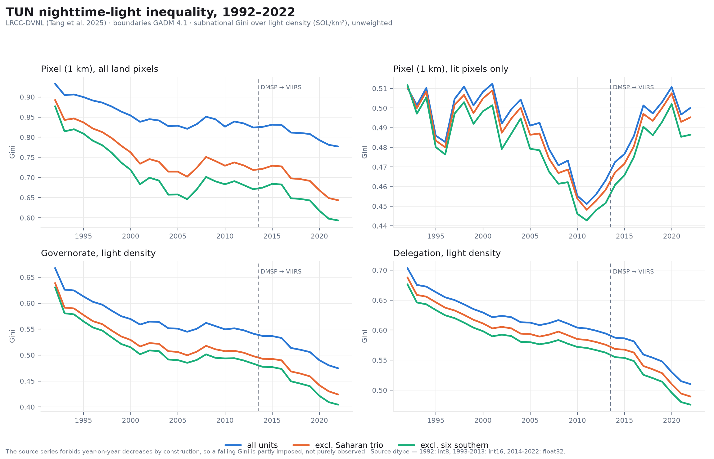
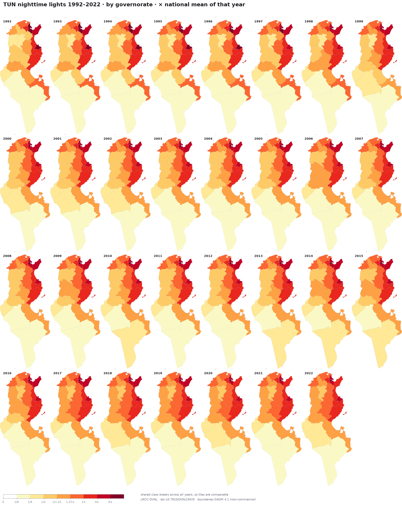

# Figures

Every figure this repository produces, in one place — 608 of them, 47.1 MB.

*This file is generated by `satimg figures build`; edit
[`src/satimg/figures.py`](../src/satimg/figures.py), not this page.*

The renderers write full-resolution output under `data/`, which is gitignored
(439 MB). The gallery is the same figures re-encoded to a 256-colour palette,
with the per-year series capped at 1200 px on the longest side; the charts
and the small-multiple panels keep their native pixels. To regenerate at any
size:

```bash
pip install -e ".[dev]"
satimg lrcc-dvnl overlay                                # global sets
satimg lrcc-dvnl extract    --country TUN --levels 0,1,2
satimg lrcc-dvnl choropleth --country TUN --levels 1,2
satimg lrcc-dvnl inequality --country TUN
satimg figures build --max-px 0                         # 0 = keep full size
```

## Provenance and terms — read before reusing a figure

* **Imagery** — LRCC-DVNL, 1992–2022 at 1 km
  ([paper](https://doi.org/10.1038/s41597-025-05246-8) ·
  [data](https://doi.org/10.7910/DVN/15IKI5))
* **Boundaries** — GADM 4.1 ([gadm.org](https://gadm.org))
* **Projection** — WGS 84 / Equal Earth Greenwich (EPSG:8857)

⚠️ **These figures are not covered by the repository's MIT licence.** They
depict GADM 4.1 boundaries, and GADM's terms are *academic and other
non-commercial use; redistribution or commercial use not allowed without prior
permission*. Reproducing a figure in academic work with the attribution above is
what GADM permits; commercial use is not. The MIT licence applies to the code
only. See [`NOTICE.md`](NOTICE.md) and
[`../docs/overlays.md`](../docs/overlays.md).

No GADM data is committed here: the vector layers, the boundary-mask GeoTIFF
bands and the GID-keyed zonal tables all stay under gitignored `data/`. What is
committed is rendered raster imagery, at a resolution from which the source
geometry cannot be recovered.

Every figure also carries its own provenance and attribution in its footer, so
a figure lifted out of this folder stays self-describing.

## What to look at first

Tunisia, three inequality measures, four levels of aggregation, 1992–2022.

[](charts/TUN_inequality_series.png)

Where the inequality sits: Theil T halves, yet the share of it that is *between* governorates rises — convergence happened within regions, not between them.

[](charts/TUN_theil_decomposition.png)

Governorates coloured by their own light density relative to the national mean of the same year — 31 years at once.

[](panels/choropleth/ylorrd/TUN_adm1_relative_1992-2022.png)

The 2022 global grid with GADM subnational boundaries over it.

[](global/adm1/LACC_2022_adm1.png)

## Summary figures

### Inequality series and Theil decomposition

Gini/Theil T/Theil L over 1992–2022, and the additive between/within split of Theil over the nested pixel → delegation → governorate hierarchy.

`charts/` — 2 file(s)

[TUN_inequality_series](charts/TUN_inequality_series.png) · [TUN_theil_decomposition](charts/TUN_theil_decomposition.png)

### Tunisia raster panels (inferno)

All 31 years of one admin level in a single small-multiple.

`panels/raster/inferno/` — 3 file(s)

[TUN_adm0_1992-2022](panels/raster/inferno/TUN_adm0_1992-2022.png) · [TUN_adm1_1992-2022](panels/raster/inferno/TUN_adm1_1992-2022.png) · [TUN_adm2_1992-2022](panels/raster/inferno/TUN_adm2_1992-2022.png)

### Tunisia raster panels (magma)

All 31 years of one admin level in a single small-multiple.

`panels/raster/magma/` — 3 file(s)

[TUN_adm0_1992-2022](panels/raster/magma/TUN_adm0_1992-2022.png) · [TUN_adm1_1992-2022](panels/raster/magma/TUN_adm1_1992-2022.png) · [TUN_adm2_1992-2022](panels/raster/magma/TUN_adm2_1992-2022.png)

### Tunisia raster panels (cividis)

All 31 years of one admin level in a single small-multiple.

`panels/raster/cividis/` — 3 file(s)

[TUN_adm0_1992-2022](panels/raster/cividis/TUN_adm0_1992-2022.png) · [TUN_adm1_1992-2022](panels/raster/cividis/TUN_adm1_1992-2022.png) · [TUN_adm2_1992-2022](panels/raster/cividis/TUN_adm2_1992-2022.png)

### Tunisia choropleth panels (ylorrd)

Units filled by their own light level, all 31 years at once.

`panels/choropleth/ylorrd/` — 4 file(s)

[TUN_adm1_absolute_1992-2022](panels/choropleth/ylorrd/TUN_adm1_absolute_1992-2022.png) · [TUN_adm1_relative_1992-2022](panels/choropleth/ylorrd/TUN_adm1_relative_1992-2022.png) · [TUN_adm2_absolute_1992-2022](panels/choropleth/ylorrd/TUN_adm2_absolute_1992-2022.png) · [TUN_adm2_relative_1992-2022](panels/choropleth/ylorrd/TUN_adm2_relative_1992-2022.png)

### Tunisia choropleth panels (cividis)

Units filled by their own light level, all 31 years at once.

`panels/choropleth/cividis/` — 4 file(s)

[TUN_adm1_absolute_1992-2022](panels/choropleth/cividis/TUN_adm1_absolute_1992-2022.png) · [TUN_adm1_relative_1992-2022](panels/choropleth/cividis/TUN_adm1_relative_1992-2022.png) · [TUN_adm2_absolute_1992-2022](panels/choropleth/cividis/TUN_adm2_absolute_1992-2022.png) · [TUN_adm2_relative_1992-2022](panels/choropleth/cividis/TUN_adm2_relative_1992-2022.png)

## Tunisia — raster maps

### adm0 · national outline · inferno

Clipped LRCC-DVNL imagery with GADM boundaries over it.

`tunisia/raster/inferno/adm0/` — 31 file(s)

[1992](tunisia/raster/inferno/adm0/LACC_1992_TUN_adm0.png) · [1993](tunisia/raster/inferno/adm0/LACC_1993_TUN_adm0.png) · [1994](tunisia/raster/inferno/adm0/LACC_1994_TUN_adm0.png) · [1995](tunisia/raster/inferno/adm0/LACC_1995_TUN_adm0.png) · [1996](tunisia/raster/inferno/adm0/LACC_1996_TUN_adm0.png) · [1997](tunisia/raster/inferno/adm0/LACC_1997_TUN_adm0.png) · [1998](tunisia/raster/inferno/adm0/LACC_1998_TUN_adm0.png) · [1999](tunisia/raster/inferno/adm0/LACC_1999_TUN_adm0.png) · [2000](tunisia/raster/inferno/adm0/LACC_2000_TUN_adm0.png) · [2001](tunisia/raster/inferno/adm0/LACC_2001_TUN_adm0.png) · [2002](tunisia/raster/inferno/adm0/LACC_2002_TUN_adm0.png) · [2003](tunisia/raster/inferno/adm0/LACC_2003_TUN_adm0.png) · [2004](tunisia/raster/inferno/adm0/LACC_2004_TUN_adm0.png) · [2005](tunisia/raster/inferno/adm0/LACC_2005_TUN_adm0.png) · [2006](tunisia/raster/inferno/adm0/LACC_2006_TUN_adm0.png) · [2007](tunisia/raster/inferno/adm0/LACC_2007_TUN_adm0.png) · [2008](tunisia/raster/inferno/adm0/LACC_2008_TUN_adm0.png) · [2009](tunisia/raster/inferno/adm0/LACC_2009_TUN_adm0.png) · [2010](tunisia/raster/inferno/adm0/LACC_2010_TUN_adm0.png) · [2011](tunisia/raster/inferno/adm0/LACC_2011_TUN_adm0.png) · [2012](tunisia/raster/inferno/adm0/LACC_2012_TUN_adm0.png) · [2013](tunisia/raster/inferno/adm0/LACC_2013_TUN_adm0.png) · [2014](tunisia/raster/inferno/adm0/LACC_2014_TUN_adm0.png) · [2015](tunisia/raster/inferno/adm0/LACC_2015_TUN_adm0.png) · [2016](tunisia/raster/inferno/adm0/LACC_2016_TUN_adm0.png) · [2017](tunisia/raster/inferno/adm0/LACC_2017_TUN_adm0.png) · [2018](tunisia/raster/inferno/adm0/LACC_2018_TUN_adm0.png) · [2019](tunisia/raster/inferno/adm0/LACC_2019_TUN_adm0.png) · [2020](tunisia/raster/inferno/adm0/LACC_2020_TUN_adm0.png) · [2021](tunisia/raster/inferno/adm0/LACC_2021_TUN_adm0.png) · [2022](tunisia/raster/inferno/adm0/LACC_2022_TUN_adm0.png)

### adm1 · governorates · inferno

Clipped LRCC-DVNL imagery with GADM boundaries over it.

`tunisia/raster/inferno/adm1/` — 31 file(s)

[1992](tunisia/raster/inferno/adm1/LACC_1992_TUN_adm1.png) · [1993](tunisia/raster/inferno/adm1/LACC_1993_TUN_adm1.png) · [1994](tunisia/raster/inferno/adm1/LACC_1994_TUN_adm1.png) · [1995](tunisia/raster/inferno/adm1/LACC_1995_TUN_adm1.png) · [1996](tunisia/raster/inferno/adm1/LACC_1996_TUN_adm1.png) · [1997](tunisia/raster/inferno/adm1/LACC_1997_TUN_adm1.png) · [1998](tunisia/raster/inferno/adm1/LACC_1998_TUN_adm1.png) · [1999](tunisia/raster/inferno/adm1/LACC_1999_TUN_adm1.png) · [2000](tunisia/raster/inferno/adm1/LACC_2000_TUN_adm1.png) · [2001](tunisia/raster/inferno/adm1/LACC_2001_TUN_adm1.png) · [2002](tunisia/raster/inferno/adm1/LACC_2002_TUN_adm1.png) · [2003](tunisia/raster/inferno/adm1/LACC_2003_TUN_adm1.png) · [2004](tunisia/raster/inferno/adm1/LACC_2004_TUN_adm1.png) · [2005](tunisia/raster/inferno/adm1/LACC_2005_TUN_adm1.png) · [2006](tunisia/raster/inferno/adm1/LACC_2006_TUN_adm1.png) · [2007](tunisia/raster/inferno/adm1/LACC_2007_TUN_adm1.png) · [2008](tunisia/raster/inferno/adm1/LACC_2008_TUN_adm1.png) · [2009](tunisia/raster/inferno/adm1/LACC_2009_TUN_adm1.png) · [2010](tunisia/raster/inferno/adm1/LACC_2010_TUN_adm1.png) · [2011](tunisia/raster/inferno/adm1/LACC_2011_TUN_adm1.png) · [2012](tunisia/raster/inferno/adm1/LACC_2012_TUN_adm1.png) · [2013](tunisia/raster/inferno/adm1/LACC_2013_TUN_adm1.png) · [2014](tunisia/raster/inferno/adm1/LACC_2014_TUN_adm1.png) · [2015](tunisia/raster/inferno/adm1/LACC_2015_TUN_adm1.png) · [2016](tunisia/raster/inferno/adm1/LACC_2016_TUN_adm1.png) · [2017](tunisia/raster/inferno/adm1/LACC_2017_TUN_adm1.png) · [2018](tunisia/raster/inferno/adm1/LACC_2018_TUN_adm1.png) · [2019](tunisia/raster/inferno/adm1/LACC_2019_TUN_adm1.png) · [2020](tunisia/raster/inferno/adm1/LACC_2020_TUN_adm1.png) · [2021](tunisia/raster/inferno/adm1/LACC_2021_TUN_adm1.png) · [2022](tunisia/raster/inferno/adm1/LACC_2022_TUN_adm1.png)

### adm2 · delegations · inferno

Clipped LRCC-DVNL imagery with GADM boundaries over it.

`tunisia/raster/inferno/adm2/` — 31 file(s)

[1992](tunisia/raster/inferno/adm2/LACC_1992_TUN_adm2.png) · [1993](tunisia/raster/inferno/adm2/LACC_1993_TUN_adm2.png) · [1994](tunisia/raster/inferno/adm2/LACC_1994_TUN_adm2.png) · [1995](tunisia/raster/inferno/adm2/LACC_1995_TUN_adm2.png) · [1996](tunisia/raster/inferno/adm2/LACC_1996_TUN_adm2.png) · [1997](tunisia/raster/inferno/adm2/LACC_1997_TUN_adm2.png) · [1998](tunisia/raster/inferno/adm2/LACC_1998_TUN_adm2.png) · [1999](tunisia/raster/inferno/adm2/LACC_1999_TUN_adm2.png) · [2000](tunisia/raster/inferno/adm2/LACC_2000_TUN_adm2.png) · [2001](tunisia/raster/inferno/adm2/LACC_2001_TUN_adm2.png) · [2002](tunisia/raster/inferno/adm2/LACC_2002_TUN_adm2.png) · [2003](tunisia/raster/inferno/adm2/LACC_2003_TUN_adm2.png) · [2004](tunisia/raster/inferno/adm2/LACC_2004_TUN_adm2.png) · [2005](tunisia/raster/inferno/adm2/LACC_2005_TUN_adm2.png) · [2006](tunisia/raster/inferno/adm2/LACC_2006_TUN_adm2.png) · [2007](tunisia/raster/inferno/adm2/LACC_2007_TUN_adm2.png) · [2008](tunisia/raster/inferno/adm2/LACC_2008_TUN_adm2.png) · [2009](tunisia/raster/inferno/adm2/LACC_2009_TUN_adm2.png) · [2010](tunisia/raster/inferno/adm2/LACC_2010_TUN_adm2.png) · [2011](tunisia/raster/inferno/adm2/LACC_2011_TUN_adm2.png) · [2012](tunisia/raster/inferno/adm2/LACC_2012_TUN_adm2.png) · [2013](tunisia/raster/inferno/adm2/LACC_2013_TUN_adm2.png) · [2014](tunisia/raster/inferno/adm2/LACC_2014_TUN_adm2.png) · [2015](tunisia/raster/inferno/adm2/LACC_2015_TUN_adm2.png) · [2016](tunisia/raster/inferno/adm2/LACC_2016_TUN_adm2.png) · [2017](tunisia/raster/inferno/adm2/LACC_2017_TUN_adm2.png) · [2018](tunisia/raster/inferno/adm2/LACC_2018_TUN_adm2.png) · [2019](tunisia/raster/inferno/adm2/LACC_2019_TUN_adm2.png) · [2020](tunisia/raster/inferno/adm2/LACC_2020_TUN_adm2.png) · [2021](tunisia/raster/inferno/adm2/LACC_2021_TUN_adm2.png) · [2022](tunisia/raster/inferno/adm2/LACC_2022_TUN_adm2.png)

### adm0 · national outline · magma

Clipped LRCC-DVNL imagery with GADM boundaries over it.

`tunisia/raster/magma/adm0/` — 31 file(s)

[1992](tunisia/raster/magma/adm0/LACC_1992_TUN_adm0.png) · [1993](tunisia/raster/magma/adm0/LACC_1993_TUN_adm0.png) · [1994](tunisia/raster/magma/adm0/LACC_1994_TUN_adm0.png) · [1995](tunisia/raster/magma/adm0/LACC_1995_TUN_adm0.png) · [1996](tunisia/raster/magma/adm0/LACC_1996_TUN_adm0.png) · [1997](tunisia/raster/magma/adm0/LACC_1997_TUN_adm0.png) · [1998](tunisia/raster/magma/adm0/LACC_1998_TUN_adm0.png) · [1999](tunisia/raster/magma/adm0/LACC_1999_TUN_adm0.png) · [2000](tunisia/raster/magma/adm0/LACC_2000_TUN_adm0.png) · [2001](tunisia/raster/magma/adm0/LACC_2001_TUN_adm0.png) · [2002](tunisia/raster/magma/adm0/LACC_2002_TUN_adm0.png) · [2003](tunisia/raster/magma/adm0/LACC_2003_TUN_adm0.png) · [2004](tunisia/raster/magma/adm0/LACC_2004_TUN_adm0.png) · [2005](tunisia/raster/magma/adm0/LACC_2005_TUN_adm0.png) · [2006](tunisia/raster/magma/adm0/LACC_2006_TUN_adm0.png) · [2007](tunisia/raster/magma/adm0/LACC_2007_TUN_adm0.png) · [2008](tunisia/raster/magma/adm0/LACC_2008_TUN_adm0.png) · [2009](tunisia/raster/magma/adm0/LACC_2009_TUN_adm0.png) · [2010](tunisia/raster/magma/adm0/LACC_2010_TUN_adm0.png) · [2011](tunisia/raster/magma/adm0/LACC_2011_TUN_adm0.png) · [2012](tunisia/raster/magma/adm0/LACC_2012_TUN_adm0.png) · [2013](tunisia/raster/magma/adm0/LACC_2013_TUN_adm0.png) · [2014](tunisia/raster/magma/adm0/LACC_2014_TUN_adm0.png) · [2015](tunisia/raster/magma/adm0/LACC_2015_TUN_adm0.png) · [2016](tunisia/raster/magma/adm0/LACC_2016_TUN_adm0.png) · [2017](tunisia/raster/magma/adm0/LACC_2017_TUN_adm0.png) · [2018](tunisia/raster/magma/adm0/LACC_2018_TUN_adm0.png) · [2019](tunisia/raster/magma/adm0/LACC_2019_TUN_adm0.png) · [2020](tunisia/raster/magma/adm0/LACC_2020_TUN_adm0.png) · [2021](tunisia/raster/magma/adm0/LACC_2021_TUN_adm0.png) · [2022](tunisia/raster/magma/adm0/LACC_2022_TUN_adm0.png)

### adm1 · governorates · magma

Clipped LRCC-DVNL imagery with GADM boundaries over it.

`tunisia/raster/magma/adm1/` — 31 file(s)

[1992](tunisia/raster/magma/adm1/LACC_1992_TUN_adm1.png) · [1993](tunisia/raster/magma/adm1/LACC_1993_TUN_adm1.png) · [1994](tunisia/raster/magma/adm1/LACC_1994_TUN_adm1.png) · [1995](tunisia/raster/magma/adm1/LACC_1995_TUN_adm1.png) · [1996](tunisia/raster/magma/adm1/LACC_1996_TUN_adm1.png) · [1997](tunisia/raster/magma/adm1/LACC_1997_TUN_adm1.png) · [1998](tunisia/raster/magma/adm1/LACC_1998_TUN_adm1.png) · [1999](tunisia/raster/magma/adm1/LACC_1999_TUN_adm1.png) · [2000](tunisia/raster/magma/adm1/LACC_2000_TUN_adm1.png) · [2001](tunisia/raster/magma/adm1/LACC_2001_TUN_adm1.png) · [2002](tunisia/raster/magma/adm1/LACC_2002_TUN_adm1.png) · [2003](tunisia/raster/magma/adm1/LACC_2003_TUN_adm1.png) · [2004](tunisia/raster/magma/adm1/LACC_2004_TUN_adm1.png) · [2005](tunisia/raster/magma/adm1/LACC_2005_TUN_adm1.png) · [2006](tunisia/raster/magma/adm1/LACC_2006_TUN_adm1.png) · [2007](tunisia/raster/magma/adm1/LACC_2007_TUN_adm1.png) · [2008](tunisia/raster/magma/adm1/LACC_2008_TUN_adm1.png) · [2009](tunisia/raster/magma/adm1/LACC_2009_TUN_adm1.png) · [2010](tunisia/raster/magma/adm1/LACC_2010_TUN_adm1.png) · [2011](tunisia/raster/magma/adm1/LACC_2011_TUN_adm1.png) · [2012](tunisia/raster/magma/adm1/LACC_2012_TUN_adm1.png) · [2013](tunisia/raster/magma/adm1/LACC_2013_TUN_adm1.png) · [2014](tunisia/raster/magma/adm1/LACC_2014_TUN_adm1.png) · [2015](tunisia/raster/magma/adm1/LACC_2015_TUN_adm1.png) · [2016](tunisia/raster/magma/adm1/LACC_2016_TUN_adm1.png) · [2017](tunisia/raster/magma/adm1/LACC_2017_TUN_adm1.png) · [2018](tunisia/raster/magma/adm1/LACC_2018_TUN_adm1.png) · [2019](tunisia/raster/magma/adm1/LACC_2019_TUN_adm1.png) · [2020](tunisia/raster/magma/adm1/LACC_2020_TUN_adm1.png) · [2021](tunisia/raster/magma/adm1/LACC_2021_TUN_adm1.png) · [2022](tunisia/raster/magma/adm1/LACC_2022_TUN_adm1.png)

### adm2 · delegations · magma

Clipped LRCC-DVNL imagery with GADM boundaries over it.

`tunisia/raster/magma/adm2/` — 31 file(s)

[1992](tunisia/raster/magma/adm2/LACC_1992_TUN_adm2.png) · [1993](tunisia/raster/magma/adm2/LACC_1993_TUN_adm2.png) · [1994](tunisia/raster/magma/adm2/LACC_1994_TUN_adm2.png) · [1995](tunisia/raster/magma/adm2/LACC_1995_TUN_adm2.png) · [1996](tunisia/raster/magma/adm2/LACC_1996_TUN_adm2.png) · [1997](tunisia/raster/magma/adm2/LACC_1997_TUN_adm2.png) · [1998](tunisia/raster/magma/adm2/LACC_1998_TUN_adm2.png) · [1999](tunisia/raster/magma/adm2/LACC_1999_TUN_adm2.png) · [2000](tunisia/raster/magma/adm2/LACC_2000_TUN_adm2.png) · [2001](tunisia/raster/magma/adm2/LACC_2001_TUN_adm2.png) · [2002](tunisia/raster/magma/adm2/LACC_2002_TUN_adm2.png) · [2003](tunisia/raster/magma/adm2/LACC_2003_TUN_adm2.png) · [2004](tunisia/raster/magma/adm2/LACC_2004_TUN_adm2.png) · [2005](tunisia/raster/magma/adm2/LACC_2005_TUN_adm2.png) · [2006](tunisia/raster/magma/adm2/LACC_2006_TUN_adm2.png) · [2007](tunisia/raster/magma/adm2/LACC_2007_TUN_adm2.png) · [2008](tunisia/raster/magma/adm2/LACC_2008_TUN_adm2.png) · [2009](tunisia/raster/magma/adm2/LACC_2009_TUN_adm2.png) · [2010](tunisia/raster/magma/adm2/LACC_2010_TUN_adm2.png) · [2011](tunisia/raster/magma/adm2/LACC_2011_TUN_adm2.png) · [2012](tunisia/raster/magma/adm2/LACC_2012_TUN_adm2.png) · [2013](tunisia/raster/magma/adm2/LACC_2013_TUN_adm2.png) · [2014](tunisia/raster/magma/adm2/LACC_2014_TUN_adm2.png) · [2015](tunisia/raster/magma/adm2/LACC_2015_TUN_adm2.png) · [2016](tunisia/raster/magma/adm2/LACC_2016_TUN_adm2.png) · [2017](tunisia/raster/magma/adm2/LACC_2017_TUN_adm2.png) · [2018](tunisia/raster/magma/adm2/LACC_2018_TUN_adm2.png) · [2019](tunisia/raster/magma/adm2/LACC_2019_TUN_adm2.png) · [2020](tunisia/raster/magma/adm2/LACC_2020_TUN_adm2.png) · [2021](tunisia/raster/magma/adm2/LACC_2021_TUN_adm2.png) · [2022](tunisia/raster/magma/adm2/LACC_2022_TUN_adm2.png)

### adm0 · national outline · cividis

Clipped LRCC-DVNL imagery with GADM boundaries over it.

`tunisia/raster/cividis/adm0/` — 31 file(s)

[1992](tunisia/raster/cividis/adm0/LACC_1992_TUN_adm0.png) · [1993](tunisia/raster/cividis/adm0/LACC_1993_TUN_adm0.png) · [1994](tunisia/raster/cividis/adm0/LACC_1994_TUN_adm0.png) · [1995](tunisia/raster/cividis/adm0/LACC_1995_TUN_adm0.png) · [1996](tunisia/raster/cividis/adm0/LACC_1996_TUN_adm0.png) · [1997](tunisia/raster/cividis/adm0/LACC_1997_TUN_adm0.png) · [1998](tunisia/raster/cividis/adm0/LACC_1998_TUN_adm0.png) · [1999](tunisia/raster/cividis/adm0/LACC_1999_TUN_adm0.png) · [2000](tunisia/raster/cividis/adm0/LACC_2000_TUN_adm0.png) · [2001](tunisia/raster/cividis/adm0/LACC_2001_TUN_adm0.png) · [2002](tunisia/raster/cividis/adm0/LACC_2002_TUN_adm0.png) · [2003](tunisia/raster/cividis/adm0/LACC_2003_TUN_adm0.png) · [2004](tunisia/raster/cividis/adm0/LACC_2004_TUN_adm0.png) · [2005](tunisia/raster/cividis/adm0/LACC_2005_TUN_adm0.png) · [2006](tunisia/raster/cividis/adm0/LACC_2006_TUN_adm0.png) · [2007](tunisia/raster/cividis/adm0/LACC_2007_TUN_adm0.png) · [2008](tunisia/raster/cividis/adm0/LACC_2008_TUN_adm0.png) · [2009](tunisia/raster/cividis/adm0/LACC_2009_TUN_adm0.png) · [2010](tunisia/raster/cividis/adm0/LACC_2010_TUN_adm0.png) · [2011](tunisia/raster/cividis/adm0/LACC_2011_TUN_adm0.png) · [2012](tunisia/raster/cividis/adm0/LACC_2012_TUN_adm0.png) · [2013](tunisia/raster/cividis/adm0/LACC_2013_TUN_adm0.png) · [2014](tunisia/raster/cividis/adm0/LACC_2014_TUN_adm0.png) · [2015](tunisia/raster/cividis/adm0/LACC_2015_TUN_adm0.png) · [2016](tunisia/raster/cividis/adm0/LACC_2016_TUN_adm0.png) · [2017](tunisia/raster/cividis/adm0/LACC_2017_TUN_adm0.png) · [2018](tunisia/raster/cividis/adm0/LACC_2018_TUN_adm0.png) · [2019](tunisia/raster/cividis/adm0/LACC_2019_TUN_adm0.png) · [2020](tunisia/raster/cividis/adm0/LACC_2020_TUN_adm0.png) · [2021](tunisia/raster/cividis/adm0/LACC_2021_TUN_adm0.png) · [2022](tunisia/raster/cividis/adm0/LACC_2022_TUN_adm0.png)

### adm1 · governorates · cividis

Clipped LRCC-DVNL imagery with GADM boundaries over it.

`tunisia/raster/cividis/adm1/` — 31 file(s)

[1992](tunisia/raster/cividis/adm1/LACC_1992_TUN_adm1.png) · [1993](tunisia/raster/cividis/adm1/LACC_1993_TUN_adm1.png) · [1994](tunisia/raster/cividis/adm1/LACC_1994_TUN_adm1.png) · [1995](tunisia/raster/cividis/adm1/LACC_1995_TUN_adm1.png) · [1996](tunisia/raster/cividis/adm1/LACC_1996_TUN_adm1.png) · [1997](tunisia/raster/cividis/adm1/LACC_1997_TUN_adm1.png) · [1998](tunisia/raster/cividis/adm1/LACC_1998_TUN_adm1.png) · [1999](tunisia/raster/cividis/adm1/LACC_1999_TUN_adm1.png) · [2000](tunisia/raster/cividis/adm1/LACC_2000_TUN_adm1.png) · [2001](tunisia/raster/cividis/adm1/LACC_2001_TUN_adm1.png) · [2002](tunisia/raster/cividis/adm1/LACC_2002_TUN_adm1.png) · [2003](tunisia/raster/cividis/adm1/LACC_2003_TUN_adm1.png) · [2004](tunisia/raster/cividis/adm1/LACC_2004_TUN_adm1.png) · [2005](tunisia/raster/cividis/adm1/LACC_2005_TUN_adm1.png) · [2006](tunisia/raster/cividis/adm1/LACC_2006_TUN_adm1.png) · [2007](tunisia/raster/cividis/adm1/LACC_2007_TUN_adm1.png) · [2008](tunisia/raster/cividis/adm1/LACC_2008_TUN_adm1.png) · [2009](tunisia/raster/cividis/adm1/LACC_2009_TUN_adm1.png) · [2010](tunisia/raster/cividis/adm1/LACC_2010_TUN_adm1.png) · [2011](tunisia/raster/cividis/adm1/LACC_2011_TUN_adm1.png) · [2012](tunisia/raster/cividis/adm1/LACC_2012_TUN_adm1.png) · [2013](tunisia/raster/cividis/adm1/LACC_2013_TUN_adm1.png) · [2014](tunisia/raster/cividis/adm1/LACC_2014_TUN_adm1.png) · [2015](tunisia/raster/cividis/adm1/LACC_2015_TUN_adm1.png) · [2016](tunisia/raster/cividis/adm1/LACC_2016_TUN_adm1.png) · [2017](tunisia/raster/cividis/adm1/LACC_2017_TUN_adm1.png) · [2018](tunisia/raster/cividis/adm1/LACC_2018_TUN_adm1.png) · [2019](tunisia/raster/cividis/adm1/LACC_2019_TUN_adm1.png) · [2020](tunisia/raster/cividis/adm1/LACC_2020_TUN_adm1.png) · [2021](tunisia/raster/cividis/adm1/LACC_2021_TUN_adm1.png) · [2022](tunisia/raster/cividis/adm1/LACC_2022_TUN_adm1.png)

### adm2 · delegations · cividis

Clipped LRCC-DVNL imagery with GADM boundaries over it.

`tunisia/raster/cividis/adm2/` — 31 file(s)

[1992](tunisia/raster/cividis/adm2/LACC_1992_TUN_adm2.png) · [1993](tunisia/raster/cividis/adm2/LACC_1993_TUN_adm2.png) · [1994](tunisia/raster/cividis/adm2/LACC_1994_TUN_adm2.png) · [1995](tunisia/raster/cividis/adm2/LACC_1995_TUN_adm2.png) · [1996](tunisia/raster/cividis/adm2/LACC_1996_TUN_adm2.png) · [1997](tunisia/raster/cividis/adm2/LACC_1997_TUN_adm2.png) · [1998](tunisia/raster/cividis/adm2/LACC_1998_TUN_adm2.png) · [1999](tunisia/raster/cividis/adm2/LACC_1999_TUN_adm2.png) · [2000](tunisia/raster/cividis/adm2/LACC_2000_TUN_adm2.png) · [2001](tunisia/raster/cividis/adm2/LACC_2001_TUN_adm2.png) · [2002](tunisia/raster/cividis/adm2/LACC_2002_TUN_adm2.png) · [2003](tunisia/raster/cividis/adm2/LACC_2003_TUN_adm2.png) · [2004](tunisia/raster/cividis/adm2/LACC_2004_TUN_adm2.png) · [2005](tunisia/raster/cividis/adm2/LACC_2005_TUN_adm2.png) · [2006](tunisia/raster/cividis/adm2/LACC_2006_TUN_adm2.png) · [2007](tunisia/raster/cividis/adm2/LACC_2007_TUN_adm2.png) · [2008](tunisia/raster/cividis/adm2/LACC_2008_TUN_adm2.png) · [2009](tunisia/raster/cividis/adm2/LACC_2009_TUN_adm2.png) · [2010](tunisia/raster/cividis/adm2/LACC_2010_TUN_adm2.png) · [2011](tunisia/raster/cividis/adm2/LACC_2011_TUN_adm2.png) · [2012](tunisia/raster/cividis/adm2/LACC_2012_TUN_adm2.png) · [2013](tunisia/raster/cividis/adm2/LACC_2013_TUN_adm2.png) · [2014](tunisia/raster/cividis/adm2/LACC_2014_TUN_adm2.png) · [2015](tunisia/raster/cividis/adm2/LACC_2015_TUN_adm2.png) · [2016](tunisia/raster/cividis/adm2/LACC_2016_TUN_adm2.png) · [2017](tunisia/raster/cividis/adm2/LACC_2017_TUN_adm2.png) · [2018](tunisia/raster/cividis/adm2/LACC_2018_TUN_adm2.png) · [2019](tunisia/raster/cividis/adm2/LACC_2019_TUN_adm2.png) · [2020](tunisia/raster/cividis/adm2/LACC_2020_TUN_adm2.png) · [2021](tunisia/raster/cividis/adm2/LACC_2021_TUN_adm2.png) · [2022](tunisia/raster/cividis/adm2/LACC_2022_TUN_adm2.png)

## Tunisia — choropleths

### adm1 · governorates · absolute · ylorrd

absolute (shared scale across years)

`tunisia/choropleth/ylorrd/adm1/absolute/` — 31 file(s)

[1992](tunisia/choropleth/ylorrd/adm1/absolute/LACC_1992_TUN_adm1_absolute.png) · [1993](tunisia/choropleth/ylorrd/adm1/absolute/LACC_1993_TUN_adm1_absolute.png) · [1994](tunisia/choropleth/ylorrd/adm1/absolute/LACC_1994_TUN_adm1_absolute.png) · [1995](tunisia/choropleth/ylorrd/adm1/absolute/LACC_1995_TUN_adm1_absolute.png) · [1996](tunisia/choropleth/ylorrd/adm1/absolute/LACC_1996_TUN_adm1_absolute.png) · [1997](tunisia/choropleth/ylorrd/adm1/absolute/LACC_1997_TUN_adm1_absolute.png) · [1998](tunisia/choropleth/ylorrd/adm1/absolute/LACC_1998_TUN_adm1_absolute.png) · [1999](tunisia/choropleth/ylorrd/adm1/absolute/LACC_1999_TUN_adm1_absolute.png) · [2000](tunisia/choropleth/ylorrd/adm1/absolute/LACC_2000_TUN_adm1_absolute.png) · [2001](tunisia/choropleth/ylorrd/adm1/absolute/LACC_2001_TUN_adm1_absolute.png) · [2002](tunisia/choropleth/ylorrd/adm1/absolute/LACC_2002_TUN_adm1_absolute.png) · [2003](tunisia/choropleth/ylorrd/adm1/absolute/LACC_2003_TUN_adm1_absolute.png) · [2004](tunisia/choropleth/ylorrd/adm1/absolute/LACC_2004_TUN_adm1_absolute.png) · [2005](tunisia/choropleth/ylorrd/adm1/absolute/LACC_2005_TUN_adm1_absolute.png) · [2006](tunisia/choropleth/ylorrd/adm1/absolute/LACC_2006_TUN_adm1_absolute.png) · [2007](tunisia/choropleth/ylorrd/adm1/absolute/LACC_2007_TUN_adm1_absolute.png) · [2008](tunisia/choropleth/ylorrd/adm1/absolute/LACC_2008_TUN_adm1_absolute.png) · [2009](tunisia/choropleth/ylorrd/adm1/absolute/LACC_2009_TUN_adm1_absolute.png) · [2010](tunisia/choropleth/ylorrd/adm1/absolute/LACC_2010_TUN_adm1_absolute.png) · [2011](tunisia/choropleth/ylorrd/adm1/absolute/LACC_2011_TUN_adm1_absolute.png) · [2012](tunisia/choropleth/ylorrd/adm1/absolute/LACC_2012_TUN_adm1_absolute.png) · [2013](tunisia/choropleth/ylorrd/adm1/absolute/LACC_2013_TUN_adm1_absolute.png) · [2014](tunisia/choropleth/ylorrd/adm1/absolute/LACC_2014_TUN_adm1_absolute.png) · [2015](tunisia/choropleth/ylorrd/adm1/absolute/LACC_2015_TUN_adm1_absolute.png) · [2016](tunisia/choropleth/ylorrd/adm1/absolute/LACC_2016_TUN_adm1_absolute.png) · [2017](tunisia/choropleth/ylorrd/adm1/absolute/LACC_2017_TUN_adm1_absolute.png) · [2018](tunisia/choropleth/ylorrd/adm1/absolute/LACC_2018_TUN_adm1_absolute.png) · [2019](tunisia/choropleth/ylorrd/adm1/absolute/LACC_2019_TUN_adm1_absolute.png) · [2020](tunisia/choropleth/ylorrd/adm1/absolute/LACC_2020_TUN_adm1_absolute.png) · [2021](tunisia/choropleth/ylorrd/adm1/absolute/LACC_2021_TUN_adm1_absolute.png) · [2022](tunisia/choropleth/ylorrd/adm1/absolute/LACC_2022_TUN_adm1_absolute.png)

### adm1 · governorates · relative · ylorrd

relative to the national mean of the same year

`tunisia/choropleth/ylorrd/adm1/relative/` — 31 file(s)

[1992](tunisia/choropleth/ylorrd/adm1/relative/LACC_1992_TUN_adm1_relative.png) · [1993](tunisia/choropleth/ylorrd/adm1/relative/LACC_1993_TUN_adm1_relative.png) · [1994](tunisia/choropleth/ylorrd/adm1/relative/LACC_1994_TUN_adm1_relative.png) · [1995](tunisia/choropleth/ylorrd/adm1/relative/LACC_1995_TUN_adm1_relative.png) · [1996](tunisia/choropleth/ylorrd/adm1/relative/LACC_1996_TUN_adm1_relative.png) · [1997](tunisia/choropleth/ylorrd/adm1/relative/LACC_1997_TUN_adm1_relative.png) · [1998](tunisia/choropleth/ylorrd/adm1/relative/LACC_1998_TUN_adm1_relative.png) · [1999](tunisia/choropleth/ylorrd/adm1/relative/LACC_1999_TUN_adm1_relative.png) · [2000](tunisia/choropleth/ylorrd/adm1/relative/LACC_2000_TUN_adm1_relative.png) · [2001](tunisia/choropleth/ylorrd/adm1/relative/LACC_2001_TUN_adm1_relative.png) · [2002](tunisia/choropleth/ylorrd/adm1/relative/LACC_2002_TUN_adm1_relative.png) · [2003](tunisia/choropleth/ylorrd/adm1/relative/LACC_2003_TUN_adm1_relative.png) · [2004](tunisia/choropleth/ylorrd/adm1/relative/LACC_2004_TUN_adm1_relative.png) · [2005](tunisia/choropleth/ylorrd/adm1/relative/LACC_2005_TUN_adm1_relative.png) · [2006](tunisia/choropleth/ylorrd/adm1/relative/LACC_2006_TUN_adm1_relative.png) · [2007](tunisia/choropleth/ylorrd/adm1/relative/LACC_2007_TUN_adm1_relative.png) · [2008](tunisia/choropleth/ylorrd/adm1/relative/LACC_2008_TUN_adm1_relative.png) · [2009](tunisia/choropleth/ylorrd/adm1/relative/LACC_2009_TUN_adm1_relative.png) · [2010](tunisia/choropleth/ylorrd/adm1/relative/LACC_2010_TUN_adm1_relative.png) · [2011](tunisia/choropleth/ylorrd/adm1/relative/LACC_2011_TUN_adm1_relative.png) · [2012](tunisia/choropleth/ylorrd/adm1/relative/LACC_2012_TUN_adm1_relative.png) · [2013](tunisia/choropleth/ylorrd/adm1/relative/LACC_2013_TUN_adm1_relative.png) · [2014](tunisia/choropleth/ylorrd/adm1/relative/LACC_2014_TUN_adm1_relative.png) · [2015](tunisia/choropleth/ylorrd/adm1/relative/LACC_2015_TUN_adm1_relative.png) · [2016](tunisia/choropleth/ylorrd/adm1/relative/LACC_2016_TUN_adm1_relative.png) · [2017](tunisia/choropleth/ylorrd/adm1/relative/LACC_2017_TUN_adm1_relative.png) · [2018](tunisia/choropleth/ylorrd/adm1/relative/LACC_2018_TUN_adm1_relative.png) · [2019](tunisia/choropleth/ylorrd/adm1/relative/LACC_2019_TUN_adm1_relative.png) · [2020](tunisia/choropleth/ylorrd/adm1/relative/LACC_2020_TUN_adm1_relative.png) · [2021](tunisia/choropleth/ylorrd/adm1/relative/LACC_2021_TUN_adm1_relative.png) · [2022](tunisia/choropleth/ylorrd/adm1/relative/LACC_2022_TUN_adm1_relative.png)

### adm2 · delegations · absolute · ylorrd

absolute (shared scale across years)

`tunisia/choropleth/ylorrd/adm2/absolute/` — 31 file(s)

[1992](tunisia/choropleth/ylorrd/adm2/absolute/LACC_1992_TUN_adm2_absolute.png) · [1993](tunisia/choropleth/ylorrd/adm2/absolute/LACC_1993_TUN_adm2_absolute.png) · [1994](tunisia/choropleth/ylorrd/adm2/absolute/LACC_1994_TUN_adm2_absolute.png) · [1995](tunisia/choropleth/ylorrd/adm2/absolute/LACC_1995_TUN_adm2_absolute.png) · [1996](tunisia/choropleth/ylorrd/adm2/absolute/LACC_1996_TUN_adm2_absolute.png) · [1997](tunisia/choropleth/ylorrd/adm2/absolute/LACC_1997_TUN_adm2_absolute.png) · [1998](tunisia/choropleth/ylorrd/adm2/absolute/LACC_1998_TUN_adm2_absolute.png) · [1999](tunisia/choropleth/ylorrd/adm2/absolute/LACC_1999_TUN_adm2_absolute.png) · [2000](tunisia/choropleth/ylorrd/adm2/absolute/LACC_2000_TUN_adm2_absolute.png) · [2001](tunisia/choropleth/ylorrd/adm2/absolute/LACC_2001_TUN_adm2_absolute.png) · [2002](tunisia/choropleth/ylorrd/adm2/absolute/LACC_2002_TUN_adm2_absolute.png) · [2003](tunisia/choropleth/ylorrd/adm2/absolute/LACC_2003_TUN_adm2_absolute.png) · [2004](tunisia/choropleth/ylorrd/adm2/absolute/LACC_2004_TUN_adm2_absolute.png) · [2005](tunisia/choropleth/ylorrd/adm2/absolute/LACC_2005_TUN_adm2_absolute.png) · [2006](tunisia/choropleth/ylorrd/adm2/absolute/LACC_2006_TUN_adm2_absolute.png) · [2007](tunisia/choropleth/ylorrd/adm2/absolute/LACC_2007_TUN_adm2_absolute.png) · [2008](tunisia/choropleth/ylorrd/adm2/absolute/LACC_2008_TUN_adm2_absolute.png) · [2009](tunisia/choropleth/ylorrd/adm2/absolute/LACC_2009_TUN_adm2_absolute.png) · [2010](tunisia/choropleth/ylorrd/adm2/absolute/LACC_2010_TUN_adm2_absolute.png) · [2011](tunisia/choropleth/ylorrd/adm2/absolute/LACC_2011_TUN_adm2_absolute.png) · [2012](tunisia/choropleth/ylorrd/adm2/absolute/LACC_2012_TUN_adm2_absolute.png) · [2013](tunisia/choropleth/ylorrd/adm2/absolute/LACC_2013_TUN_adm2_absolute.png) · [2014](tunisia/choropleth/ylorrd/adm2/absolute/LACC_2014_TUN_adm2_absolute.png) · [2015](tunisia/choropleth/ylorrd/adm2/absolute/LACC_2015_TUN_adm2_absolute.png) · [2016](tunisia/choropleth/ylorrd/adm2/absolute/LACC_2016_TUN_adm2_absolute.png) · [2017](tunisia/choropleth/ylorrd/adm2/absolute/LACC_2017_TUN_adm2_absolute.png) · [2018](tunisia/choropleth/ylorrd/adm2/absolute/LACC_2018_TUN_adm2_absolute.png) · [2019](tunisia/choropleth/ylorrd/adm2/absolute/LACC_2019_TUN_adm2_absolute.png) · [2020](tunisia/choropleth/ylorrd/adm2/absolute/LACC_2020_TUN_adm2_absolute.png) · [2021](tunisia/choropleth/ylorrd/adm2/absolute/LACC_2021_TUN_adm2_absolute.png) · [2022](tunisia/choropleth/ylorrd/adm2/absolute/LACC_2022_TUN_adm2_absolute.png)

### adm2 · delegations · relative · ylorrd

relative to the national mean of the same year

`tunisia/choropleth/ylorrd/adm2/relative/` — 31 file(s)

[1992](tunisia/choropleth/ylorrd/adm2/relative/LACC_1992_TUN_adm2_relative.png) · [1993](tunisia/choropleth/ylorrd/adm2/relative/LACC_1993_TUN_adm2_relative.png) · [1994](tunisia/choropleth/ylorrd/adm2/relative/LACC_1994_TUN_adm2_relative.png) · [1995](tunisia/choropleth/ylorrd/adm2/relative/LACC_1995_TUN_adm2_relative.png) · [1996](tunisia/choropleth/ylorrd/adm2/relative/LACC_1996_TUN_adm2_relative.png) · [1997](tunisia/choropleth/ylorrd/adm2/relative/LACC_1997_TUN_adm2_relative.png) · [1998](tunisia/choropleth/ylorrd/adm2/relative/LACC_1998_TUN_adm2_relative.png) · [1999](tunisia/choropleth/ylorrd/adm2/relative/LACC_1999_TUN_adm2_relative.png) · [2000](tunisia/choropleth/ylorrd/adm2/relative/LACC_2000_TUN_adm2_relative.png) · [2001](tunisia/choropleth/ylorrd/adm2/relative/LACC_2001_TUN_adm2_relative.png) · [2002](tunisia/choropleth/ylorrd/adm2/relative/LACC_2002_TUN_adm2_relative.png) · [2003](tunisia/choropleth/ylorrd/adm2/relative/LACC_2003_TUN_adm2_relative.png) · [2004](tunisia/choropleth/ylorrd/adm2/relative/LACC_2004_TUN_adm2_relative.png) · [2005](tunisia/choropleth/ylorrd/adm2/relative/LACC_2005_TUN_adm2_relative.png) · [2006](tunisia/choropleth/ylorrd/adm2/relative/LACC_2006_TUN_adm2_relative.png) · [2007](tunisia/choropleth/ylorrd/adm2/relative/LACC_2007_TUN_adm2_relative.png) · [2008](tunisia/choropleth/ylorrd/adm2/relative/LACC_2008_TUN_adm2_relative.png) · [2009](tunisia/choropleth/ylorrd/adm2/relative/LACC_2009_TUN_adm2_relative.png) · [2010](tunisia/choropleth/ylorrd/adm2/relative/LACC_2010_TUN_adm2_relative.png) · [2011](tunisia/choropleth/ylorrd/adm2/relative/LACC_2011_TUN_adm2_relative.png) · [2012](tunisia/choropleth/ylorrd/adm2/relative/LACC_2012_TUN_adm2_relative.png) · [2013](tunisia/choropleth/ylorrd/adm2/relative/LACC_2013_TUN_adm2_relative.png) · [2014](tunisia/choropleth/ylorrd/adm2/relative/LACC_2014_TUN_adm2_relative.png) · [2015](tunisia/choropleth/ylorrd/adm2/relative/LACC_2015_TUN_adm2_relative.png) · [2016](tunisia/choropleth/ylorrd/adm2/relative/LACC_2016_TUN_adm2_relative.png) · [2017](tunisia/choropleth/ylorrd/adm2/relative/LACC_2017_TUN_adm2_relative.png) · [2018](tunisia/choropleth/ylorrd/adm2/relative/LACC_2018_TUN_adm2_relative.png) · [2019](tunisia/choropleth/ylorrd/adm2/relative/LACC_2019_TUN_adm2_relative.png) · [2020](tunisia/choropleth/ylorrd/adm2/relative/LACC_2020_TUN_adm2_relative.png) · [2021](tunisia/choropleth/ylorrd/adm2/relative/LACC_2021_TUN_adm2_relative.png) · [2022](tunisia/choropleth/ylorrd/adm2/relative/LACC_2022_TUN_adm2_relative.png)

### adm1 · governorates · absolute · cividis

absolute (shared scale across years)

`tunisia/choropleth/cividis/adm1/absolute/` — 31 file(s)

[1992](tunisia/choropleth/cividis/adm1/absolute/LACC_1992_TUN_adm1_absolute.png) · [1993](tunisia/choropleth/cividis/adm1/absolute/LACC_1993_TUN_adm1_absolute.png) · [1994](tunisia/choropleth/cividis/adm1/absolute/LACC_1994_TUN_adm1_absolute.png) · [1995](tunisia/choropleth/cividis/adm1/absolute/LACC_1995_TUN_adm1_absolute.png) · [1996](tunisia/choropleth/cividis/adm1/absolute/LACC_1996_TUN_adm1_absolute.png) · [1997](tunisia/choropleth/cividis/adm1/absolute/LACC_1997_TUN_adm1_absolute.png) · [1998](tunisia/choropleth/cividis/adm1/absolute/LACC_1998_TUN_adm1_absolute.png) · [1999](tunisia/choropleth/cividis/adm1/absolute/LACC_1999_TUN_adm1_absolute.png) · [2000](tunisia/choropleth/cividis/adm1/absolute/LACC_2000_TUN_adm1_absolute.png) · [2001](tunisia/choropleth/cividis/adm1/absolute/LACC_2001_TUN_adm1_absolute.png) · [2002](tunisia/choropleth/cividis/adm1/absolute/LACC_2002_TUN_adm1_absolute.png) · [2003](tunisia/choropleth/cividis/adm1/absolute/LACC_2003_TUN_adm1_absolute.png) · [2004](tunisia/choropleth/cividis/adm1/absolute/LACC_2004_TUN_adm1_absolute.png) · [2005](tunisia/choropleth/cividis/adm1/absolute/LACC_2005_TUN_adm1_absolute.png) · [2006](tunisia/choropleth/cividis/adm1/absolute/LACC_2006_TUN_adm1_absolute.png) · [2007](tunisia/choropleth/cividis/adm1/absolute/LACC_2007_TUN_adm1_absolute.png) · [2008](tunisia/choropleth/cividis/adm1/absolute/LACC_2008_TUN_adm1_absolute.png) · [2009](tunisia/choropleth/cividis/adm1/absolute/LACC_2009_TUN_adm1_absolute.png) · [2010](tunisia/choropleth/cividis/adm1/absolute/LACC_2010_TUN_adm1_absolute.png) · [2011](tunisia/choropleth/cividis/adm1/absolute/LACC_2011_TUN_adm1_absolute.png) · [2012](tunisia/choropleth/cividis/adm1/absolute/LACC_2012_TUN_adm1_absolute.png) · [2013](tunisia/choropleth/cividis/adm1/absolute/LACC_2013_TUN_adm1_absolute.png) · [2014](tunisia/choropleth/cividis/adm1/absolute/LACC_2014_TUN_adm1_absolute.png) · [2015](tunisia/choropleth/cividis/adm1/absolute/LACC_2015_TUN_adm1_absolute.png) · [2016](tunisia/choropleth/cividis/adm1/absolute/LACC_2016_TUN_adm1_absolute.png) · [2017](tunisia/choropleth/cividis/adm1/absolute/LACC_2017_TUN_adm1_absolute.png) · [2018](tunisia/choropleth/cividis/adm1/absolute/LACC_2018_TUN_adm1_absolute.png) · [2019](tunisia/choropleth/cividis/adm1/absolute/LACC_2019_TUN_adm1_absolute.png) · [2020](tunisia/choropleth/cividis/adm1/absolute/LACC_2020_TUN_adm1_absolute.png) · [2021](tunisia/choropleth/cividis/adm1/absolute/LACC_2021_TUN_adm1_absolute.png) · [2022](tunisia/choropleth/cividis/adm1/absolute/LACC_2022_TUN_adm1_absolute.png)

### adm1 · governorates · relative · cividis

relative to the national mean of the same year

`tunisia/choropleth/cividis/adm1/relative/` — 31 file(s)

[1992](tunisia/choropleth/cividis/adm1/relative/LACC_1992_TUN_adm1_relative.png) · [1993](tunisia/choropleth/cividis/adm1/relative/LACC_1993_TUN_adm1_relative.png) · [1994](tunisia/choropleth/cividis/adm1/relative/LACC_1994_TUN_adm1_relative.png) · [1995](tunisia/choropleth/cividis/adm1/relative/LACC_1995_TUN_adm1_relative.png) · [1996](tunisia/choropleth/cividis/adm1/relative/LACC_1996_TUN_adm1_relative.png) · [1997](tunisia/choropleth/cividis/adm1/relative/LACC_1997_TUN_adm1_relative.png) · [1998](tunisia/choropleth/cividis/adm1/relative/LACC_1998_TUN_adm1_relative.png) · [1999](tunisia/choropleth/cividis/adm1/relative/LACC_1999_TUN_adm1_relative.png) · [2000](tunisia/choropleth/cividis/adm1/relative/LACC_2000_TUN_adm1_relative.png) · [2001](tunisia/choropleth/cividis/adm1/relative/LACC_2001_TUN_adm1_relative.png) · [2002](tunisia/choropleth/cividis/adm1/relative/LACC_2002_TUN_adm1_relative.png) · [2003](tunisia/choropleth/cividis/adm1/relative/LACC_2003_TUN_adm1_relative.png) · [2004](tunisia/choropleth/cividis/adm1/relative/LACC_2004_TUN_adm1_relative.png) · [2005](tunisia/choropleth/cividis/adm1/relative/LACC_2005_TUN_adm1_relative.png) · [2006](tunisia/choropleth/cividis/adm1/relative/LACC_2006_TUN_adm1_relative.png) · [2007](tunisia/choropleth/cividis/adm1/relative/LACC_2007_TUN_adm1_relative.png) · [2008](tunisia/choropleth/cividis/adm1/relative/LACC_2008_TUN_adm1_relative.png) · [2009](tunisia/choropleth/cividis/adm1/relative/LACC_2009_TUN_adm1_relative.png) · [2010](tunisia/choropleth/cividis/adm1/relative/LACC_2010_TUN_adm1_relative.png) · [2011](tunisia/choropleth/cividis/adm1/relative/LACC_2011_TUN_adm1_relative.png) · [2012](tunisia/choropleth/cividis/adm1/relative/LACC_2012_TUN_adm1_relative.png) · [2013](tunisia/choropleth/cividis/adm1/relative/LACC_2013_TUN_adm1_relative.png) · [2014](tunisia/choropleth/cividis/adm1/relative/LACC_2014_TUN_adm1_relative.png) · [2015](tunisia/choropleth/cividis/adm1/relative/LACC_2015_TUN_adm1_relative.png) · [2016](tunisia/choropleth/cividis/adm1/relative/LACC_2016_TUN_adm1_relative.png) · [2017](tunisia/choropleth/cividis/adm1/relative/LACC_2017_TUN_adm1_relative.png) · [2018](tunisia/choropleth/cividis/adm1/relative/LACC_2018_TUN_adm1_relative.png) · [2019](tunisia/choropleth/cividis/adm1/relative/LACC_2019_TUN_adm1_relative.png) · [2020](tunisia/choropleth/cividis/adm1/relative/LACC_2020_TUN_adm1_relative.png) · [2021](tunisia/choropleth/cividis/adm1/relative/LACC_2021_TUN_adm1_relative.png) · [2022](tunisia/choropleth/cividis/adm1/relative/LACC_2022_TUN_adm1_relative.png)

### adm2 · delegations · absolute · cividis

absolute (shared scale across years)

`tunisia/choropleth/cividis/adm2/absolute/` — 31 file(s)

[1992](tunisia/choropleth/cividis/adm2/absolute/LACC_1992_TUN_adm2_absolute.png) · [1993](tunisia/choropleth/cividis/adm2/absolute/LACC_1993_TUN_adm2_absolute.png) · [1994](tunisia/choropleth/cividis/adm2/absolute/LACC_1994_TUN_adm2_absolute.png) · [1995](tunisia/choropleth/cividis/adm2/absolute/LACC_1995_TUN_adm2_absolute.png) · [1996](tunisia/choropleth/cividis/adm2/absolute/LACC_1996_TUN_adm2_absolute.png) · [1997](tunisia/choropleth/cividis/adm2/absolute/LACC_1997_TUN_adm2_absolute.png) · [1998](tunisia/choropleth/cividis/adm2/absolute/LACC_1998_TUN_adm2_absolute.png) · [1999](tunisia/choropleth/cividis/adm2/absolute/LACC_1999_TUN_adm2_absolute.png) · [2000](tunisia/choropleth/cividis/adm2/absolute/LACC_2000_TUN_adm2_absolute.png) · [2001](tunisia/choropleth/cividis/adm2/absolute/LACC_2001_TUN_adm2_absolute.png) · [2002](tunisia/choropleth/cividis/adm2/absolute/LACC_2002_TUN_adm2_absolute.png) · [2003](tunisia/choropleth/cividis/adm2/absolute/LACC_2003_TUN_adm2_absolute.png) · [2004](tunisia/choropleth/cividis/adm2/absolute/LACC_2004_TUN_adm2_absolute.png) · [2005](tunisia/choropleth/cividis/adm2/absolute/LACC_2005_TUN_adm2_absolute.png) · [2006](tunisia/choropleth/cividis/adm2/absolute/LACC_2006_TUN_adm2_absolute.png) · [2007](tunisia/choropleth/cividis/adm2/absolute/LACC_2007_TUN_adm2_absolute.png) · [2008](tunisia/choropleth/cividis/adm2/absolute/LACC_2008_TUN_adm2_absolute.png) · [2009](tunisia/choropleth/cividis/adm2/absolute/LACC_2009_TUN_adm2_absolute.png) · [2010](tunisia/choropleth/cividis/adm2/absolute/LACC_2010_TUN_adm2_absolute.png) · [2011](tunisia/choropleth/cividis/adm2/absolute/LACC_2011_TUN_adm2_absolute.png) · [2012](tunisia/choropleth/cividis/adm2/absolute/LACC_2012_TUN_adm2_absolute.png) · [2013](tunisia/choropleth/cividis/adm2/absolute/LACC_2013_TUN_adm2_absolute.png) · [2014](tunisia/choropleth/cividis/adm2/absolute/LACC_2014_TUN_adm2_absolute.png) · [2015](tunisia/choropleth/cividis/adm2/absolute/LACC_2015_TUN_adm2_absolute.png) · [2016](tunisia/choropleth/cividis/adm2/absolute/LACC_2016_TUN_adm2_absolute.png) · [2017](tunisia/choropleth/cividis/adm2/absolute/LACC_2017_TUN_adm2_absolute.png) · [2018](tunisia/choropleth/cividis/adm2/absolute/LACC_2018_TUN_adm2_absolute.png) · [2019](tunisia/choropleth/cividis/adm2/absolute/LACC_2019_TUN_adm2_absolute.png) · [2020](tunisia/choropleth/cividis/adm2/absolute/LACC_2020_TUN_adm2_absolute.png) · [2021](tunisia/choropleth/cividis/adm2/absolute/LACC_2021_TUN_adm2_absolute.png) · [2022](tunisia/choropleth/cividis/adm2/absolute/LACC_2022_TUN_adm2_absolute.png)

### adm2 · delegations · relative · cividis

relative to the national mean of the same year

`tunisia/choropleth/cividis/adm2/relative/` — 31 file(s)

[1992](tunisia/choropleth/cividis/adm2/relative/LACC_1992_TUN_adm2_relative.png) · [1993](tunisia/choropleth/cividis/adm2/relative/LACC_1993_TUN_adm2_relative.png) · [1994](tunisia/choropleth/cividis/adm2/relative/LACC_1994_TUN_adm2_relative.png) · [1995](tunisia/choropleth/cividis/adm2/relative/LACC_1995_TUN_adm2_relative.png) · [1996](tunisia/choropleth/cividis/adm2/relative/LACC_1996_TUN_adm2_relative.png) · [1997](tunisia/choropleth/cividis/adm2/relative/LACC_1997_TUN_adm2_relative.png) · [1998](tunisia/choropleth/cividis/adm2/relative/LACC_1998_TUN_adm2_relative.png) · [1999](tunisia/choropleth/cividis/adm2/relative/LACC_1999_TUN_adm2_relative.png) · [2000](tunisia/choropleth/cividis/adm2/relative/LACC_2000_TUN_adm2_relative.png) · [2001](tunisia/choropleth/cividis/adm2/relative/LACC_2001_TUN_adm2_relative.png) · [2002](tunisia/choropleth/cividis/adm2/relative/LACC_2002_TUN_adm2_relative.png) · [2003](tunisia/choropleth/cividis/adm2/relative/LACC_2003_TUN_adm2_relative.png) · [2004](tunisia/choropleth/cividis/adm2/relative/LACC_2004_TUN_adm2_relative.png) · [2005](tunisia/choropleth/cividis/adm2/relative/LACC_2005_TUN_adm2_relative.png) · [2006](tunisia/choropleth/cividis/adm2/relative/LACC_2006_TUN_adm2_relative.png) · [2007](tunisia/choropleth/cividis/adm2/relative/LACC_2007_TUN_adm2_relative.png) · [2008](tunisia/choropleth/cividis/adm2/relative/LACC_2008_TUN_adm2_relative.png) · [2009](tunisia/choropleth/cividis/adm2/relative/LACC_2009_TUN_adm2_relative.png) · [2010](tunisia/choropleth/cividis/adm2/relative/LACC_2010_TUN_adm2_relative.png) · [2011](tunisia/choropleth/cividis/adm2/relative/LACC_2011_TUN_adm2_relative.png) · [2012](tunisia/choropleth/cividis/adm2/relative/LACC_2012_TUN_adm2_relative.png) · [2013](tunisia/choropleth/cividis/adm2/relative/LACC_2013_TUN_adm2_relative.png) · [2014](tunisia/choropleth/cividis/adm2/relative/LACC_2014_TUN_adm2_relative.png) · [2015](tunisia/choropleth/cividis/adm2/relative/LACC_2015_TUN_adm2_relative.png) · [2016](tunisia/choropleth/cividis/adm2/relative/LACC_2016_TUN_adm2_relative.png) · [2017](tunisia/choropleth/cividis/adm2/relative/LACC_2017_TUN_adm2_relative.png) · [2018](tunisia/choropleth/cividis/adm2/relative/LACC_2018_TUN_adm2_relative.png) · [2019](tunisia/choropleth/cividis/adm2/relative/LACC_2019_TUN_adm2_relative.png) · [2020](tunisia/choropleth/cividis/adm2/relative/LACC_2020_TUN_adm2_relative.png) · [2021](tunisia/choropleth/cividis/adm2/relative/LACC_2021_TUN_adm2_relative.png) · [2022](tunisia/choropleth/cividis/adm2/relative/LACC_2022_TUN_adm2_relative.png)

## Global overlays

### World · GADM adm0 boundaries

The full 34 488 × 15 315 grid, downsampled for display; the georeferenced two-band GeoTIFFs stay under `data/`.

`global/adm0/` — 31 file(s)

[1992](global/adm0/LACC_1992_adm0.png) · [1993](global/adm0/LACC_1993_adm0.png) · [1994](global/adm0/LACC_1994_adm0.png) · [1995](global/adm0/LACC_1995_adm0.png) · [1996](global/adm0/LACC_1996_adm0.png) · [1997](global/adm0/LACC_1997_adm0.png) · [1998](global/adm0/LACC_1998_adm0.png) · [1999](global/adm0/LACC_1999_adm0.png) · [2000](global/adm0/LACC_2000_adm0.png) · [2001](global/adm0/LACC_2001_adm0.png) · [2002](global/adm0/LACC_2002_adm0.png) · [2003](global/adm0/LACC_2003_adm0.png) · [2004](global/adm0/LACC_2004_adm0.png) · [2005](global/adm0/LACC_2005_adm0.png) · [2006](global/adm0/LACC_2006_adm0.png) · [2007](global/adm0/LACC_2007_adm0.png) · [2008](global/adm0/LACC_2008_adm0.png) · [2009](global/adm0/LACC_2009_adm0.png) · [2010](global/adm0/LACC_2010_adm0.png) · [2011](global/adm0/LACC_2011_adm0.png) · [2012](global/adm0/LACC_2012_adm0.png) · [2013](global/adm0/LACC_2013_adm0.png) · [2014](global/adm0/LACC_2014_adm0.png) · [2015](global/adm0/LACC_2015_adm0.png) · [2016](global/adm0/LACC_2016_adm0.png) · [2017](global/adm0/LACC_2017_adm0.png) · [2018](global/adm0/LACC_2018_adm0.png) · [2019](global/adm0/LACC_2019_adm0.png) · [2020](global/adm0/LACC_2020_adm0.png) · [2021](global/adm0/LACC_2021_adm0.png) · [2022](global/adm0/LACC_2022_adm0.png)

### World · GADM adm1 boundaries

The full 34 488 × 15 315 grid, downsampled for display; the georeferenced two-band GeoTIFFs stay under `data/`.

`global/adm1/` — 31 file(s)

[1992](global/adm1/LACC_1992_adm1.png) · [1993](global/adm1/LACC_1993_adm1.png) · [1994](global/adm1/LACC_1994_adm1.png) · [1995](global/adm1/LACC_1995_adm1.png) · [1996](global/adm1/LACC_1996_adm1.png) · [1997](global/adm1/LACC_1997_adm1.png) · [1998](global/adm1/LACC_1998_adm1.png) · [1999](global/adm1/LACC_1999_adm1.png) · [2000](global/adm1/LACC_2000_adm1.png) · [2001](global/adm1/LACC_2001_adm1.png) · [2002](global/adm1/LACC_2002_adm1.png) · [2003](global/adm1/LACC_2003_adm1.png) · [2004](global/adm1/LACC_2004_adm1.png) · [2005](global/adm1/LACC_2005_adm1.png) · [2006](global/adm1/LACC_2006_adm1.png) · [2007](global/adm1/LACC_2007_adm1.png) · [2008](global/adm1/LACC_2008_adm1.png) · [2009](global/adm1/LACC_2009_adm1.png) · [2010](global/adm1/LACC_2010_adm1.png) · [2011](global/adm1/LACC_2011_adm1.png) · [2012](global/adm1/LACC_2012_adm1.png) · [2013](global/adm1/LACC_2013_adm1.png) · [2014](global/adm1/LACC_2014_adm1.png) · [2015](global/adm1/LACC_2015_adm1.png) · [2016](global/adm1/LACC_2016_adm1.png) · [2017](global/adm1/LACC_2017_adm1.png) · [2018](global/adm1/LACC_2018_adm1.png) · [2019](global/adm1/LACC_2019_adm1.png) · [2020](global/adm1/LACC_2020_adm1.png) · [2021](global/adm1/LACC_2021_adm1.png) · [2022](global/adm1/LACC_2022_adm1.png)

## Two caveats these figures cannot show you

1. **LRCC-DVNL forbids year-on-year decreases by construction.** Lit area can
   only grow across this series, so brightening between two frames is partly
   imposed by the calibration rather than observed. Genuine dimming — urban
   shrinkage, conflict, blackout — is invisible here.
2. **2014 is a sensor handover** (DMSP → VIIRS), and the storage dtype changes
   with it. Treat any 2013 → 2014 step as a candidate artefact. The charts mark
   the break with a dashed line.

Full method, results and the remaining caveats:
[`../docs/tunisia.md`](../docs/tunisia.md) and
[`../docs/lrcc-dvnl.md`](../docs/lrcc-dvnl.md).
